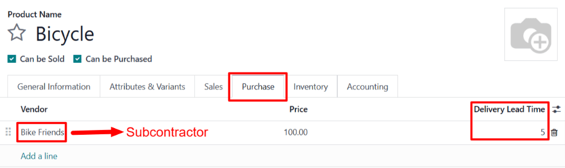

==================================
Dropship subcontracting lead times
==================================

.. |PO| replace:: :abbr:`PO (Purchase Order)`
.. |RfQ| replace:: :abbr:`RfQ (Request for Quotation)`
.. |BoM| replace:: :abbr:`BoM (Bill of Materials)`

In Odoo, lead times are used to predict how long it takes to complete a certain action. For example,
a *delivery lead time* can be set for a purchased product, which specifies the number of days it
usually takes for the product's vendor to deliver the product to the purchasing company.

For subcontracted products specifically, delivery lead times can be configured to take into account
the amount of time required for the subcontractor to manufacture a product. Doing so allows the
contracting company to better predict the delivery dates of subcontracted products.

Certain subcontracted products require the contracting company to supply the subcontractor with
manufacturing components. In this case, a *manufacturing lead time* can be used, in addition to the
delivery lead time, to generate the date on which the subcontractor must receive the required
components, in order to manufacture the product and deliver it on time.

In cases where components are dropshipped to the subcontractor, an additional delivery lead time
can be set for each component. This should be set to the amount of time it takes the vendor to
deliver components to the subcontractor.

Once a delivery lead time has been set on a component, dropship orders for the component display the
date by which the order must be confirmed, so that it can be dropshipped to the subcontractor by the
date on which manufacturing must begin.

.. important::
   Like all lead times in Odoo, lead times for subcontracted products are only an estimate, and are
   based on how long actions are *expected* to take.

   Unforeseen circumstances can impact the completion of these actions, which means that lead times
   should not be viewed as guarantees.

Configuration
=============

When using the :doc:`Dropship Subcontractor on Order <subcontracting_dropship>` route, a company is
responsible for purchasing the necessary components from a vendor, and having them dropshipped
directly to the subcontractor.

This means that, in addition to the amount of time it takes the subcontractor to manufacture and
deliver the product, it is also necessary to consider how long it takes the component vendor to
dropship the components to the subcontractor.

By assigning a product's subcontractor a *delivery lead time*, specifying a *manufacturing lead
time* on the product's BoM, and assigning the vendor of the components an additional *delivery lead
time*, *Dropship Subcontractor* orders for the product's components display the deadline for
confirming a dropship order to send the components to the subcontractor.

Product delivery lead time
--------------------------

To set a delivery lead time for a product's subcontractor, navigate to :guilabel:`Inventory app -->
Products --> Products`, and select a subcontracted product.

Then, select the :guilabel:`Purchase` tab on the product's page. If the subcontractor has not
already been added as a vendor, do so now by clicking :guilabel:`Add a line`, and selecting the
subcontractor in the :guilabel:`Vendor` column.

Once the subcontractor has been added, enter the number of days it takes them to manufacture and
deliver the product, in the :guilabel:`Delivery Lead Time` column.

Product manufacturing lead time
-------------------------------

Next, navigate to the product's |BoM| by clicking the :guilabel:`Bill of Materials` smart button at
the top of the product's page. Then, select a BoM from the list.

On the |BoM|, select the :guilabel:`Miscellaneous` tab. In the :guilabel:`Manuf. Lead Time` field,
enter the same number of days that was entered in the :guilabel:`Delivery Lead Time` field of the
|BoM|'s product.

.. image:: dropship_subcontracting_lead_times/manufacturing-lead-time.png
   :align: center
   :alt: The Manuf. Lead Time field on a product's BoM.

While not all of these days are actually used for manufacturing by the subcontractor, setting the
same number of days in each field tells Odoo that the subcontractor must receive the components and
begin production by the start of the product's delivery lead time. This gives the subcontractor
enough time to both manufacture and deliver the product.

Component delivery lead time
----------------------------

From the product's BoM, navigate to each component by clicking on the component in the
:guilabel:`Components` tab, and then clicking the :icon:`oi-arrow-right` :guilabel:`(right arrow)`
button to the right of the component.

On the product page for each component, select the :guilabel:`Purchase` tab. If the vendor has not
already been added, do so now by clicking :guilabel:`Add a line`, and selecting the subcontractor in
the :guilabel:`Vendor` column.

Once the vendor has been added, enter the number of days it takes them to dropship the product to
the subcontractor, in the :guilabel:`Delivery Lead Time` column.

Dropship subcontracting workflow
================================

Create a request for quotation (RfQ) for the product by navigating to :menuselection:`Purchase app
--> Orders --> Requests for Quotation`, and clicking :guilabel:`New`.

Specify the subcontractor in :guilabel:`Vendor` field. Then, add the product in the
:guilabel:`Products` tab by clicking :guilabel:`Add a product`, selecting the product in the
:guilabel:`Product` column, and specifying a quantity in the :guilabel:`Quantity` column.

In the :guilabel:`Expected Arrival` field, enter a date that provides enough time for the component
vendor to dropship the components, and the subcontractor to manufacture and deliver the product.

.. important::
   When a product is added to an |RfQ|, the :guilabel:`Expected Arrival` field auto-populates with a
   date that is today's date plus the delivery lead time of the product. However, this does not
   consider the time it takes to dropship the components to the subcontractor.

   When purchasing a product subcontracted using the *Dropship Subcontractor on Order* route, it is
   necessary to adjust this date to take into account the extra time needed for the components to be
   delivered to the subcontractor.

   Since production does not begin until they receive the components, leaving the date as is results
   in the finished product arriving *after* the date listed on the |RfQ|.

Next, click :guilabel:`Confirm Order` to turn the |RfQ| into a |PO|. Doing so creates a second |RfQ|
to purchase the components from the dropshipper, and have them sent to the subcontractor.

Navigate to :menuselection:`Purchase app --> Orders --> Requests for Quotation`, and select the
|RfQ| that lists the dropshipper in the :guilabel:`Vendor` column.

On the |RfQ|, the :guilabel:`Expected Arrival` field lists the date on which the subcontractor must
receive the components, in order to deliver the finished product by the *Expected Arrival* date
listed on the subcontractor |PO|.

The :guilabel:`Order Deadline` field lists the latest date on which the |RfQ| can be confirmed, in
order for the dropshipper to deliver the components to the subcontractor by the :guilabel:`Expected
Arrival` date.

Click :guilabel:`Confirm Order` to turn the |RfQ| into a |PO|, and confirm the purchase of the
components from the dropshipper. Doing so causes a :guilabel:`Dropship` smart button to appear at
the top of the page.

Click the :guilabel:`Dropship` smart button to open the dropship order. This order can also be
accessed from the :guilabel:`Resupply` smart button that now appears on the subcontractor |PO|.

After the dropshipper has delivered the components to the subcontractor, click the
:guilabel:`Validate` button at the top of the dropship order to confirm that the subcontractor has
received the components.

Once the subcontractor receives the components, they begin manufacturing the component, before
delivering it to the contracting company.

.. example::

   Bike retailer *Mike's Bikes* works with a subcontractor — *Bike Friends* — to produce units of
   their *Bicycle* product.

   Mike's Bikes must purchase the required components from vendor Bike World, and have them
   dropshipped to Bike Friends.

   On average, Bike Friends takes three days to manufacture each bicycle, plus an addition two days
   to deliver it to Mike's Bikes.

   As a result, Mike's Bikes sets a delivery lead time of five days for bicycle manufactured by Bike
   Friends: three days for manufacturing, plus two days for delivery.

   On the bicycle's BoM, they enter a manufacturing lead time of five days as well, to remind
   themselves of the date that components must be delivered to the subcontractor.

   On the product pages for each of the bicycle's components, they assign Bike World a delivery lead
   time of two days. This is the amount of time it takes Bike World to dropship each component
   directly to the subcontractor.

   On May 10th, Mike's Bikes confirms a |PO| for one bicycle, with an expected delivery date of May
   17th.

   The |RfQ| for purchasing the components from Bike World and having them dropshipped to Bike
   Friends has an Expected Arrival date of May 12th, and a Deadline of May 10th. The |RfQ| must be
   confirmed by the deadline in order for Bike Friends to receive the components by the Expected
   Arrival date, giving them enough time to deliver the finished bicycle to Mike's Bikes by May
   17th.

   .. image:: dropship_subcontracting_lead_times/deadline-arrival.png
      :align: center
      :alt: The Order Deadline and Expected Arrival dates on a dropship order.

   Mike's Bikes confirms the |RfQ| on May 10th, and Bike World delivers the components to Bike
   Friends on May 12th. Bike Friends manufactures the bicycle, and delivers it to Mike's Bikes on
   May 17th.
