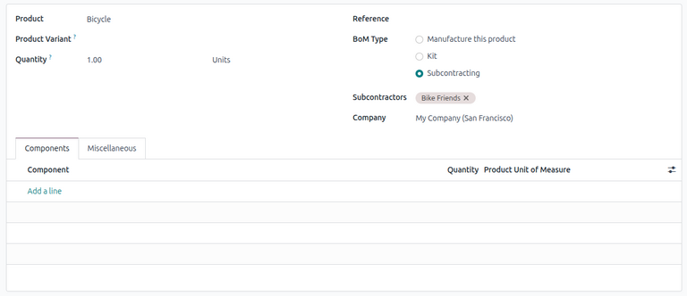
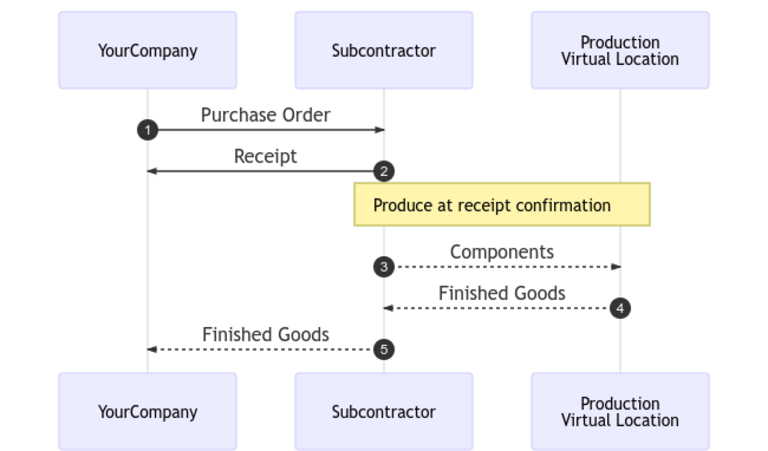
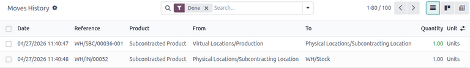

====================
Basic subcontracting
====================

.. |SO| replace:: :abbr:`SO (Sales Order)`
.. |PO| replace:: :abbr:`PO (Purchase Order)`
.. |POs| replace:: :abbr:`POs (Purchase Orders)`
.. |BoM| replace:: :abbr:`BoM (Bill of Materials)`

In basic subcontracting, a company's product is produced entirely by a subcontractor. The product is
first purchased from the subcontractor, who acquires their own components, manufactures the final
product, then delivers the final product to the contracting company's warehouse.

The following documentation covers how to configure a subcontracted product and trigger the
subcontracting process.

Configuration
=============

To use subcontracting, contractors must first configure products with a :ref:`vendor pricelist
<purchase/products/pricelist>` as well as a subcontracting-type |BoM|.

The pricelist allows the contracting company to purchase the product from the vendor (subcontractor)
through a |PO|, while the |BoM| allows the product to be manufactured externally by the
subcontractor.

.. _manufacturing/workflows/subcontracting_basic/product-config:

Configure product vendor
------------------------

To configure a product's vendor for basic subcontracting, navigate to :menuselection:`Inventory app
--> Products --> Products`. Then, select a product or create a new one.

On the product form, click the :guilabel:`Purchase` tab and add the product's subcontractor as a
vendor by clicking :guilabel:`Add a line`. Select the subcontractor in the :guilabel:`Vendor`
drop-down menu.

Then, enter the price of the product in the :guilabel:`Price` field.

Finally, set a :doc:`lead time <../../inventory/warehouses_storage/replenishment/lead_times>` for
the product in the :guilabel:`Delivery Lead Time` field to specify the number of days for the
subcontractor to produce and deliver the final product.

.. note::
   Since contractors are only responsible for purchasing and receiving the final product, they do
   not need to additionally configure manufacturing lead times on a |BoM|. Instead, provide only a
   single *Delivery Lead Time* on the vendor pricelist that factors in both the subcontractor's
   manufacturing and delivery time.

.. _manufacturing/workflows/subcontracting_basic/bom-config:

Configure BoM
-------------

After specifying the vendor, configure a subcontracting-type |BoM| for the product. Click the
:guilabel:`Bill of Materials` smart button on the product form. Then, select the desired |BoM| or
create a new one.

.. tip::
   Alternatively, navigate to :menuselection:`Manufacturing app --> Products --> Bills of
   Materials`, and select the |BoM| for the subcontracted product.

In the :guilabel:`BoM Type` field, select :guilabel:`Subcontracting`. In the resulting
:guilabel:`Subcontractors` field, add one or more subcontractors.

Because the components and manufacturing are both handled by the subcontractor, there is no need to
list any components in the :guilabel:`Components` tab of the |BoM|.

.. _subcontracting_basic/workflow:

Basic subcontracting workflow
=============================

The basic subcontracting workflow begins by :ref:`creating a PO
<subcontracting_basic/workflow/create_po>` to purchase the product from the subcontractor (1).

The contractor (YourCompany) then confirms the |PO|, which creates a receipt to transfer the final product
(2). The subcontractor manufactures the product and delivers it back to the contractor when done.

Once the product has been produced and received, the contractor :ref:`validates the receipt
<subcontracting_basic/workflow/validate_receipt>` (5) to trigger :ref:`inventory moves
<subcontracting_basic/workflow/track-inventory>` from the subcontractor to the company's stock (3,
4).

.. _subcontracting_basic/workflow/create_po:

Create and confirm PO
---------------------

To create a |PO| for the subcontracted product, navigate to :menuselection:`Purchase app --> Orders
--> Purchase Orders`, and click :guilabel:`New`.

Begin filling out the |PO| by selecting a subcontractor from the :guilabel:`Vendor` drop-down menu.
In the :guilabel:`Products` tab, click :guilabel:`Add a product` to create a new product line.
Select the subcontracted product in the :guilabel:`Product` field, and enter the quantity in the
:guilabel:`Quantity` field.

After adding the product, the :guilabel:`Expected Arrival` field is updated with the finished
product's expected delivery date, as configured earlier with the vendor's *Delivery Lead Time*.

Finally, click :guilabel:`Confirm Order` to confirm the |PO|. A receipt is automatically created,
and a :guilabel:`Receipt` smart button appears at the top of the form.

.. _subcontracting_basic/workflow/validate_receipt:

Process receipt
---------------

After the order is confirmed, the subcontractor manufactures the product and delivers the finished
good back to the contracting company.

To receive the finished product from the subcontractor, click the :guilabel:`Receive Products`
button on the |PO|, or click the :guilabel:`Receipt` smart button at the top of the page. Then,
click :guilabel:`Validate` to enter the incoming shipment into inventory.

.. note::
   If :doc:`multi-step inventory flows <../../inventory/shipping_receiving/daily_operations>` are
   enabled, additional transfers must be validated to enter the incoming product into stock.

.. _subcontracting_basic/workflow/track-inventory:

Track inventory moves
---------------------

After validating a receipt, Odoo automatically generates inventory moves to track the movement of
subcontracted products between locations. To view these inventory moves, navigate to
:menuselection:`Inventory app --> Reporting --> Moves History`.

To track inventory movement in subcontracting, Odoo sends any product components to a dedicated
*Subcontracting Location*. A :ref:`virtual location <inventory/warehouses_storage/location-type>`
called *Production* then consumes the components and produces the finished good. Once produced, the
good then moves back to the *Subcontracting Location* before finally entering the contractor's stock
when the receipt is validated.

.. note::
   Because no components are sent in basic subcontracting, there is no movement from the
   *Subcontracting Location* to the *Production* location.
