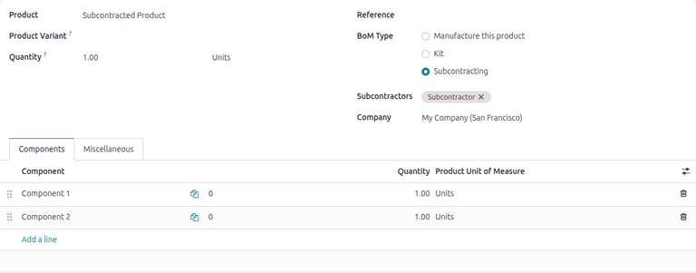
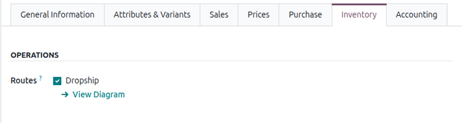
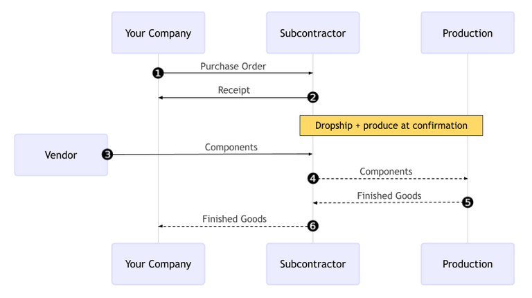
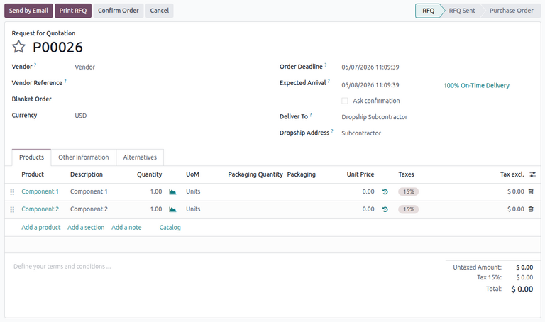
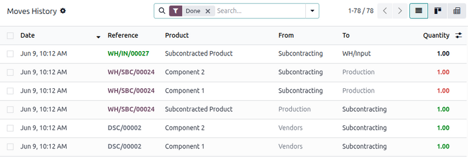

=========================
Dropship to subcontractor
=========================

.. |SO| replace:: :abbr:`SO (Sales Order)`
.. |SOs| replace:: :abbr:`SOs (Sales Orders)`
.. |PO| replace:: :abbr:`PO (Purchase Order)`
.. |POs| replace:: :abbr:`POs (Purchase Orders)`
.. |RfQ| replace:: :abbr:`RfQ (Request for Quotation)`
.. |BoM| replace:: :abbr:`BoM (Bill of Materials)`

In the *Dropship to Subcontractor* workflow, a company purchases the components of a product from a
vendor, who delivers them directly to the subcontractor for manufacturing. The subcontractor then
ships the finished product back to the company.

The following documentation covers how to configure a subcontracted product and walk through the
*Dropship to Subcontractor* workflow.

.. note::
   This document uses the term *company* to refer to the internal company requiring subcontracted
   goods, and the term *subcontractor* to refer to the external vendor handling the outsourced
   production of the subcontracted goods.

.. _manufacturing/subcontracting_dropship/config:

Configuration
=============

To use the *Dropship to Subcontractor* workflow, companies must first configure subcontracted
products with a :ref:`vendor pricelist <purchase/products/pricelist>` and a
:ref:`subcontracting-type BoM <manufacturing/subcontracting_dropship/config/bom-config>` specifying
the product's components. Companies must then :ref:`configure each component
<manufacturing/subcontracting_dropship/config/component-config>` by specifying a dropship vendor and
an appropriate route.

The pricelist allows the company to purchase the product from the vendor (subcontractor) through
a |PO|. The |BoM| allows the product to be manufactured externally by the subcontractor.
:doc:`Routes <../../inventory/shipping_receiving/daily_operations/use_routes>` are applied to each
component in order to be properly sent from the dropshipping vendor to the subcontractor.

.. important::
   In order to configure product components for dropshipping, make sure that the *Dropshipping*
   feature is enabled in the Odoo settings.

   To do so, navigate to either the **Inventory** or **Purchase** app, then click
   :menuselection:`Configuration --> Settings`. Finally, in the *Logistics* section, enable the
   :guilabel:`Dropshipping` setting.

.. _manufacturing/subcontracting_dropship/config/product-config:

Configure product vendor
------------------------

To configure a product's vendor for dropship subcontracting, navigate to :menuselection:`Inventory
app --> Products --> Products`, and select a product, or :doc:`create a new one
<../../inventory/product_management/configure/type>`.

On the product form, click the *Purchase* tab and add the product's subcontractor as a vendor by
clicking :guilabel:`Add a line`. Select the subcontractor in the :guilabel:`Vendor` drop-down menu.

Then, enter the price of the product in the :guilabel:`Unit Price` field.

Finally, set a :doc:`Lead Time <../../inventory/warehouses_storage/replenishment/lead_times>` for
the product in the corresponding field to specify the number of days for the subcontractor to
receive components, produce the product, and deliver the finished good.

.. note::
   Companies do not need to configure manufacturing lead times on a |BoM|. Instead, provide only a
   single :guilabel:`Lead Time` on the vendor pricelist, factoring in the duration for the
   subcontractor to receive the components from the dropship vendor, manufacture the product, and
   deliver the finished good back to the company.

.. _manufacturing/subcontracting_dropship/config/bom-config:

Configure BoM
-------------

After specifying the vendor, configure a subcontracting-type |BoM| for the product. To start, click
the :icon:`fa-flask` :guilabel:`Bill of Materials` smart button on the product's page. Then, select
the desired |BoM| or create a new one.

.. tip::
   Alternatively, navigate to :menuselection:`Manufacturing app --> Products --> Bills of
   Materials`, and select the |BoM| for the subcontracted product.

In the :guilabel:`BoM Type` field, select the :guilabel:`Subcontracting` option. Then, add one or
more subcontractors in the :guilabel:`Subcontractors` field.

Finally, make sure that all necessary components are specified on the :guilabel:`Components` tab. To
add a new component, click :guilabel:`Add a line`, select the component in the :guilabel:`Component`
drop-down menu, and specify the required quantity in the :guilabel:`Quantity` field.

.. _manufacturing/subcontracting_dropship/config/component-config:

Configure components
--------------------

When dropshipping to subcontractors, each component of a product must have a specified vendor and
have the *Dropship* route enabled. This allows the components to be properly dropshipped from the
vendor to the subcontractor.

To specify a component's vendor, select the component's name in the :guilabel:`Components` tab, and
click the :icon:`oi-arrow-right` :guilabel:`(Internal link)` arrow.

.. tip::
   Alternatively, navigate to :menuselection:`Inventory app --> Products --> Products` and select
   the component.

On the component product form, click the :guilabel:`Purchase` tab. Add a vendor by clicking
:guilabel:`Add a line`. Then, select the vendor in the :guilabel:`Vendor` field.

Next, to configure the route, click on the *Inventory* tab and select the :guilabel:`Dropship` route
in the *Routes* section.

Repeat the process for every component dropshipped to the subcontractor.

.. _manufacturing/subcontracting-dropship/workflow:

Workflow
========

The *Dropship to Subcontractor* workflow begins by :ref:`creating a PO
<manufacturing/subcontracting-dropship/workflow/create-po>` to purchase the product from the
subcontractor (1).

The company then confirms the *subcontractor* |PO| (2). This creates an |RfQ| to purchase the
components from the vendor, as well as a receipt to transfer the final product.

Next, the company :ref:`confirms the RfQ
<manufacturing/subcontracting-dropship/workflow/confirm-rfq>`, turning it into a *vendor* |PO| and
creating a dropship order to send the components from the vendor to the subcontractor (3). Once the
company :ref:`validates the dropship
<manufacturing/subcontracting-dropship/workflow/validate-dropship>` order, the subcontractor begins
to manufacture the final product with the components and ships it to the company when done.

Once the product has been produced and received, the company :ref:`validates the receipt
<manufacturing/subcontracting-dropship/workflow/process-receipt>` (6) to trigger :ref:`inventory
moves <manufacturing/subcontracting-dropship/workflow/track-inventory>` from the subcontractor to
the company's stock (4, 5).

.. _manufacturing/subcontracting-dropship/workflow/create-po:

Create and confirm subcontractor PO
-----------------------------------

To create a |PO| for the subcontracted product, navigate to :menuselection:`Purchase app --> Orders
--> Purchase Orders`, and click :guilabel:`New`.

Begin filling out the |PO| by selecting a subcontractor from the :guilabel:`Vendor` drop-down menu.
In the :guilabel:`Products` tab, click :guilabel:`Add a product` to create a new product line.
Select the subcontracted product in the :guilabel:`Product` field, and enter the quantity in the
:guilabel:`Quantity` field.

After adding the product, the :guilabel:`Expected Arrival` field is updated with the finished
product's expected delivery date, as configured earlier with the vendor's *Lead Time*.

Finally, click :guilabel:`Confirm Order` to confirm the |PO|. A receipt is automatically created,
and a :icon:`fa-truck` :guilabel:`Receipt` smart button appears at the top of the form. In addition,
a separate |RfQ| is automatically created to purchase the components from the dropship vendor.

.. note::
   This |RfQ| is **not** automatically linked to the |PO|. It must be accessed separately on the
   *Requests for Quotation* page.

.. _manufacturing/subcontracting-dropship/workflow/confirm-rfq:

Confirm vendor RfQ
------------------

To confirm the vendor |RfQ|, navigate to :menuselection:`Purchase app --> Orders --> Requests for
Quotation`. Select the newly-created |RfQ| for the appropriate vendor.

On the |RfQ|, the :guilabel:`Deliver To` field reads :guilabel:`Dropship Subcontractor`, and the
:guilabel:`Dropship Address` field shows the name of the subcontractor to whom components are being
dropshipped.

Click :guilabel:`Confirm Order` to confirm the purchase of components from the vendor. Doing so
turns the |RfQ| into a *vendor* |PO|. A :icon:`fa-truck` :guilabel:`Dropship` smart button appears
at the top of the vendor |PO|.

.. note::
   Simultaneously, a :icon:`fa-truck` :guilabel:`Resupply` smart button appears at the top of the
   *subcontractor* |PO| created earlier. In dropship subcontracting, this smart button links to the
   dropship order.

.. _manufacturing/subcontracting-dropship/workflow/validate-dropship:

Validate dropship order
-----------------------

Once the components have been delivered to the subcontractor by the dropship vendor, click the
:icon:`fa-truck` :guilabel:`Dropship` smart button on the vendor |PO| to open the dropship order.

.. note::
   The dropship order can also be opened from the *subcontractor* |PO|. Navigate to
   :menuselection:`Purchase app --> Orders --> Purchase Orders`, select the |PO|, then click the
   :icon:`fa-truck` :guilabel:`Resupply` smart button.

Finally, click the :guilabel:`Validate` button at the top to confirm that the subcontractor has
received the components. The subcontractor then begins manufacturing the final product.

.. _manufacturing/subcontracting-dropship/workflow/process-receipt:

Process receipt
---------------

After the subcontractor completes production, the finished product is shipped to the company.

To receive the product into stock, navigate to :menuselection:`Purchase app --> Orders --> Purchase
Orders`, and select the *subcontractor* |PO|.

At the top of the |PO|, click the :guilabel:`Receive Products` button, or click the :icon:`fa-truck`
:guilabel:`Receipt` smart button. Then, click :guilabel:`Validate` to enter the incoming shipment
into inventory.

.. note::
   If :doc:`multi-step inventory flows <../../inventory/shipping_receiving/daily_operations>` are
   enabled, additional transfers must be validated to enter the incoming product into stock.

.. _manufacturing/subcontracting-dropship/workflow/track-inventory:

Track inventory moves
---------------------

After validating a receipt, Odoo automatically generates inventory moves to track the movement of
subcontracted products between :doc:`locations
<../../inventory/warehouses_storage/inventory_management/use_locations>`. To view these inventory
moves, navigate to :menuselection:`Inventory app --> Reporting --> Moves History`.

In the *Dropship to Subcontractor* workflow, product components are first sent from the vendors to a
dedicated location called *Subcontracting*. Another location called *Production* then consumes the
components and produces the finished good. Once produced, the good then moves back to the
*Subcontracting* location before finally entering the contractor's stock when the receipt is
validated.

