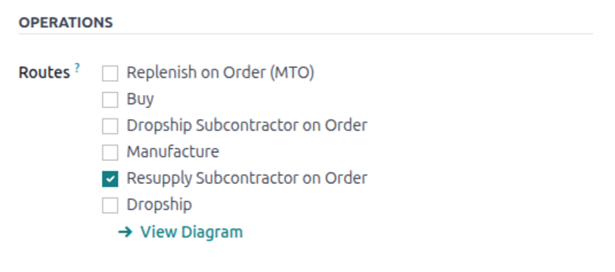

=======================
Resupply subcontracting
=======================

.. |SO| replace:: :abbr:`SO (Sales Order)`
.. |PO| replace:: :abbr:`PO (Purchase Order)`
.. |POs| replace:: :abbr:`PO (Purchase Orders)`
.. |BoM| replace:: :abbr:`BoM (Bill of Materials)`

In resupply subcontracting, a company supplies the components of its product to a subcontractor, who
manufactures the product, then delivers the finished product to the contracting company's warehouse.

This article covers how to configure a subcontracted product and walk through the resupply
subcontracting process.

.. _manufacturing/subcontracting_resupply/config:

Configuration
=============

To use the resupply subcontractor workflow, contractors must first configure products with a
:ref:`vendor pricelist <purchase/products/pricelist>` and a subcontracting-type |BoM|. Each
component must then be configured with the appropriate route.

The pricelist allows the contracting company to purchase the product from the vendor (subcontractor)
through a |PO|, while the |BoM| allows the product to be manufactured externally by the
subcontractor. Routes are applied to each component in order to be properly sent from the contractor
to the subcontractor.

.. _manufacturing/subcontracting_resupply/config/product-config:

Configure product vendor
------------------------

To configure a product's vendor for resupply subcontracting, navigate to :menuselection:`Inventory
app --> Products --> Products`, and select a product, or create a new one.

On the product form, click the :guilabel:`Purchase` tab and add the product's subcontractor as a
vendor by clicking :guilabel:`Add a line`. Select the subcontractor in the :guilabel:`Vendor`
drop-down menu.

Then, enter the price of the product in the :guilabel:`Price` field.

Finally, set a :doc:`lead time <../../inventory/warehouses_storage/replenishment/lead_times>` for
the product in the :guilabel:`Delivery Lead Time` field to specify the number of days for the
subcontractor to receive components, produce the product, and deliver the finished good.

.. note::
   Since contractors are not responsible for manufacturing the final product, there is no need to
   configure manufacturing lead times on a |BoM|. Instead, provide only a single *Delivery Lead
   Time* on the vendor pricelist, factoring in the duration for the subcontractor to receive the
   components from the contractor, manufacture the product, and deliver the finished good back to
   the contractor.

.. _manufacturing/subcontracting_resupply/config/bom-config:

Configure BoM
-------------

After specifying the vendor, configure a subcontracting-type |BoM| for the product. To start, click
the :guilabel:`Bill of Materials` smart button on the product's page. Then, select the desired |BoM|
or create a new one.

.. tip::
   Alternatively, navigate to :menuselection:`Manufacturing app --> Products --> Bills of
   Materials`, and select the |BoM| for the subcontracted product.

In the :guilabel:`BoM Type` field, select the :guilabel:`Subcontracting` option. Then, add one or
more subcontractors in the :guilabel:`Subcontractors` field below.

Finally, add all necessary components in the :guilabel:`Components` tab. To add a new component,
click :guilabel:`Add a line`. Then, select the component in the :guilabel:`Component` drop-down
menu, and specify the required quantity in the :guilabel:`Quantity` field.

.. image:: subcontracting_resupply/resupply-subcontracting-bom.png
   :alt: BoM for a resupply subcontracting product.

.. _manufacturing/subcontracting_resupply/config/component-config:

Configure components
--------------------

In resupply subcontracting, each component must be individually configured with the *Resupply
Subcontractor on Order* route. This allows the components to be transferred from the contractor to
the subcontractor when a |PO| is made for the subcontracted product.

To configure a component's route, select the component's name in the :guilabel:`Components` tab, and
click the :icon:`oi-arrow-right` :guilabel:`(Internal link)` arrow. Alternatively, navigate to
:menuselection:`Inventory app --> Products --> Products`, and select the component.

On the component product form, click on the :guilabel:`Inventory` tab. Then, in the
:guilabel:`Routes` section, select the :guilabel:`Resupply Subcontractor on Order` route.

.. important::
   Repeat the process for every component that must be sent to the subcontractor.

.. _manufacturing/subcontracting_resupply/workflow:

Workflow
========

.. image:: subcontracting_resupply/resupply-subcontracting.png
   :alt: Diagram of resupply subcontracting workflow in Odoo MRP Subcontracting.

The resupply subcontracting workflow begins by :ref:`creating a PO
<manufacturing/subcontracting_resupply/workflow/create-po>` to purchase the product from the
subcontractor (1).

The contractor (YourCompany) then confirms the |PO|, which creates both a resupply order to transfer
the components and a receipt to receive the final product (2) from the subcontractor.

Next, the contractor :ref:`validates the transfer
<manufacturing/subcontracting_resupply/workflow/validate-resupply>` of components to the
subcontractor (3). The subcontractor begins producing the product.

Once the product has been produced and received, the contractor :ref:`validates the receipt
<manufacturing/subcontracting_resupply/workflow/process-receipt>` (6) to trigger :ref:`inventory
moves <manufacturing/subcontracting_resupply/workflow/track-inventory>` from the subcontractor to
the company's stock (4, 5).

.. _manufacturing/subcontracting_resupply/workflow/create-po:

Create and confirm PO
---------------------

To create a |PO| for the subcontracted product, navigate to :menuselection:`Purchase app --> Orders
--> Purchase Orders` and click :guilabel:`New`.

Begin filling out the |PO| by selecting a subcontractor from the :guilabel:`Vendor` drop-down menu.
In the :guilabel:`Products` tab, click :guilabel:`Add a product` to create a new product line.
Select the subcontracted product in the :guilabel:`Product` field, and enter the quantity in the
:guilabel:`Quantity` field.

After adding the product, the :guilabel:`Expected Arrival` field is updated with the finished
product's expected delivery date, as configured earlier with the vendor *Delivery Lead Time*.

Finally, click :guilabel:`Confirm Order` to confirm the |PO|. A receipt and a resupply order are
automatically created, accessible via the :guilabel:`Receipt` and :guilabel:`Resupply` smart buttons
at the top of the form.

.. _manufacturing/subcontracting_resupply/workflow/validate-resupply:

Validate resupply order
-----------------------

Click the :guilabel:`Resupply` smart button at the top of the |PO| to open the resupply order, and
click :guilabel:`Validate` to confirm that the components have been sent to the subcontractor.

Alternatively, navigate to the :menuselection:`Inventory` app, click the :guilabel:`(#) To Process`
button on the :guilabel:`Resupply Subcontractor` card, and select the relevant resupply order. Then,
click :guilabel:`Validate` to confirm that the components have been sent to the subcontractor.

.. _manufacturing/subcontracting_resupply/workflow/process-receipt:

Process receipt
---------------

After the resupply order is confirmed, the subcontractor manufactures the product and delivers the
finished good back to the contracting company.

To receive the finished product from the subcontractor, click the :guilabel:`Receive Products`
button on the |PO|, or click the :guilabel:`Receipt` smart button at the top of the page. Then,
click :guilabel:`Validate` to enter the incoming shipment into inventory.

.. note::
   If :doc:`multi-step inventory flows <../../inventory/shipping_receiving/daily_operations>` are
   enabled, additional transfers must be validated to enter the incoming product into stock.

.. _manufacturing/subcontracting_resupply/workflow/track-inventory:

Track inventory moves
---------------------

After validating the receipt, Odoo automatically generates inventory moves to track the movement of
subcontracted products between locations. To view these inventory moves, navigate to
:menuselection:`Inventory app --> Reporting --> Moves History`.

In resupply subcontracting, Odoo first transfers any product components to a dedicated
*Subcontracting Location*. A :ref:`virtual location <inventory/warehouses_storage/location-type>`
called *Production* then consumes the components and produces the finished good. Once produced, the
good then moves back to the *Subcontracting Location* before finally entering the contractor's stock
when the receipt is validated.

.. image:: subcontracting_resupply/resupply-subcontracting-moves.png
   :alt: Moves History of resupply subcontracting in Odoo MRP Subcontracting.
