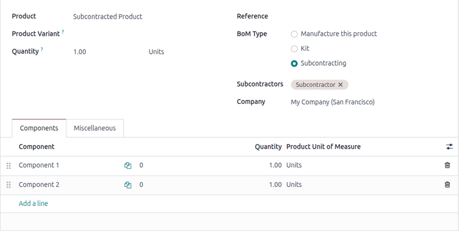
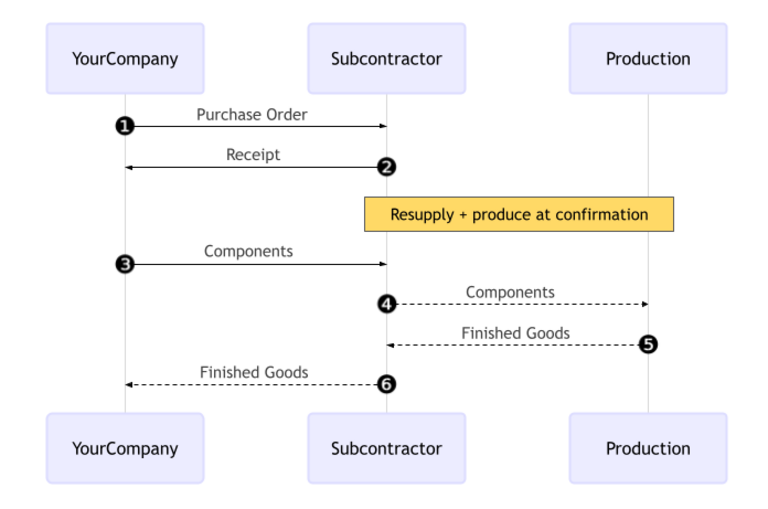
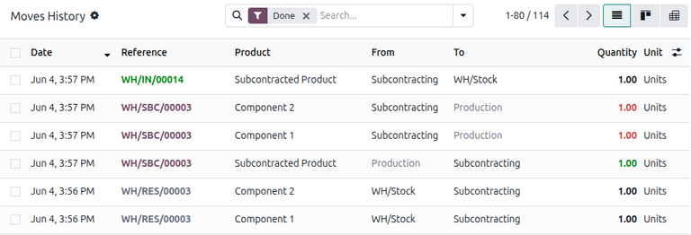

=======================
Resupply subcontracting
=======================

.. |PO| replace:: :abbr:`PO (Purchase Order)`
.. |BoM| replace:: :abbr:`BoM (Bill of Materials)`

In resupply subcontracting, a company supplies the components of its product to a subcontractor, who
manufactures the product, then delivers the finished product to the company's warehouse.

This document covers how to configure a subcontracted product and walk through the resupply
subcontracting process.

.. note::
   This document uses the term *company* to refer to the internal company requiring subcontracted
   goods, and the term *subcontractor* to refer to the external vendor handling the outsourced
   production of the subcontracted goods.

.. _manufacturing/subcontracting_resupply/config:

Configuration
=============

In order to use the resupply subcontractor :ref:`workflow
<manufacturing/subcontracting_resupply/workflow>`, users must follow the configuration process
below:

#. :ref:`Specify the subcontractor <manufacturing/subcontracting_resupply/config/product-config>` as
   a vendor on the subcontracted product.
#. :ref:`Create a subcontracting-type BoM <manufacturing/subcontracting_resupply/config/bom-config>`
   for the product and add the necessary components.
#. For each component, open its product form and set its *Resupply Subcontractor on Order* route.

Specifying the subcontractor as a vendor on the product form allows the contracting company to
properly purchase the product from the subcontractor through a purchase order (PO). The bill of
materials (BoM) allows the product to be manufactured externally by the subcontractor. The *Resupply
Subcontractor on Order* route is applied to each component in order for them to be properly sent
from the contractor to the subcontractor.

.. _manufacturing/subcontracting_resupply/config/product-config:

Specify product vendor
----------------------

To configure a product's vendor for resupply subcontracting, navigate to :menuselection:`Inventory
app --> Products --> Products`, and select a product, or create a new one.

On the product form, click the *Purchase* tab and add the product's subcontractor as a vendor by
clicking :guilabel:`Add a line`. Select the subcontractor using the :guilabel:`Vendor` drop-down
menu.

Then, enter the price of the product in the :guilabel:`Unit Price` field.

Finally, set a :doc:`Lead Time <../../inventory/warehouses_storage/replenishment/lead_times>` for
the product in the corresponding field to specify the number of days for the subcontractor to
receive components, produce the product, and deliver the finished good.

.. note::
   Since contractors are not responsible for manufacturing the final product, there is no need to
   configure manufacturing lead times on a |BoM|. Instead, provide only a single :guilabel:`Lead
   Time` on the vendor pricelist, factoring in the duration for the subcontractor to receive the
   components from the contractor, manufacture the product, and deliver the finished goods back to
   the company.

.. _manufacturing/subcontracting_resupply/config/bom-config:

Configure |BoM|
---------------

After specifying the vendor, configure a subcontracting-type |BoM| for the product. To start, click
the :guilabel:`Bill of Materials` smart button on the product's page. Then, select the desired |BoM|
or create a new one.

.. tip::
   Alternatively, navigate to :menuselection:`Manufacturing app --> Products --> Bills of
   Materials`, and select the |BoM| for the subcontracted product.

In the :guilabel:`BoM Type` field, select the :guilabel:`Subcontracting` option. Then, add one or
more subcontractors in the :guilabel:`Subcontractors` field below.

Finally, add all necessary components in the *Components* tab. To add a new component, click
:guilabel:`Add a line`. Then, select the  :guilabel:`Component` using the drop-down menu , and
specify the required :guilabel:`Quantity` in the corresponding field.

.. _manufacturing/subcontracting_resupply/workflow:

Workflow
========

The resupply subcontracting workflow can be summarized in the following steps:

#. :ref:`Create and confirm a subcontractor PO
   <manufacturing/subcontracting_resupply/workflow/create-po>`.
#. :ref:`Validate the resupply order
   <manufacturing/subcontracting_resupply/workflow/validate-resupply>` to send the components.
#. :ref:`Validate the receipt <manufacturing/subcontracting_resupply/workflow/process-receipt>` to
   receive the final product.

The workflow begins by creating a |PO| to purchase the product from the subcontractor (1).

The company then confirms the |PO|, which creates both a resupply order to transfer the components
and a receipt to receive the final product (2) from the subcontractor.

Next, the contractor validates the transfer of components to the subcontractor (3). The
subcontractor begins producing the product.

Once the product has been produced and received, the contractor validates the receipt (6) to trigger
:ref:`inventory moves <manufacturing/subcontracting_resupply/workflow/track-inventory>` from the
subcontractor to the company's stock (4, 5).

.. _manufacturing/subcontracting_resupply/workflow/create-po:

Create and confirm subcontractor |PO|
-------------------------------------

To create a |PO| for the subcontracted product, navigate to :menuselection:`Purchase app --> Orders
--> Purchase Orders` and click :guilabel:`New`.

Begin filling out the |PO| by selecting a subcontractor from the :guilabel:`Vendor` drop-down menu.

In the *Products* tab, click :guilabel:`Add a product` and select the subcontracted product. Next,
enter the :guilabel:`Quantity` in the corresponding field.

After adding the product, the :guilabel:`Expected Arrival` field is updated with the finished
product's expected delivery date, as configured earlier with the vendor *Lead Time*.

Finally, click :guilabel:`Confirm Order` to confirm the |PO|. A receipt and a resupply order are
automatically created, accessible via the :icon:`fa-truck` :guilabel:`Receipt` and :icon:`fa-truck`
:guilabel:`Resupply` smart buttons at the top of the form.

.. _manufacturing/subcontracting_resupply/workflow/validate-resupply:

Validate resupply order
-----------------------

Click the :icon:`fa-truck` :guilabel:`Resupply` smart button at the top of the |PO| to open the
resupply order, and click :guilabel:`Validate` to confirm that the components have been sent to the
subcontractor.

Alternatively, open the **Inventory** app, and on the :guilabel:`Resupply Subcontractor` card, click
the :guilabel:`(#) To Process` button. Select the relevant resupply order, then click
:guilabel:`Validate` to confirm that the components have been sent to the subcontractor.

.. _manufacturing/subcontracting_resupply/workflow/process-receipt:

Process receipt
---------------

After the resupply order is confirmed, the subcontractor manufactures the product and delivers the
finished good back to the company.

To receive the finished product from the subcontractor, click the :guilabel:`Receive Products`
button on the |PO|, or click the :icon:`fa-truck` :guilabel:`Receipt` smart button at the top of the
page. Then, click :guilabel:`Validate` to enter the incoming shipment into inventory.

.. note::
   If :doc:`multi-step inventory flows <../../inventory/shipping_receiving/daily_operations>` are
   enabled, additional transfers must be validated to enter the incoming product into stock.

.. _manufacturing/subcontracting_resupply/workflow/track-inventory:

Track inventory moves
---------------------

After validating the receipt, Odoo automatically generates inventory moves to track the movement of
subcontracted products between :doc:`locations
<../../inventory/warehouses_storage/inventory_management/use_locations>`. To view these inventory
moves, navigate to :menuselection:`Inventory app --> Reporting --> Moves History`.

In resupply subcontracting, Odoo first transfers any product components to a dedicated location
called *Subcontracting*. Another location called *Production* then consumes the components and
produces the finished good. Once produced, the good then moves back to the *Subcontracting* location
before finally entering the company's stock when the receipt is validated.

