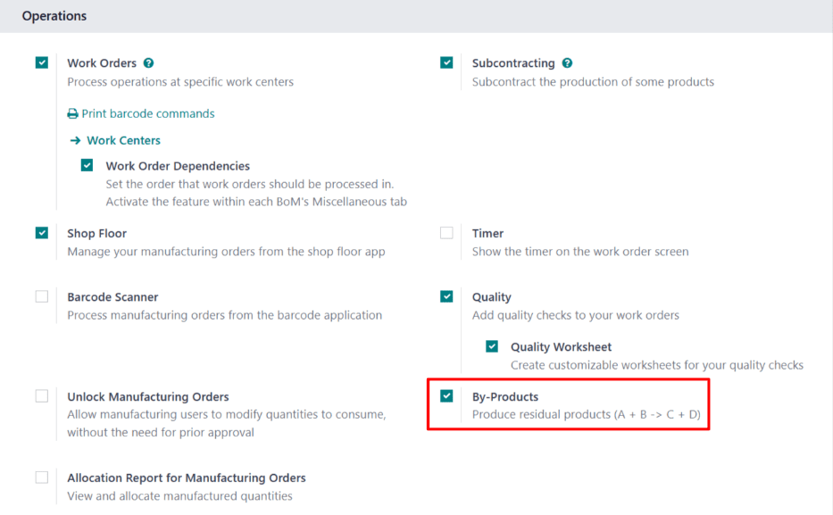
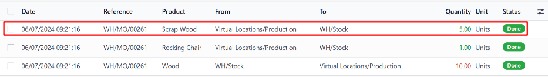

===========
By-Products
===========

.. |MO| replace:: :abbr:`MO (manufacturing order)`
.. |BoM| replace:: :abbr:`BoM (bill of materials)`
.. |BoMs| replace:: :abbr:`BoMs (bills of materials)`

When manufacturing certain products, it is common to be left with residual materials, in addition to
the finished product. These materials are known as *by-products*. By specifying the by-products
created during manufacturing on a product's bill of materials (BoM), the quantity of by-products
on-hand is tracked by Odoo.

.. example::
   Manufacturing a *rocking chair* requires ten pieces of wood. During production, five pieces of
   *scrap wood* are created, in addition to the rocking chair. By designating the scrap wood as a
   by-product on the rocking chair's |BoM|, Odoo tracks the on-hand count of scrap wood, as well as
   the quantity of rocking chairs produced.

Configuration
=============

To specify by-products on a product's |BoM|, the *By-Products* setting **must** be enabled. To do
so, navigate to :menuselection:`Manufacturing app --> Configuration --> Settings`, and tick the
:guilabel:`By-Products` checkbox, located under the :guilabel:`Operations` heading. Then, click
:guilabel:`Save` to apply the change.

With the :guilabel:`By-Products` setting enabled, a :guilabel:`By-products` tab appears on product
|BoMs|.

Add byproduct to BoM
====================

To add by-products to a |BoM|, navigate to :menuselection:`Manufacturing app --> Products --> Bills
of Materials`, and select a |BoM|.

On the |BoM|, select the :guilabel:`By-products` tab. Click :guilabel:`Add a line`, and select the
by-product in the :guilabel:`By-product` drop-down field. In the :guilabel:`Quantity` field, enter
the quantity of the by-product produced during manufacturing.

If the by-product is produced during a specific operation of a manufacturing order (MO), select the
operation in the :guilabel:`Produced in Operation` field. For example, if a scrap wood by-product is
produced during an *Assemble* operation, select that operation in the :guilabel:`Produced in
Operation` field.

.. image:: byproducts/byproducts-tab.png
   :align: center
   :alt: The By-Products tab on a BoM, configured with a "Scrap Wood" by-product.

Manufacture by-product
======================

When an |MO| is completed and marked as *Done*, Odoo registers the quantity of by-products created
during the manufacturing process. To create a new |MO|, navigate to :menuselection:`Manufacturing
app --> Operations --> Manufacturing Orders`, and click :guilabel:`New`.

In the :guilabel:`Bill of Material` field, select a |BoM| on which by-products have been specified.
After doing so, the :guilabel:`Product` field auto-populates with the corresponding product. Click
:guilabel:`Confirm` to confirm the |MO|.

When manufacturing is completed, click the :guilabel:`Produce All` button at the top of the |MO|.
After doing so, inventory counts update to reflect the quantity of by-product(s) produced, as well
as the quantity of the product.

Click the :guilabel:`Product Moves` smart button at the top of the |MO| page to see the movements of
components and products. Each by-product is listed on the resulting :guilabel:`Inventory Moves`
page, with the :guilabel:`From` column displaying the virtual production location, and the
:guilabel:`To` column displaying the location where the by-product is stored.

