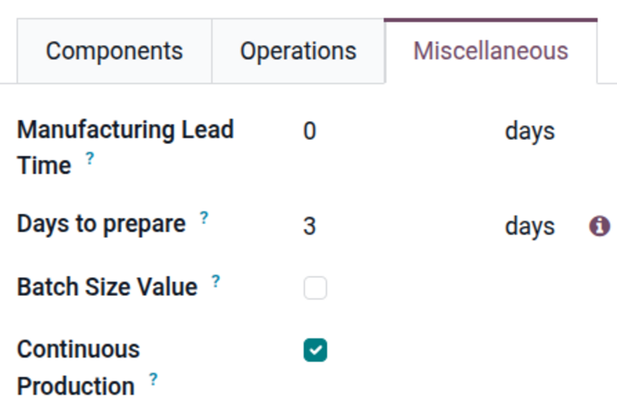
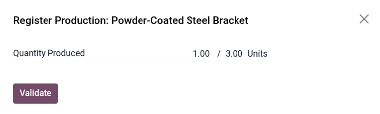
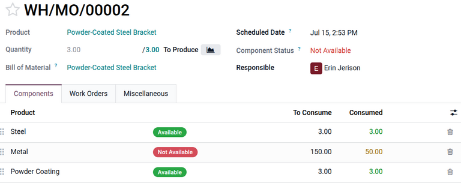
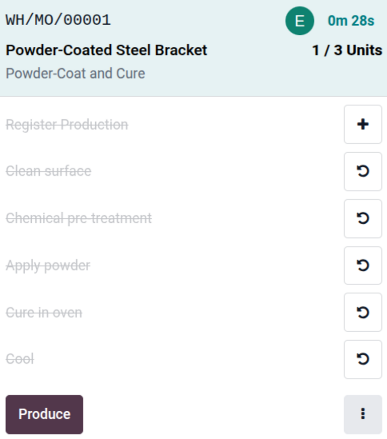

=====================
Continuous production
=====================

.. |MO| replace:: :abbr:`MO (Manufacturing Order)`
.. |MOs| replace:: :abbr:`MOs (Manufacturing Orders)`
.. |BOM| replace:: :abbr:`Bill of Materials (BOM)`

To ensure that finished goods can arrive in stock as efficiently as possible, enable *continuous
production*. Continuous production allows operators to continue processing work orders for
manufacturing orders (MOs) even if they have not fully finished all units they expected to produce.
Operators can continue to produce for the next work orders.

When an operator registers fewer units of the finished good than expected, Odoo offers to create a
back order for the remaining units. The |MO| is effectively split so that the operator can enter
what they produced into stock and finish producing the rest later.

Continuous production improves efficiency of processing |MOs|. When an operator has not finished
producing all demanded units, but they want production to continue, they can enter the units that
they can produce right now into stock in a clear, efficient way.

Enable settings
===============

Navigate to :menuselection:`Manufacturing app --> Configuration --> Settings`. In the *Operations*
section, select the :guilabel:`Work Orders` checkbox.

Set up BOM
==========

Next:

#. :doc:`Set up a bill of materials (BOM) <../basic_setup/bill_configuration>`
#. :ref:`Enable continuous production on a product <mrp/workflows/enable-cp>`

.. _mrp/workflows/enable-cp:

Enable continuous production
----------------------------

Continuous production for a product is set up through its |BOM|.

To set up continuous production for a product, navigate to :menuselection:`Manufacturing app -->
Products --> Bills of Materials`, then open the |BOM|.

.. note::
   Alternatively, navigate to :menuselection:`Manufacturing app --> Operations --> Manufacturing
   Orders` and open a manufacturing order. Then, click the :icon:`oi-arrow-right`
   :guilabel:`(Internal link)` icon next to the :guilabel:`Bill of Material` field.

In the *Miscellaneous* tab of the |BOM|, select the :guilabel:`Continuous Production` checkbox. This
setting ensures that when production is registered on a work order, the next work order is unblocked
to allow production to continue on what is produced.

Continuous production on MOs
============================

After enabling continuous production on a |BOM|, work orders can proceed as components become
available, allowing work centers to remain active while components are unavailable.

First, navigate to :menuselection:`Manufacturing app --> Operations --> Manufacturing Orders`. Then,
create a manufacturing order for a product under continuous production.

Continuous production can be registered from a work order, ideally from the *Shop Floor* module.

Shop Floor can be opened one of two ways:

- **From the |MO|**: Navigate to :menuselection:`Manufacturing app --> Operations --> Manufacturing
  Orders`, and open or create an |MO|. In the |MO| form, click the :icon:`oi-view-kanban`
  :guilabel:`Shop Floor` smart button. The *Overview* opens, displaying the first work order of the
  |MO|.
- **From the main Odoo dashboard**: From the main Odoo dashboard, open the :menuselection:`Shop
  Floor` module. The *Overview* opens, displaying work orders for all |MOs|.

Registering partial production
------------------------------

Process a work order.

When reaching a work order where only a partial quantity is produced, click the
:icon:`fa-ellipsis-v` :guilabel:`(vertical ellipsis)` icon on the work order card. Then, click
:icon:`fa-plus` :guilabel:`Register Quantity / Lot` button to open the *Register Production* window.

In the :guilabel:`Quantity Produced` field, enter the quantity produced, then click
:guilabel:`Validate`.

Then click :guilabel:`Mark as Done` on the work order card. The work order disappears, and work can
begin on the next work order.

Complete work order and create back order
-----------------------------------------

After all work orders for the available quantity are complete, tap the :guilabel:`Produce` button.
The *Consumption Warning* pop-up window opens to verify the quantity produced. Click
:guilabel:`Confirm`.

The *You produced less than the initial demand* window opens. Use this window to create a back order
for the remaining quantity of products. Click :guilabel:`Create Backorder`.

The manufacturing order is effectively split, creating two |MOs|, using the original |MO| number:

- `WH/MO/XXXXX-001`: Contains the produced quantity and completed work orders from the original
  |MO|.
- `WH/MO/XXXXX-002`: Contains the remaining quantity. Work orders that were completed in `-001` are
  marked as :guilabel:`Cancelled`, and the remaining work orders are marked as :guilabel:`To Do` or
  :guilabel:`Blocked`.

The remaining quantity can be produced when all materials and production requirements are in place.

Example
=======

A company produces `Powder-Coated Steel Brackets` using four work orders:

#. Laser cutting
#. Bending
#. Welding
#. Powder coating

Three components make up each bracket:

- `1` `Sheet` of `Steel` (consumed during the cutting work order)
- `50` `Units` of welding `Metal` (consumed during the welding work order)
- `1` `Pound` of `Powder Coating` (consumed during the powder coating work order)

First, the lead engineer, Martin enables continuous production on the bracket's |BOM|.

Then, an |MO| (`WH/MO/00002`) for three brackets is created and confirmed. At the moment, there are
three sheets of `Steel`, three pounds of powder coating, but only 50 units of welding `Metal`
available to complete the order.

To avoid downtime, Martin decides to produce the components and the bracket that they can currently
produce. A back order can be created for the remaining two brackets, and production can be resumed
when more `Metal` is in inventory.

Arthur, the operator for The `Assembly 1` work center, opens the |MO| in *Shop Floor*.

At the `Assembly 1` work center, the first work order proceeds as usual: He cuts three bracket
blanks with a laser cutter, producing long pieces of metal and triangular pieces meant to make up
the gussets of the brackets. The first work order is marked as done.

Then, the long pieces are bent into an L shape. The second work order is also marked as done.

At the `Assembly 2` work center, Jane receives the components to start the welding process. She
knows she can only manufacture **one** of the brackets. She welds a triangular gusset to the
L-shaped part.

In the *Shop Floor* module, she opens the overflow menu from the :icon:`fa-ellipsis-v`
:guilabel:`(vertical ellipsis)` icon. She opts to register a quantity of the product, entering `1`
in the *Register Production* window.

Then, she taps :guilabel:`Mark as Done` on the work order card.

She immediately starts to powder-coat the bracket. After the powder is applied and cured, she looks
at *Shop Floor* on the work center's tablet and taps :guilabel:`Produce`.

She confirms the quantity produced in the *Consumption Warning* pop-up window.

Jane creates a back order for the remaining brackets to ensure they are manufactured later.

Back in the **Manufacturing** app, Martin sees the original work order was split, creating an |MO|
for the completed bracket (`WH/MO/00002-001`), and a second |MO| for the remaining quantity
(`WH/MO/00002-002`).

In the `-002` |MO|, the first two work orders are :guilabel:`Cancelled` because they were completed
in the `-001` |MO|. Only the welding and powder coating work orders remain.
