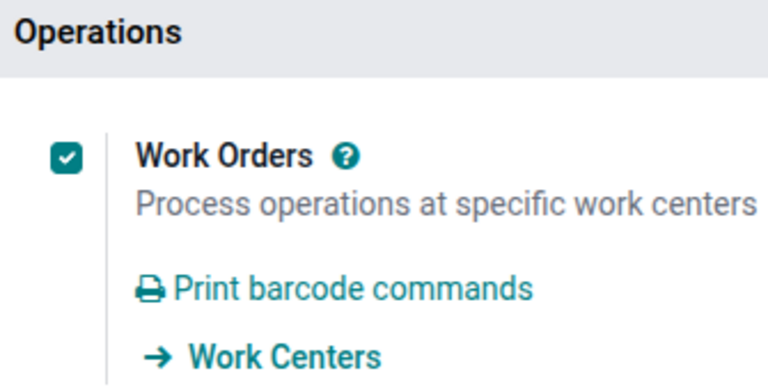
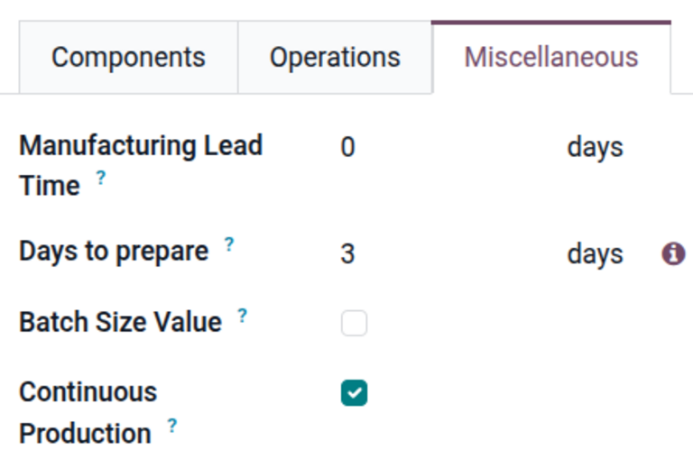
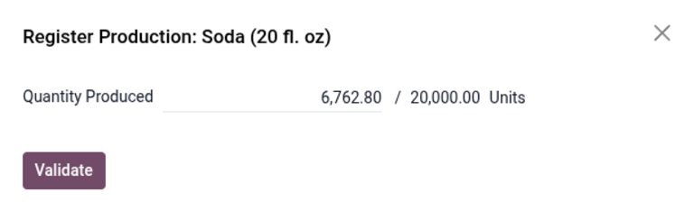
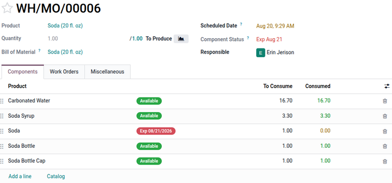
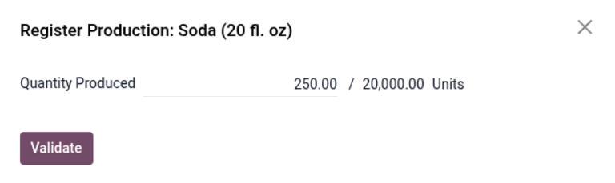
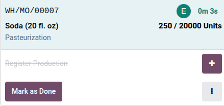

=====================
Continuous production
=====================

.. |MO| replace:: :abbr:`MO (Manufacturing Order)`
.. |MOs| replace:: :abbr:`MOs (Manufacturing Orders)`
.. |BOM| replace:: :abbr:`Bill of Materials (BOM)`

Continuous production lets manufacturers process work orders in partial quantities. When enabled on
a bill of materials, registering production on a work order automatically unblocks the next work
order, making the next dependent work order ready before the full quantity of the previous is
finished.

If the manufacturing order (MO) is closed before the full demand is produced, Odoo's normal
backorder flow handles the remaining quantity.

The standard |MO| flow is sequential, meaning each work order waits for the previous work order to
finish the full quantity before the next work order can start. That works for simple cases, but it
can create unnecessary idle time when manufactured goods move through an assembly line from one
machine or work station to the next. In those environments, products are often produced in batches,
waves, or a steady line, rather than as one single finished block.

Continuous production changes that behavior by letting a completed partial quantity advance to the
next operation before the full |MO| is done. For example, if the first operation has finished 20
units out of 100, those 20 units can start the next operation while the first work center continues
producing the remaining 80.

The quantities produced enter stock after the |MO| is complete.

Enable settings
===============

Navigate to :menuselection:`Manufacturing app --> Configuration --> Settings`. In the *Operations*
section, select the :guilabel:`Work Orders` checkbox.

Set up BOM
==========

Next:

#. :doc:`Set up a bill of materials (BOM) <../basic_setup/bill_configuration>`
#. :ref:`Enable continuous production on a product <manufacturing/continuous_production/enable-cp>`

.. _manufacturing/continuous_production/enable-cp:

Enable continuous production
----------------------------

Continuous production for a product is set up through its |BOM|.

To set up continuous production for a product, navigate to :menuselection:`Manufacturing app -->
Products --> Bills of Materials`, then open the |BOM|.

.. note::
   Alternatively, navigate to :menuselection:`Manufacturing app --> Operations --> Manufacturing
   Orders` and open a manufacturing order. Then, click the :icon:`oi-arrow-right`
   :guilabel:`(Internal link)` icon next to the :guilabel:`Bill of Material` field.

   If using this method, save the changes, then update the |BOM| in the |MO|.

In the *Miscellaneous* tab of the |BOM|, select the :guilabel:`Continuous Production` checkbox. This
setting ensures that when production is registered on a work order, the next work order is unblocked
to allow production to continue on what is produced.

Continuous production on |MOs|
==============================

After enabling continuous production on a |BOM|, work orders can proceed as components become
available, allowing work centers to remain active while components are unavailable.

First, navigate to :menuselection:`Manufacturing app --> Operations --> Manufacturing Orders`. Then,
create a manufacturing order for a product under continuous production.

Continuous production can be registered from a work order, ideally from the *Shop Floor* module.

Shop Floor can be opened one of two ways:

- **From the MO**: Navigate to :menuselection:`Manufacturing app --> Operations --> Manufacturing
  Orders`, and open or create an |MO|. In the |MO| form, click the :icon:`oi-view-kanban`
  :guilabel:`Shop Floor` smart button. The *Overview* opens, displaying the first work order of the
  |MO|.
- **From the main Odoo dashboard**: From the main Odoo dashboard, open the :menuselection:`Shop
  Floor` module. The *Overview* opens, displaying work orders for all |MOs|.

Registering partial production
------------------------------

To process a work order where only a partial quantity is produced, click the :icon:`fa-ellipsis-v`
:guilabel:`(vertical ellipsis)` icon on the work order card. Then, click :icon:`fa-plus`
:guilabel:`Register Quantity / Lot` button to open the *Register Production* window.

In the :guilabel:`Quantity Produced` field, enter the quantity produced, then click
:guilabel:`Validate`.

The registered units can move on to the next work order.

Example
=======

A company produces `20 fl. oz Soda` using three work orders:

#. Mixing
#. Bottling and sealing
#. Pasteurization

Four components make up each completed soda:

- `16.7` `fluid ounces` of `Carbonated Water` (consumed during the mixing stage)
- `3.3` `fluid ounces` of `Soda Syrup` (consumed during the mixing stage)
- `1` `unit` of `Soda Bottle` (consumed during the bottling and sealing stage)
- `1` `unit` of `Soda Bottle Cap` (consumed during the bottling and sealing work order)

The production facility aims to make 20,000 bottles of soda per day.

The company's five soda mixing machines can only contain 200 liters of water and syrup. They are
producing close to 12,000 liters per day. They need to be able to continuously produce soda to meet
the daily quota, so they have :ref:`enabled continuous production
<manufacturing/continuous_production/enable-cp>` on their soda |BOM| to allow soda to be bottled and
sealed as soon as it's mixed, then pasteurized.

Arthur is responsible for the first work order, mixing. He oversees the addition of the proper
amounts of carbonated water and soda syrup to each of the mixing machines. After five minutes,
mixing is complete, and Arthur registers production of each 200-liter batch in *Shop Floor*, using
a conversion from liters to fluid ounces.

He sends the mixed soda to the bottling machines. Marvin monitors the filling machine to ensure
sodas are bottled safely and accurately. Soda is pumped into bottles, which are then immediately
capped tightly as the sodas leave the machine. Marvin uses *Shop Floor* to register production for
every 250 bottles made.

The sodas leave via conveyor belt to enter the tunnel pasteurization machine. The bottles are
slowly heated to pasteurization temperature, then gradually cooled as they work their way through
the machine. Using *Shop Floor*, Bart registers production for every 250 bottles as they exit the
machine.

From there, the bottles can move on to packaging and then shipment.
