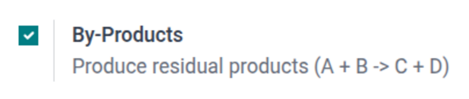
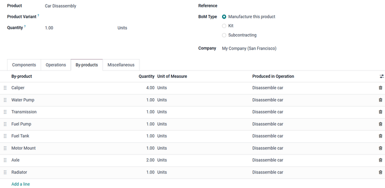
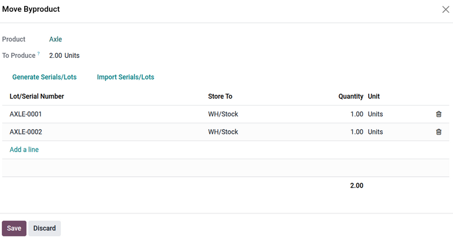
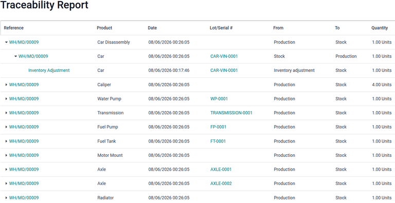
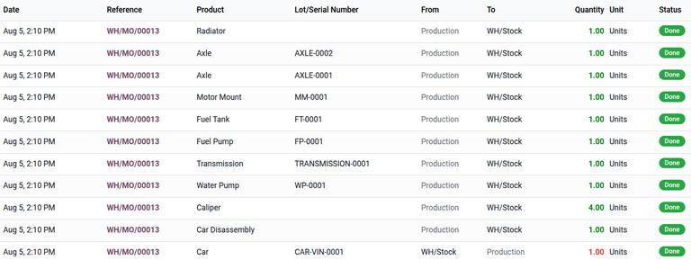

==================================
Dismantle products into components
==================================

.. |BOM| replace:: :abbr:`BoM (Bill of Materials)`
.. |MO| replace:: :abbr:`MO (Manufacturing Order)`

Some companies may take in products from external sources and retain components of those products
for future use. For example, a car junkyard may take in cars that are no longer functional and break
them down into their components, selling the functional parts to mechanics, who can make use of
those parts.

While :doc:`unbuild orders <unbuild_orders>` apply to products that are manufactured, purchased
products being disassembled rely on a bill of material's (BoM) :doc:`by-products <byproducts>` to
split the item into components and add those parts to inventory.

Creating by-products ensures that the components for each product can be entered into inventory,
complete with serial numbers (if they are used).

Typically, the process is as follows:

#. :ref:`Create a bill of materials for the product to dismantle
   <manufacturing/dismantle_products/create-bom>`.
#. Create a manufacturing order (MO) for the product.
#. :ref:`Break down the product into its by-product components
   <manufacturing/dismantle_products/dismantle>` and enter any tracking numbers (like lots or serial
   numbers) for the component parts.
#. :ref:`Enter parts into inventory <manufacturing/dismantle_products/inventory>` by clicking
   :guilabel:`Produce All` on the manufacturing order.

.. _manufacturing/dismantle_products/config:

Enable settings
===============

To set up Odoo to dismantle products into by-products, navigate to :menuselection:`Manufacturing app
--> Configuration --> Settings`. In the *Operations* section, select the :guilabel:`By-Products`
checkbox.

.. _manufacturing/dismantle_products/create-bom:

Create bill of materials
========================

First, create a new |BoM| for the product that will be dismantled.

Set up a :ref:`new BoM <manufacturing/basic_setup/bom-setup>`. Be sure to name the product in a way
that differentiates it from the product being disassembled.

Add the product being disassembled to the |BoM| as a component. Doing this will ensure that the
on-hand quantity of the product being disassembled will decrease by `1` every time an |MO| is
completed.

:ref:`Add by-products <manufacturing/byproducts/add-to-bom>` to the |BoM| that define the components
that will be entered into inventory as a result of an |MO|.

If necessary, add work orders and operations to the |BoM| to track disassembly.

After the |BoM| is created, create an |MO| and confirm it.

.. seealso::
   - :doc:`../basic_setup/one_step_manufacturing`
   - :doc:`../basic_setup/two_step_manufacturing`
   - :doc:`../basic_setup/three_step_manufacturing`

.. _manufacturing/dismantle_products/dismantle:

Dismantle product
=================

After the |MO| is confirmed, the product can be broken down into its component parts.

Retrieve the parts, or by-products, from the product.

If the by-products are tracked by lot or serial number, open the *By-Products* tab of the |MO|.
Click the :icon:`fa-list` :guilabel:`(Show Details)` icon to open the *Move Byproduct* window. Enter
the :guilabel:`Lot/Serial Number` for each by-product, then click :guilabel:`Save`.

.. _manufacturing/dismantle_products/inventory:

Enter by-products into inventory
--------------------------------

To enter the by-products into inventory, click the :guilabel:`Produce All` button on the |MO|.

To confirm that the products have been entered into inventory, click the :icon:`oi-arrow-up`
:guilabel:`Traceability` smart button. A *Traceability Report* opens, showing the manufacturing
order responsible for creating the by-products in the :guilabel:`Reference` column, the
:guilabel:`Lot/Serial #` associated with the by-products, where it is moving :guilabel:`From` and
:guilabel:`To`, and the :guilabel:`Quantity`.

Similar information can be found on the :icon:`fa-exchange` :guilabel:`Product Moves` smart button
of the manufacturing order.

