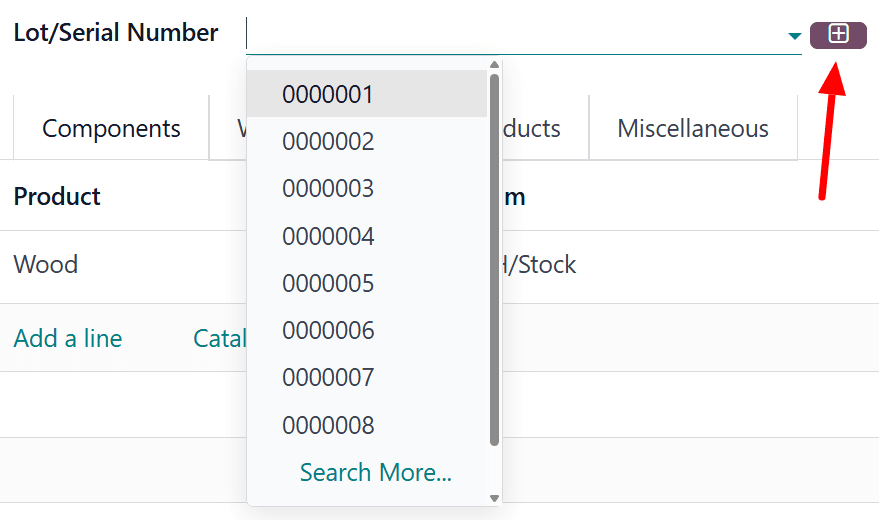
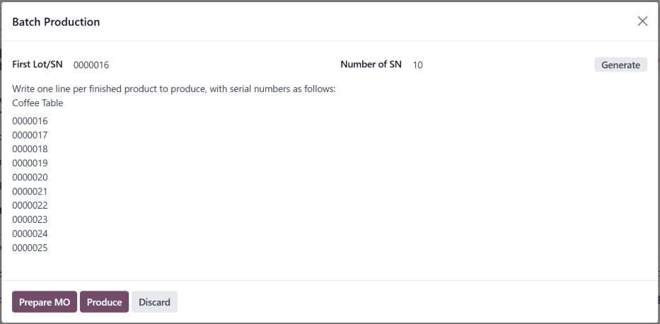

========================================
Manufacture with lots and serial numbers
========================================

.. |MO| replace:: :abbr:`MO (Manufacturing Order)`
.. |MOs| replace:: :abbr:`MOs (Manufacturing Orders)`

In Odoo, *lot numbers* and *serial numbers* are used to identify and track products in Odoo. Serial
numbers are used to assign unique numbers to individual products, while lot numbers are used to
assign a single number to multiple units of a specific product.

When manufacturing products tracked using lots or serial numbers, Odoo requires the lot or serial
number to be assigned to each product before manufacturing can be completed. This ensures that each
product is properly tracked from the moment it enters inventory.

Configure products for tracking
===============================

By default, Odoo tracks the quantity of each product on hand, but does not track individual units of
a product. Lot or serial number tracking must be enabled for each product individually.

To track a product using lots or serial numbers, begin by navigating to :menuselection:`Inventory
--> Configuration --> Settings`, then scroll down to the :guilabel:`Traceability` section, and tick
the :guilabel:`Lots & Serial Numbers` checkbox. Finally, click :guilabel:`Save` to save the change.

Next, click on :menuselection:`Products --> Products`, and select a product to track. Make sure the
:guilabel:`Track Inventory` checkbox is ticked in the :guilabel:`General Information` tab. Since lot
and serial number functionality is enabled, a drop-down menu appears next to the ticked checkbox.

Click on the :guilabel:`Track Inventory` drop-down menu. By default, :guilabel:`By Quantity` is
selected, which only tracks the quantity on hand. Select :guilabel:`By Lots` to track the product
using lot numbers, or :guilabel:`By Unique Serial Number` to track the product using serial numbers.

.. seealso::
   :doc:`Lots <../../inventory/product_management/product_tracking/lots>`
   :doc:`Serial numbers <../../inventory/product_management/product_tracking/serial_numbers>`

Lot number manufacturing
========================

To manufacture a product tracked with lots, begin by navigating to :menuselection:`Manufacturing -->
Operations --> Manufacturing Orders`. Click :guilabel:`New` to create a new manufacturing order
(MO).

In the :guilabel:`Product` field, select a product tracked using lots, and enter the desired
:guilabel:`Quantity`. Click :guilabel:`Confirm` to confirm the |MO|.

Once the |MO| is confirmed, a :guilabel:`Lot/Serial Number` field appears in the top section of the
|MO| form. By default, this field is empty.

To populate the :guilabel:`Lot/Serial Number` field with a lot number, click the
:icon:`fa-plus-square-o` :guilabel:`(plus)` icon to the right of the field. Doing so automatically
generates a lot, using the next available number, and enters it in the field.

Alternatively, click on the :guilabel:`Lot/Serial Number` field and select an existing lot number,
or manually enter a new lot number and click :guilabel:`Create "#"` in the drop-down menu.

Either of these methods assign the product(s) in the |MO| a lot number before production is
finished. It is also possible to complete production and close the |MO| by clicking
:guilabel:`Produce All`, without assigning a lot number. Doing so automatically generates and
assigns a lot, using the next available number.

Serial number manufacturing
===========================

To manufacture a product tracked with serial numbers, begin by navigating to
:menuselection:`Manufacturing --> Operations --> Manufacturing Orders`. Click :guilabel:`New` to
create a new |MO|.

In the :guilabel:`Product` field, select a product tracked using serial numbers, and enter the
desired :guilabel:`Quantity`. Click :guilabel:`Confirm` to confirm the |MO|.

Once the |MO| is confirmed, a :guilabel:`Lot/Serial Number` field appears in the top section of the
|MO| form. By default, this field is empty.

The rest of the manufacturing process depends on how many units the |MO| contains.

Manufacture single unit
-----------------------

If a single unit of the product is being manufactured, clicking :guilabel:`Produce All` closes the
|MO|, and automatically generates and assigns the next available serial number, which appears in the
:guilabel:`Lot/Serial Number` field.

To assign a serial number without closing the |MO|, enter a number manually in the
:guilabel:`Lot/Serial Number` field, and click :guilabel:`Create "#"`, or click the
:icon:`fa-plus-square-o` :guilabel:`(plus)` icon to the right of the field to auto-fill it with the
next available number.

Manufacture multiple units
--------------------------

.. important::
   When manufacturing a product tracked using serial numbers, an |MO| can be created for multiple
   units. However, when serial numbers are assigned to each unit, either at the end of production or
   before, the |MO| is split into multiple |MOs|, each containing one unit of the product.

   Each of the split |MOs| is identified by a numerical tag added to the end of the original |MO|
   number.

   .. example::
      |MO| `WH/MO/00109` contains two units of a `Chair`, a product tracked using serial numbers. A
      serial number is assigned to each unit of the chair. This causes the |MO| to be split into two
      |MOs|, each containing one unit of the chair. The |MOs| are titled `WH/MO/00109-001` and
      `WH/MO/00109-002`.

To assign serial numbers to each unit of an |MO|, click :guilabel:`Produce All` to open the
:guilabel:`Batch Production` pop-up window.

The :guilabel:`First Lot/SN` field of the pop-up window is auto-filled with the next available
serial number. The :guilabel:`Number of SN` field defaults to the number of units being
manufactured. The values of either field can be changed manually.

Click :guilabel:`Generate` to generate the specified number of serial numbers, beginning with the
number entered in the :guilabel:`First Lot/SN` field. The serial numbers are displayed in the text
box at the bottom of the pop-up window, and can be manually changed after generation.

To assign serial numbers without completing production, click the :guilabel:`Prepare MO` button.
Doing so splits the |MO| into individual |MOs|, one for each unit in the original |MO|. Each |MO| is
left open, and can be closed individually.

To assign serial numbers and complete production, click the :guilabel:`Produce` button. Doing so
splits the |MO| into individual |MOs|, one for each unit in the original |MO|. All of the |MOs| are
closed, since production is complete.

After clicking :guilabel:`Prepare MO` or :guilabel:`Produce`, the :menuselection:`Manufacturing` app
automatically shows the first of the split |MOs| (ex. `WH/MO/00109-001`). To view and access the
rest the split |MOs|, click the :guilabel:`Backorders` smart button at the top of the screen.
