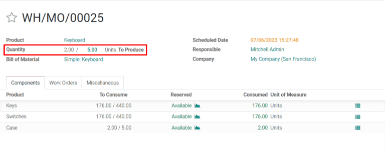
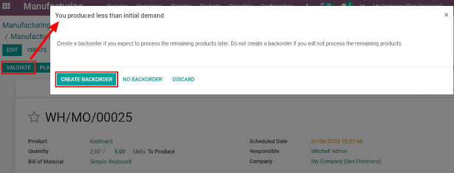
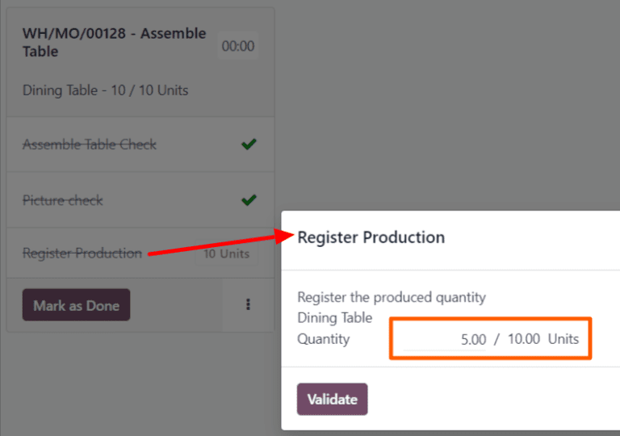

========================
Manufacturing backorders
========================

.. |MO| replace:: :abbr:`MO (Manufacturing Order)`

In some cases, the full quantity of a manufacturing order cannot be produced immediately. When this
happens, Odoo *Manufacturing* allows for the manufacturing of partial quantities of the order and
creates a *backorder* for the remaining amount.

In the *Manufacturing* app, creating a backorder splits the original manufacturing order into two
orders. The reference tag for each order is the tag used for the original order, followed by a
hyphen and then an additional number to indicate that it's a backorder.

.. example::
   A company creates a manufacturing order with the reference tag *WH/MO/00175*, for 10 units of
   *Product X*. After starting work on the manufacturing order, the employee working the production
   line realizes there are only enough components in stock to produce five units of the product.

   Instead of waiting for additional stock of the components, they manufacture five units and create
   a backorder for the remaining five. This splits the manufacturing order into two separate orders:
   *WH/MO/00175-001* and *WH/MO/00175-002*.

   Order *001* contains the five units that have been manufactured, and is immediately marked as
   :guilabel:`Done`. Order *002* contains the five units that still need to be manufactured and is
   marked as :guilabel:`In Progress`. Once the remaining components are available, the employee
   returns to order *002* and manufactures the remaining units before closing the order.

Create a manufacturing backorder
================================

To create a backorder for part of a manufacturing order, begin by navigating to
:menuselection:`Manufacturing --> Operations --> Manufacturing Orders`. Select a manufacturing order
with a quantity of two or more or create one by clicking :guilabel:`Create`.

If a new manufacturing order is created, select a product from the :guilabel:`Product` drop-down
menu and enter a quantity of two or more in the :guilabel:`Quantity` field, then click
:guilabel:`Confirm` to confirm the order.

After manufacturing the quantity that is being produced immediately, enter that number in the
:guilabel:`Quantity` field at the top of the manufacturing order.

Next, click :guilabel:`Validate`, and a :guilabel:`You produced less than initial demand` pop-up
window appears, from which a backorder can be created. Click :guilabel:`Create Backorder` to split
the manufacturing order into two separate orders, with the reference tags *WH/MO/XXXXX-001* and
*WH/MO/XXXXX-002*.

Order *001* contains the items that have been manufactured, and is closed immediately. Order *002*
is the backorder that contains the items that have yet to be manufactured, and remains open, to be
completed at a later date.

Once the remaining units can be manufactured, navigate to :menuselection:`Manufacturing -->
Operations --> Manufacturing Orders`, and then select the backorder manufacturing order. If all of
the remaining units are manufactured immediately, simply click :guilabel:`Validate` to close the
order.

If only some of the remaining units are manufactured immediately, create another backorder for the
remainder by following the steps detailed in this section.

Create a backorder in Shop Floor
================================

Backorders for manufacturing orders can also be created from the *Shop Floor* module.

.. note::
   In order to use the *Shop Floor* module, the *Work Orders* setting must be enabled. To do so,
   navigate to :menuselection:`Manufacturing --> Configuration --> Settings`, enable the
   :guilabel:`Work Orders` checkbox, and then click :guilabel:`Save`.

To create a backorder from the *Shop Floor* module, begin by navigating to
:menuselection:`Manufacturing --> Operations --> Manufacturing Orders`. Select an |MO| for multiple
units of a product, for which a backorder needs to be created.

On the |MO|, select the :guilabel:`Work Orders` tab, and then click the :guilabel:`Open Work Order
(external link icon)` button on the line of the work order to be processed. On the resulting
:guilabel:`Work Orders` pop-up window, click the :guilabel:`Open Shop Floor` button to open the
*Shop Floor* module.

When accessed from a specific work order, the *Shop Floor* module opens to the page for the work
center where the order is configured to be processed, and isolates the work order's card so that no
other cards are shown.

Complete the steps on the work order's card until the :guilabel:`Register Production` step is
reached, and then click on it to open the :guilabel:`Register Production` pop-up window.

.. important::
   Do **not** click the :guilabel:`# Units` button on the right side of the step. Doing so
   automatically registers the full amount of units as having been produced.

On the :guilabel:`Register Production` pop-up window, enter the number of units produced in the
:guilabel:`Quantity` field. Make sure the number entered is *less* than the number of units listed
to the right of the field. Then, click :guilabel:`Validate`.

The pop-up window disappears and the :guilabel:`# Units` button on the work order's card updates to
reflect the number of units produced, as a fraction of the number of units for which the |MO| was
originally created.

Next, click the :guilabel:`Mark as Done` button at the bottom-right of the work order's card. The
work order card begins to fade away. Once it disappears completely, a new work order card appears,
titled with the original |MO|'s reference number with a `-002` tag added to the end of it.

This new reference number represents the backorder |MO|. The original |MO|'s reference number now
appears with a `-001` tag added to the end of it to distinguish it from the backorder |MO|.

If the original |MO| has no remaining work orders, it can be closed by selecting the :guilabel:`All`
filter in the top navigation of the *Shop Floor* module, and then clicking :guilabel:`Close
Production` at the bottom of the |MO|'s card.

If the original |MO| has remaining work orders that must be completed before it can be closed, cards
for these work orders appear on the *Shop Floor* pages for the work centers where they are
configured to be carried out. They can be processed as normal, and additional backorders can be
created from their work order cards using the instructions detailed in this section.

Once the current work order for the backorder |MO| is ready to be processed, this can also be
completed as normal, and an additional backorder can be created from its work order card by
following the instructions detailed in this section.

After the final work order for the backorder |MO| has been completed, the |MO| can be closed by
clicking the :guilabel:`Close Production` button at the bottom of the work order's card.
