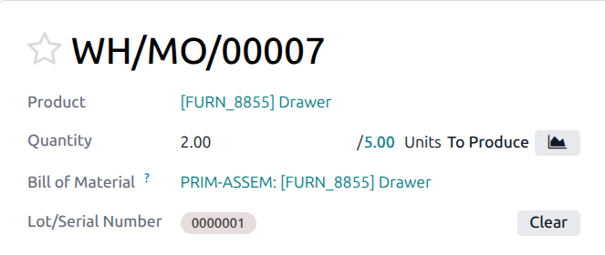
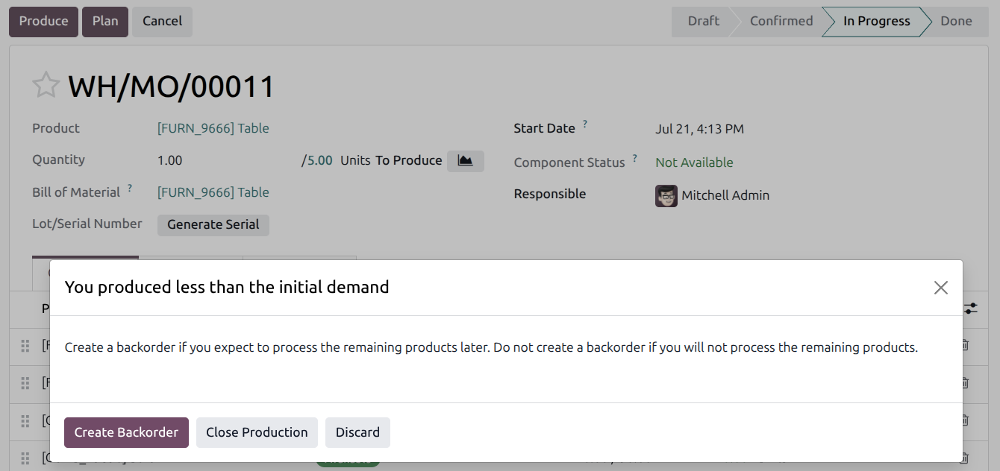
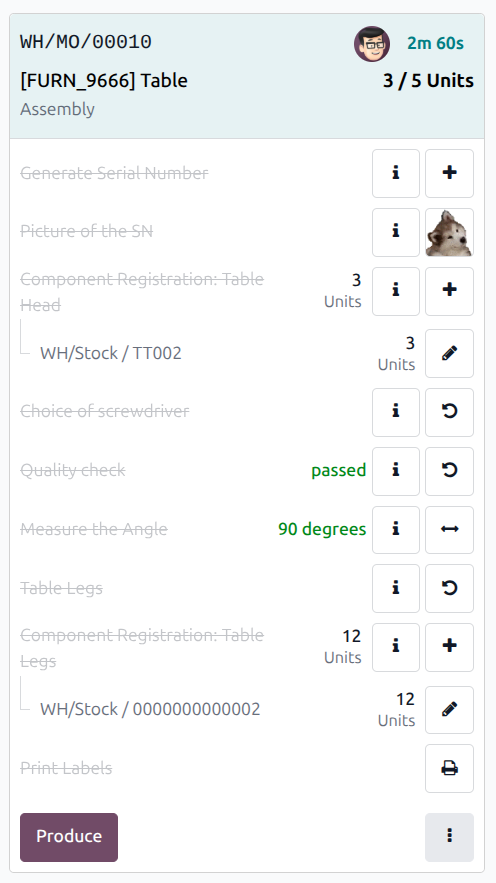

.. |MO| replace:: :abbr:`MO (Manufacturing Order)`

========================
Manufacturing backorders
========================

In some cases, the full quantity of a manufacturing order cannot be produced immediately. When this
happens, the *Manufacturing* app can manufacture partial quantities of the order and create a
*backorder* for the remaining amount. To manufacture the full quantity of a manufacturing order, see
:ref:`Create a manufacturing order <manufacturing/manufacturing-orders/create-mo>`.

Creating a backorder splits the original manufacturing order into two orders. The reference tag for
each order is the tag used for the original order, followed by a hyphen and then an additional
number to indicate that it is a backorder. Backorders can be created :ref:`in the **Manufacturing**
app <manufacturing/manufacturing-backorders/create-backorder-manufacturing-app>` or :ref:`from the
*Shop Floor* module <manufacturing/manufacturing-backorders/create-backorder-shop-floor>`.

.. example::
   A company creates a manufacturing order with the reference tag *WH/MO/00175*, for 10 units of
   *Product X*. After starting work on the manufacturing order, the employee working the production
   line realizes there are only enough components in stock to produce five units of the product.

   Instead of waiting for additional stock of the components, they manufacture five units and create
   a backorder for the remaining five. This splits the manufacturing order into two separate orders:
   *WH/MO/00175-001* and *WH/MO/00175-002*.

   Order *001* contains the five units that have been manufactured, and is immediately marked as
   :guilabel:`Done`. Order *002* contains the five units that still need to be manufactured and is
   marked as :guilabel:`In Progress`. Once the remaining components are available, the employee
   returns to order *002* and manufactures the remaining units before closing the order.

.. _manufacturing/manufacturing-backorders/create-backorder-manufacturing-app:

Create a backorder in Manufacturing app
=======================================

To create a backorder for part of a manufacturing order, begin by navigating to
:menuselection:`Manufacturing --> Operations --> Manufacturing Orders`. Select a manufacturing order
with a quantity of two or more or create one by clicking :guilabel:`Create`.

If a new manufacturing order is created, select a product from the :guilabel:`Product` drop-down
menu and enter a quantity of two or more in the :guilabel:`Quantity` field, then click
:guilabel:`Confirm` to confirm the order.

After manufacturing the quantity that is being produced immediately, enter that number in the
:guilabel:`Quantity` field at the top of the manufacturing order.

Next, click :guilabel:`Produce`. If the quantity of consumed materials does not match the quantity
of products produced, a :guilabel:`Consumption Warning` pop-up window appears. Click
:guilabel:`Confirm` to keep the existing quantity of consumed materials, or click :guilabel:`Update
Quantities & Validate` to match the consumed quantities to the quantity of products produced. A
:guilabel:`You produced less than the initial demand` pop-up window appears.

Click :guilabel:`Create Backorder` to split the manufacturing order into two separate orders, with
the reference tags *WH/MO/XXXXX-001* and *WH/MO/XXXXX-002*.

    window.

Order *001* contains the items that have been manufactured, and is closed immediately. Order *002*
is the backorder that contains the items that have yet to be manufactured, and remains open, to be
completed at a later date.

Once the remaining units can be manufactured, navigate to :menuselection:`Manufacturing -->
Operations --> Manufacturing Orders`, and then select the backorder manufacturing order. If all of
the remaining units are manufactured immediately, click :guilabel:`Produce` to close the order.

If only some of the remaining units are manufactured immediately, create another backorder for the
remainder by following the steps detailed in this section.

.. _manufacturing/manufacturing-backorders/create-backorder-shop-floor:

Create a backorder in Shop Floor
================================

Backorders for manufacturing orders can also be created from the *Shop Floor* module.

.. note::
   In order to use the *Shop Floor* module, the *Work Orders* setting must be enabled. To do so,
   navigate to :menuselection:`Manufacturing --> Configuration --> Settings`, enable the
   :guilabel:`Work Orders` checkbox, and then click :guilabel:`Save`.

To create a backorder from the *Shop Floor* module, begin by navigating to
:menuselection:`Manufacturing --> Operations --> Manufacturing Orders`. Select an |MO| for multiple
units of a product, for which a backorder needs to be created.

On the |MO|, select the :guilabel:`Work Orders` tab, and then click the :guilabel:`Open Work Order
(external link icon)` button on the line of the work order to be processed. On the resulting
:guilabel:`Work Orders` pop-up window, click the :guilabel:`Open Shop Floor` button to open the
*Shop Floor* module.

When accessed from a specific work order, the *Shop Floor* module opens to the page for the work
center where the order is configured to be processed, and isolates the work order's card so that no
other cards are shown.

Complete the steps on the work order's card, then click :guilabel:`Produce`. If the quantity of
consumed materials does not match the quantity of products produced, a :guilabel:`Consumption
Warning` pop-up window appears. Click :guilabel:`Confirm` to keep the existing quantity of consumed
materials, or click :guilabel:`Update Quantities & Validate` to match the consumed quantities to the
quantity of products produced. A :guilabel:`You produced less than the initial demand` pop-up window
appears.

Click :guilabel:`Create Backorder` to split the manufacturing order into two separate orders.

If the original |MO| has remaining work orders that must be completed before it can be closed, cards
for these work orders appear on the *Shop Floor* pages for the work centers where they are
configured to be carried out. They can be processed as normal, and additional backorders can be
created from their work order cards using the instructions detailed in this section.

Once the current work order for the backorder |MO| is ready to be processed, this can also be
completed as normal, and an additional backorder can be created from its work order card by
following the instructions detailed in this section.

After the final work order for the backorder |MO| has been completed, the |MO| can be closed by
clicking the :guilabel:`Close Production` button at the bottom of the work order's card.
