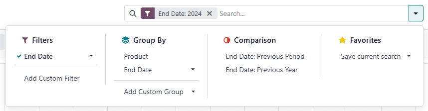
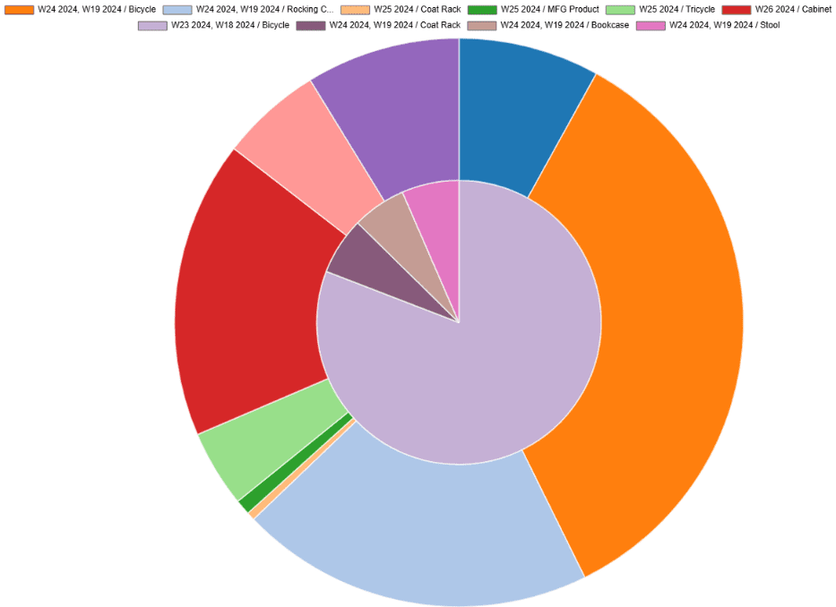
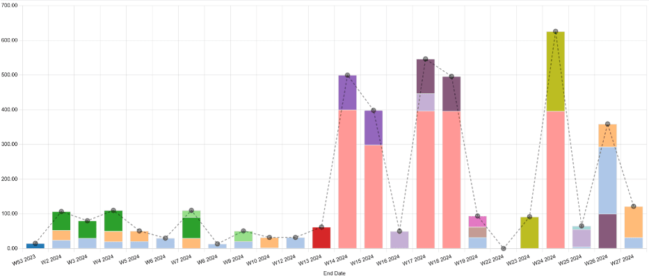
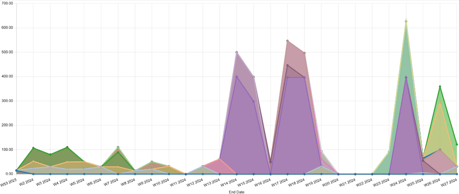
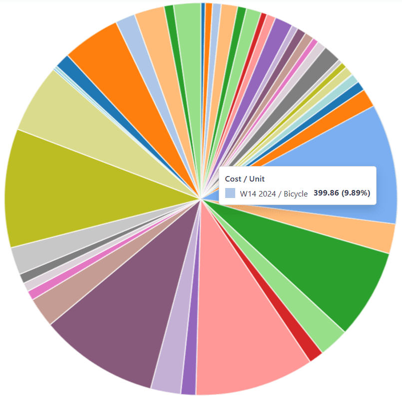
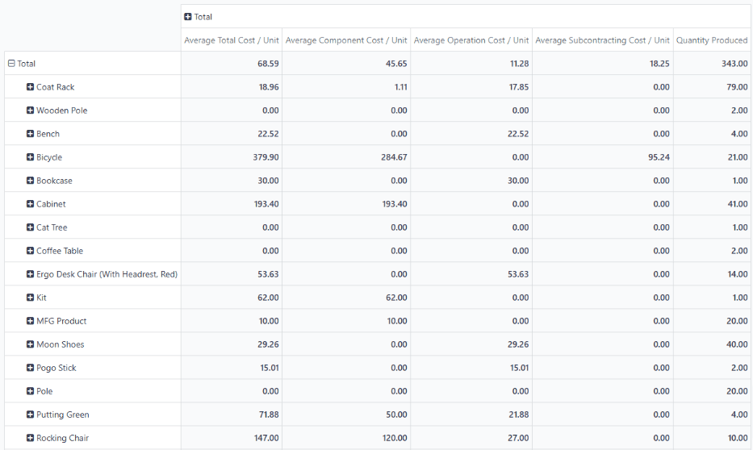

===================
Production analysis
===================

.. |MO| replace:: :abbr:`MO (manufacturing order)`
.. |MOs| replace:: :abbr:`MOs (manufacturing orders)`

The *production analysis* report provides statistics about products manufactured using Odoo's
*Manufacturing* app. The report is useful when trying to understand production costs, manufacturing
durations, and other important statistics about manufactured products.

To open the production analysis report, navigate to :menuselection:`Manufacturing app --> Reporting
--> Production Analysis`.

Search bar options
==================

In the :guilabel:`Search...` bar at the top of the :guilabel:`Production Analysis` dashboard,
a variety of filters and groupings are available to refine the data shown in the report.

By default, the :guilabel:`Search...` bar includes the :guilabel:`End Date: [current year]` filter,
so that data is only displayed for |MOs| completed within the current calendar year. To remove this
filter, and show older data as well, click the :icon:`oi-close` :guilabel:`(Remove)` button on the
right side of the filter.

To only show the data for a specific product, type the product's name in the :guilabel:`Search...`
bar, and press enter. Multiple products can be entered into the search bar, so that only the data
for those products is shown.

In addition to typing in the :guilabel:`Search...` bar to refine the data shown, clicking the
:icon:`fa-caret-down` :guilabel:`(toggle)` button on the right side of the bar opens a drop-down
menu providing additional refinement options. These are organized into the :icon:`fa-filter`
:guilabel:`Filter`, :icon:`oi-group` :guilabel:`Group By`, and :icon:`fa-adjust`
:guilabel:`Comparison` sections.

Filters
-------

The :guilabel:`Filters` section of the drop-down menu is used to select the time period for which
production data is displayed. To select a time period, click the :icon:`fa-caret-down`
:guilabel:`(toggle)` button next to :guilabel:`End Date`, and click one of the options.

The time periods to choose from are the three most recent months, each quarter of the current fiscal
year (:guilabel:`Q1`, :guilabel:`Q2`, :guilabel:`Q3`, :guilabel:`Q4`), and the three most recent
years.

.. note::
   Additional filter options can be selected by clicking the :guilabel:`Add Custom Filter` button.

Group By
--------

The :guilabel:`Group By` section of the drop-down menu is used to group manufacturing data into
specific categories. This makes each graph type show data based on that category, rather than
individual weeks.

.. example::
   With the bar chart graph type selected, clicking the :guilabel:`Product` option in the
   :guilabel:`Group By` section causes the chart to show one bar for each product, instead of one
   bar for each week during the selected time period.

Comparison
----------

The options in the :guilabel:`Comparison` section are used to compare production data from two
different time periods. There are two comparison options to choose from: :guilabel:`End Date:
Previous Period` and :guilabel:`End Date: Previous Year`.

To view data using one of the two comparisons, begin by selecting a time period in the
:guilabel:`End Date` field of the :guilabel:`Search...` bar. Then, make sure to select either the
:icon:`fa-pie-chart` :guilabel:`(pie chart)` graph type or the :icon:`oi-view-pivot`
:guilabel:`(pivot)` view.

Finally, select either :guilabel:`End Date: Previous Period` or :guilabel:`End Date: Previous Year`
in the :guilabel:`Comparison` section of the :guilabel:`Search...` bar drop-down menu.

With one of the :guilabel:`Comparison` options enabled, the pie chart appears as a large circle with
a smaller circle inside of it. The larger circle represents the selected time period, while the
smaller circle represents the same unit of time (month, quarter, year), one period or year previous.

.. example::
   :guilabel:`Q3` is selected in the :guilabel:`End Date` filter section of the
   :guilabel:`Search...` bar. In the :guilabel:`Comparison` section, :guilabel:`End Date: Previous
   Year` is selected.

   The current year is 2024, so the larger circle shows data for the third quarter (Q3) of 2024. The
   smaller circle shows data for the third quarter of 2023, which is the same unit of time, but one
   *year* previous.

   If :guilabel:`End Date: Previous Period` is selected instead, the smaller circle shows data for
   second quarter of 2024, which is the same unit of time, but one *period* previous.

.. important::
   The :guilabel:`Comparison` section only appears in the :guilabel:`Search...` bar drop-down menu if
   one or more time periods is selected in the :guilabel:`Filters --> End Date` section. This is
   because a time period must be selected, or else there would be nothing to make a comparison to.

   Additionally, the comparison view is meant to be used with the :icon:`fa-pie-chart`
   :guilabel:`(pie chart)` graph type, or the :icon:`oi-view-pivot` :guilabel:`(pivot)` view.

Measures
========

*Measures* are the datasets that can be selected in the production analysis report. Each dataset
represents a specific statistic about |MOs| in the database. Choose a measure by clicking the
:guilabel:`Measures` :icon:`fa-caret-down` button, and selecting one of the following options from
the drop-down menu:

- :guilabel:`Average Component Cost/Unit`: the average cost of the components required to produce
  one unit of the product.
- :guilabel:`Average Employee Cost/Unit`: the average cost paid to employees to produce one unit of
  the product.
- :guilabel:`Average Subcontracting Cost/Unit`: the average cost of engaging a subcontractor to
  produce one unit of the product.
- :guilabel:`Average Total Cost/Unit`: the average cost of producing one unit of the product,
  including component, employee, operation, and subcontracting costs.
- :guilabel:`By-Products Total Cost`: the total value of all by-products created by manufacturing
  the product.
- :guilabel:`Duration of Operations/Unit`: the average total duration of operations required to
  produce one unit of the product.
- :guilabel:`Quantity Demanded`: the total number of units of the product included in |MOs|.
- :guilabel:`Quantity Produced`: the total number of units of the product that have actually been
  produced.
- :guilabel:`Total Component Cost`: the total amount spent on the product's components, across every
  MO for the product.
- :guilabel:`Total Cost`: the total amount spent manufacturing every unit of the product produced so
  far.
- :guilabel:`Total Duration of Operations`: the cumulative duration of every operation completed
  while manufacturing the product.
- :guilabel:`Total Employee Cost`: the cumulative amount paid to employees to manufacture the
  product.
- :guilabel:`Total Operation Cost`: the cumulative amount spent on operations required to produce
  the product.
- :guilabel:`Total Operation Cost/Unit`: the average cost of the operations required to produce
  one unit of the product.
- :guilabel:`Total Subcontracting Cost`: the cumulative amount paid to subcontractors to produce the
  product.
- :guilabel:`Yield Percentage (%)`: the total quantity of the product produced versus the total
  quantity demanded, represented as a percentage.
- :guilabel:`Count`: the total count of |MOs| created for the product.

.. note::
   Only one measure can be selected at a time.

Views
=====

By default, the production analysis dashboard displays data using the *line chart* graph type of the
*graph view*.

To select the bar chart or pie chart graph type instead, click the :icon:`fa-bar-chart`
:guilabel:`(bar chart)`, or :icon:`fa-pie-chart` :guilabel:`(pie chart)` button below the
:guilabel:`Search...` bar. To return to the line chart, click the :icon:`fa-line-chart`
:guilabel:`line chart` button.

To see production data displayed in a pivot table instead of a graph, click the
:icon:`oi-view-pivot` :guilabel:`(pivot view)`, button to the right of the :guilabel:`Search...`
bar. To return to graph view, click the :icon:`fa-area-chart` :guilabel:`(graph view)` button.

Bar chart
---------

The x-axis of the bar chart lists each week of the selected :guilabel:`End Date` time period. The
y-axis displays ascending numbers representing the count of whichever metric was selected on the
:guilabel:`Measure` drop-down menu (ex. Average Total Cost/Unit). Thus, each bar represents the
total count during a single week of the selected time period.

Each bar is divided into sections representing one of the products manufactured during that week. By
default, the sections are stacked on top of one another to form a single bar.

To view the sections as individual bars, click the :icon:`fa-database` :guilabel:`(stacked)` button
to the right of the graph view buttons, to deactivate the stacking feature. Click the button again
to return to the stacked view.

Mouse over a bar, or a section of a bar, to see a popover providing a few details about it:

- The selected :guilabel:`Measure`.
- The week and year.
- The product produced.
- The total count of the selected :guilabel:`Measure`, during the week and year.

Click on a bar, or a section of a bar, to open a page listing all of the |MOs| contained within it.

Line chart
----------

The x-axis of the line chart lists each week of the selected :guilabel:`End Date` time period. The
y-axis displays ascending numbers representing the count of whichever metric was selected on the
:guilabel:`Measure` drop-down menu (ex. Total Component Cost). Thus, each point on the chart
represents the total count during a single week of the selected time period.

A uniquely colored line appears on the chart for each product manufactured during the selected
:guilabel:`End Date` time period, connecting the points for each week. By default, the points on the
chart, and the lines connecting them, are stacked on top of one another to show the total count of
all products for each week.

To view the points unstacked, click the :icon:`fa-database` :guilabel:`(stacked)` button to the
right of the graph view buttons, to deactivate the stacking feature. Click the button again to
return to the stacked view.

Mouse over a week to see a popover providing a few details about the products produced during it:

- The selected :guilabel:`Measure`.
- A line for each product, showing:
  - The color used to represent the product.
  - The week and year.
  - The name of the product.
  - The total count of the selected :guilabel:`Measure`, during the week and year.

Pie chart
---------

The pie chart displays one slice of pie for each product produced during each week of the selected
:guilabel:`End Date` time period.

.. example::
   The month of February is selected in the :guilabel:`End Date` section of the
   :guilabel:`Search...` bar. Units of a *chair* product and units of a *table* product were
   manufactured during each of the four weeks of the month.

   This means that the pie chart shows eight slices. Each slice represents one of the two products,
   and one of the four weeks in which it was produced.

Mouse over a pie slice to see a popover providing a few details:

- The selected :guilabel:`Measure`.
- The week and year.
- The product produced.
- The total count of the selected :guilabel:`Measure`, during the week and year.
- The percentage of the slice relative to the rest of the pie chart.

Click on a slice to open a page listing all of the |MOs| contained within it.

Pivot view
----------

Pivot view displays production data in a pivot table. By default, each row of the table lists one
product, and the columns display the following data for each of those products:

- :guilabel:`Average Total Cost/Unit`
- :guilabel:`Average Component Cost/Unit`
- :guilabel:`Average Operation Cost/Unit`
- :guilabel:`Average Subcontracting Cost/Unit`
- :guilabel:`Quantity Produced`

To change the data categories displayed, click the :guilabel:`Measures` :icon:`fa-caret-down`
button, and select or deselect categories from the popover window that appears.

Click one of the column titles to sort the data from the lowest to the highest value. Click the
title again to sort from the highest to the lowest value.

To make the rows of the pivot table display time periods instead of products, begin by clicking the
:icon:`fa-minus-square-o` :guilabel:`Total` button above the product names, which removes the
product rows, and changes the button to appear as :icon:`fa-plus-square` :guilabel:`Total`.

Click :icon:`fa-plus-square` :guilabel:`Total` to open a popover window showing options for the data
categories that can be displayed. Mouse over the :guilabel:`End Date` line to open a second popover
window showing time periods to choose from. Click one of the time periods, and the table updates to
show one unit of the period for each row.

Use case: compare products
==========================

One of the best uses for the production analysis report is comparing statistics about two or more
products. This is accomplished by entering the products into the :guilabel:`Search...` bar, then
selecting the necessary measure, filter, and grouping, to see the desired data.

.. example::
   Toy manufacturer *Tommy's Toys* is trying to reduce their manufacturing operation costs. To
   accomplish this, they've decided to identify redundant products and cease manufacturing the ones
   with higher operation costs.

   Two of the toys that have been singled out for analysis are the *pogo stick* and *moon shoes*.
   Tommy's Toys believes that these two toys are so similar that they can stop manufacturing one,
   without significantly impacting their product offering.

   To compare operation costs for the toys, business analyst Mike opens the
   :guilabel:`Manufacturing` app and navigates to the :guilabel:`Production Analysis` page. In the
   :guilabel:`Search...` bar, he enters the names of both products. Then, he opens the drop-down
   menu, and clicks :guilabel:`Product` in the :guilabel:`Group By` section.

   Below the :guilabel:`Search...` bar, Mike clicks on the :guilabel:`Measures` :icon:`fa-caret-down`
   drop-down menu, and selects the :guilabel:`Total Operation Cost/Unit` option. Finally, he selects
   the :icon:`fa-bar-chart` :guilabel:`(bar chart)` graph type.

   With these options selected, the production analysis report shows a bar chart for the current
   year, with one bar for each product, signifying the average operation cost for one unit of the
   product.

   With this data, Mike is able to see that the average operation cost for the moon shoes is almost
   twice the cost of the pogo stick. Using this insight, Tommy's Toys decides to cease production of
   moon shoes, thus lowering their average cost of manufacturing operations.

   .. image:: production_analysis/use-case.png
      :align: center
      :alt: The bar chart comparing the operation costs of the pogo stick and moon shoes.
