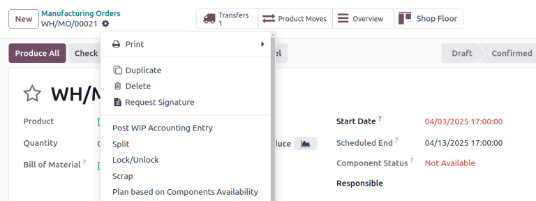
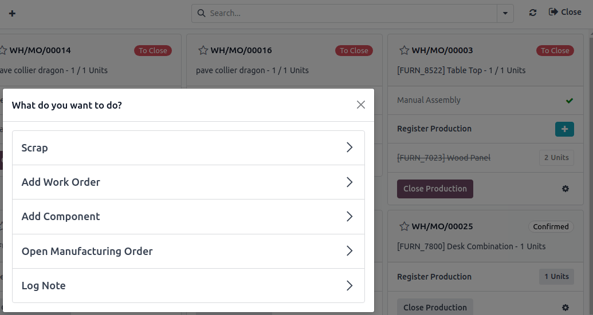

==========================
Scrap during manufacturing
==========================

.. |MO| replace:: :abbr:`MO (Manufacturing Order)`

During the manufacturing process, scrapping components or finished products may be necessary when
items are damaged, defective, or no longer usable.

Tracking scrapped materials helps manufacturers monitor waste, identify process issues, and account
for production costs.

In Odoo, scrapped items are removed from physical inventory and moved to a virtual location called
*Virtual Locations/Scrap*. This location is not a physical space—it is a way to log and track losses
without affecting real stock levels.

.. seealso::
   :doc:`Location types <../../inventory/warehouses_storage/inventory_management>`

.. tip::
   Scrap orders can be viewed by navigating to :menuselection:`Inventory --> Operations --> Scrap`.
   Each scrap order shows the date and time the order was created, along with the product and
   quantity that was scrapped.

   To view the total quantity of each item scrapped, navigate to :menuselection:`Inventory -->
   Configuration --> Locations`, then remove the :guilabel:`Internal` filter from the
   :guilabel:`Search...` bar to display all virtual locations. From the list, select the
   :guilabel:`Virtual Locations/Scrap` location.

.. _manufacturing/management/scrap-window:

Navigate to the scrap window
============================

Scrapping can be done in either the **Manufacturing** app or the **Shop Floor** module, depending on
the task.

**Manufacturing** app allows:

- Scrapping finished products (only if the |MO| is in the *Done* stage).
- Scrapping components (while the |MO| is in the *Draft* or *Confirmed* stage).

**Shop Floor** allows:

- Scrapping only components.

Manufacturing app
-----------------

To scrap a product from the **Manufacturing** app, go to :menuselection:`Manufacturing -->
Operations --> Manufacturing Orders` and select the desired |MO|.

On the |MO|, click the :icon:`fa-cog` :guilabel:`(Actions)` icon, then choose :guilabel:`Scrap` from
the drop-down menu.

Shop Floor
----------

In **Shop Floor**, only components can be scrapped. Navigate to the desired |MO| card, and then tap
the :icon:`fa-cog` :guilabel:`(Actions)` icon and in the :guilabel:`What do you want to do?` pop-up
window, select :guilabel:`Scrap`.

Scrap pop-up window
===================

After opening the :guilabel:`Scrap Products` pop-up window using one of the methods :ref:`detailed
above <manufacturing/management/scrap-window>`, select the component or finished product being
scrapped, from the :guilabel:`Product` drop-down menu.

In the :guilabel:`Quantity` field, enter the quantity being scrapped.

By default, the :guilabel:`Source Location` field is set to the warehouse's pre-production location,
while the :guilabel:`Scrap Location` field is set to the :guilabel:`Virtual Locations/Scrap`
location. If either the source or scrap location should be changed, select a different location from
their respective drop-down menus.

Enable the :guilabel:`Replenish Scrapped Quantities` checkbox if a picking order should be created
to replace the scrapped component upon confirmation of the scrap order. This option should only be
enabled for warehouses with :doc:`two-step <../basic_setup/two_step_manufacturing>` or
:doc:`three-step <../basic_setup/three_step_manufacturing>` manufacturing enabled, since components
are not picked as part of the :doc:`one-step <../basic_setup/one_step_manufacturing>` manufacturing
process.

.. image:: scrap_manufacturing/scrap-window.png
   :alt: The Scrap pop-up window.

After filling out the :guilabel:`Scrap Products` pop-up window, click the :guilabel:`Scrap Products`
button. After one or more scrap orders have been created, a :guilabel:`Scraps` smart button appears
at the top of the screen. Click it to view a list of all scrap orders for the |MO|.
