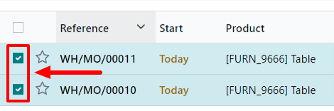
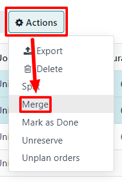

====================================
Split and merge manufacturing orders
====================================

In Odoo *Manufacturing*, it is possible to create manufacturing orders for a single unit of an item,
or multiple units of the same item. In some cases, it may be necessary to split a manufacturing
order that contains multiple units into two or more orders, or to merge two or more orders into a
single order.

.. important::
   A manufacturing order can only contain one unit of a product, or multiple units of a single
   product that all use the same Bill of Materials (BoM). As a result, it is only possible to merge
   manufacturing orders when every order contains the same product being manufactured with the same
   BoM.

Split manufacturing orders
==========================

To split a manufacturing order into multiple orders, begin by navigating to
:menuselection:`Manufacturing --> Operations --> Manufacturing Orders`, then select a manufacturing
order. At the top of the page, next to the :guilabel:`New` button, the manufacturing order's
reference number appears with a :guilabel:`⚙️ (settings)` button next to it.

Click the :guilabel:`⚙️ (settings)` button to open the general settings for the manufacturing order,
then select :guilabel:`Split`.

.. image:: split_merge/settings-split.png
   :align: center
   :alt: The Settings and Split buttons on a manufacturing order.

After selecting :guilabel:`Split`, a :guilabel:`Split production` pop-up window appears. In the
:guilabel:`Split #` field, enter the number of manufacturing orders that the original order should
be split into, then click outside of the field. A table appears below, with a line for each new
manufacturing order that will be created by the split. In the :guilabel:`Quantity To Produce`
column, enter the number of units that will be assigned to each new manufacturing order. Finally,
click :guilabel:`Split` to split the manufacturing order.

.. image:: split_merge/split-production-window.png
   :align: center
   :alt: The Split production pop-up window for a manufacturing order.

After clicking :guilabel:`Split`, the original manufacturing order is split into the number of
orders that was specified in the :guilabel:`Split #` field. The reference numbers for the new
manufacturing orders are the reference number for the original order with *-###* tags added to the
end.

.. example::
   Manufacturing order *WH/MO/00012* is split into three separate orders. The reference numbers for
   the new orders are *WH/MO/00012-001*, *WH/MO/00012-002*, and *WH/MO/00012-003*.

Merge manufacturing orders
==========================

To merge two or more manufacturing orders into a single order, begin by navigating to
:menuselection:`Manufacturing --> Operations --> Manufacturing Orders`. Select the manufacturing
orders that will be merged by activating the checkbox to the left of the name of each order.

Once all manufacturing orders have been selected, click the :guilabel:`Actions` button at the top of
the page, then select :guilabel:`Merge` from the drop-down menu.

The selected manufacturing orders are merged into a single order. The reference number for the new
manufacturing order is the next sequential number that has *not* already been assigned to an order.

.. example::
   The last reference number used for a manufacturing order was *WH/MO/00012*. Two manufacturing
   orders, *WH/MO/00008* and *WH/MO/00009*, are merged into a single order. The reference number for
   the manufacturing order created by the merger is *WH/MO/00013*.

In the :guilabel:`Source` field for the manufacturing order created by the merger, the reference
numbers of the manufacturing orders that were merged are listed.

.. example::
   Manufacturing orders *WH/MO/00009* and *WH/MO/00010* are merged to create *WH/MO/00011*. The
   source field for *WH/MO/00011* lists both *WH/MO/00009* and *WH/MO/00010*.
