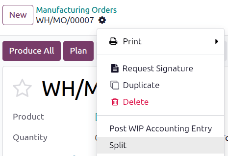
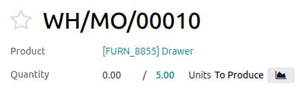
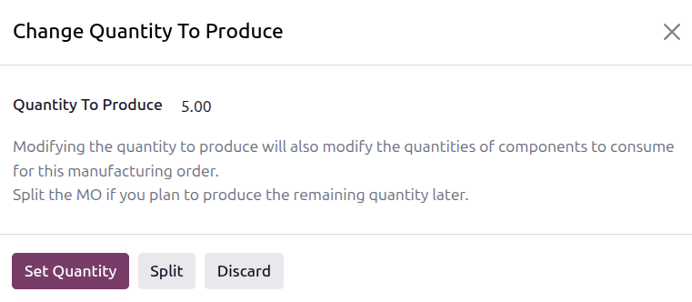

====================================
Split and merge manufacturing orders
====================================

.. |MO| replace:: :abbr:`MO (manufacturing order)`
.. |MOs| replace:: :abbr:`MOs (manufacturing orders)`
.. |BoM| replace:: :abbr:`BoM (bill of materials)`

In Odoo *Manufacturing*, it is possible to create manufacturing orders (MOs) for a single unit of an
item, or multiple units of the same item. A partially produced manufacturing order may be split to
account for both completed units and remaining production requirements. This process ensures that
the current |MO| reflects only the quantity actually finished, while supplementary |MOs| track the
balance.

An |MO| should be split if the remaining quantity cannot be completed immediately due to internal or
external constraints.

When a split is executed, the system updates the original |MO| to reflect the specific quantity that
has been produced and is ready for closing. Then, new |MOs| are automatically generated for the
difference between the original planned quantity and the actual produced quantity. This ensures that
lead times, labor costs, and material consumption remain accurately allocated to the specific
timeframe in which the work occurred.

Splits can be set up from the |MO| form.

.. important::
   An |MO| can only contain one unit of a product, or multiple units of a single product that all
   use the same bill of materials (BoM). As a result, it is only possible to merge |MOs| for the
   same products with the same |BoM|.

Split manufacturing orders
==========================

|MOs| can be split in two ways:

- :ref:`manufacturing/workflows/split-actions-menu`
- :ref:`manufacturing/workflows/split-qty-to-produce`

.. _manufacturing/workflows/split-actions-menu:

From the actions menu
---------------------

To split an |MO| into multiple orders, begin by navigating to :menuselection:`Manufacturing app -->
Operations --> Manufacturing Orders`, then select a confirmed |MO|. At the top of the page, next to
the :guilabel:`New` button, the |MO|'s reference number appears with a :icon:`fa-cog`
:guilabel:`(Actions)` icon next to it.

Click the :icon:`fa-cog` :guilabel:`(Actions)` icon to reveal the drop-down menu for the |MO|, then
select :guilabel:`Split`.

After selecting :guilabel:`Split`, a *Split production* pop-up window appears. In the :guilabel:`Max
Batch Size` field, enter the number of units that each batch should be split into, then click
outside of the field. The :guilabel:`# Splits` field updates with the total number of |MOs| that
will be created. A table appears below, with a line for each new |MO| that will be created by the
split. In the :guilabel:`Quantity To Produce` column, enter the number of units that will be
assigned to each new |MO|. Finally, click :guilabel:`Split` to split the |MO|.

.. example::
   A work order for `5` units of the `Drawer` product are split with a :guilabel:`Max Batch Size` of
   `2`. This creates 3 splits; two of the splits contain `2` units each, and the final split
   contains a single unit.

   .. image:: split_merge/split-production-window.png
      :alt: The Split production pop-up window for a manufacturing order.

After clicking :guilabel:`Split`, the original |MO| is split into the number of orders that was
specified in the :guilabel:`# Split` field. The reference numbers for the new |MOs| are the
reference number for the original order with `-###` tags added to the end.

.. example::
   |MO| `WH/MO/00012` is split into three separate orders. The reference numbers for the new orders
   are:

   - `WH/MO/00012-001`
   - `WH/MO/00012-002`
   - `WH/MO/00012-003`

To complete the |MOs|, complete all work orders, then click the :guilabel:`Produce All` button on
the |MO| form.

.. _manufacturing/workflows/split-qty-to-produce:

From the Change Quantity to Produce window
------------------------------------------

To split an |MO| from the *Change Quantity to Produce* window, first navigate to
:menuselection:`Manufacturing app --> Operations --> Manufacturing Orders`. Open a confirmed |MO|
from the list, or create a new one by clicking :guilabel:`New`, completing the form, and clicking
:guilabel:`Confirm`.

After the |MO| is confirmed, its :guilabel:`Quantity to Produce` can be updated to account for a
split |MO|. Click the second value in the :guilabel:`Quantity` field, next to :guilabel:`Units To
Produce`.

The *Change Quantity to Produce* pop-up window opens. Change the :guilabel:`Quantity to Produce`
value to the actual quantity currently produced, then click the :guilabel:`Split` button.

After clicking :guilabel:`Split`, the original |MO| is split into two orders. The reference numbers
for the new |MOs| are the reference number for the original order with `-###` tags added to the end.

.. example::
   The parent order `WH/MO/00015` with `10` units of the `Drawer` product is split based on
   production progress. The two |MOs| created are:

   - `WH/MO/00015-001` with `7` units
   - `WH/MO/00015-002` with `3` remaining units.

For traceability, the :icon:`fa-wrench` :guilabel:`Backorders` smart button appears. Click it to
view both |MOs|.

Additionally, in the first |MO|, a link to the second backorder appears in the chatter.

When the units for the first |MO| are produced, complete the work orders and click the
:guilabel:`Produce All` button to complete it.

When the second |MO| is ready to complete, open it from the *Manufacturing Orders* page or from the
chatter of the first |MO|. Complete all work orders and click the :guilabel:`Produce All` button.

Merge manufacturing orders
==========================

To merge two or more |MOs| into a single order, begin by navigating to :menuselection:`Manufacturing
app --> Operations --> Manufacturing Orders`. Select the |MOs| that will be merged by selecting the
checkbox to the side of the name of each order.

Once all |MOs| have been selected, click :icon:`fa-cog` :menuselection:`Actions --> Merge`.

The selected |MOs| are merged into a single order. The reference number for the new |MO| is the next
sequential number that has *not* already been assigned to an order.

.. example::
   The last reference number used for an |MO| was `WH/MO/00012`. Two |MOs|, `WH/MO/00008` and
   `WH/MO/00009`, are merged into a single order. The reference number for the |MO| created by the
   merger is `WH/MO/00013`.
