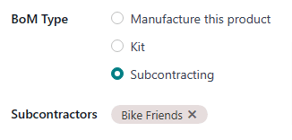

=========================
Dropship to subcontractor
=========================

.. |SO| replace:: :abbr:`SO (Sales Order)`
.. |SOs| replace:: :abbr:`SOs (Sales Orders)`
.. |PO| replace:: :abbr:`PO (Purchase Order)`
.. |POs| replace:: :abbr:`POs (Purchase Orders)`
.. |RfQ| replace:: :abbr:`RfQ (Request for Quotation)`
.. |BoM| replace:: :abbr:`BoM (Bill of Materials)`

In manufacturing, subcontracting is the process of a company engaging a third-party manufacturer, or
subcontractor, to manufacture products that are then sold by the contracting company.

In Odoo, the *Dropship Subcontractor on Order* route is used to purchase the necessary components
for a subcontracted product from the vendor, and have them delivered directly to the subcontractor,
each time a purchase order (PO) for that product is confirmed.

The subcontractor then uses the components to manufacture the desired product, before shipping it
back to the contracting company.

.. important::
   It is necessary to understand the differences between the *Dropship* and *Dropship Subcontractor
   on Order* routes. While both routes involve dropshipping, they are used for different purposes.

   The *Dropship* route is used to purchase products from a vendor, and have them shipped directly
   to the end customer.

   The *Dropship Subcontractor on Order* route is used to purchase components from a vendor, and
   have them shipped directly to a subcontractor. By default, finished products are then sent from
   the subcontractor back to the contracting company.

   However, it is possible to combine both the *Dropship* and *Dropship Subcontractor on Order*
   routes so they are used for the same product. In this workflow, components are dropshipped to the
   subcontractor, who then ships the finished product directly to the end customer.

   This can be achieved by following steps one through five in the :ref:`workflow section
   <manufacturing/workflows/subcontracting-dropship>` of this doc.

Configuration
=============

To use the *Dropship Subcontractor on Order* route, navigate to :menuselection:`Manufacturing app
--> Configuration --> Settings`, and enable the checkbox next to :guilabel:`Subcontracting`, under
the :guilabel:`Operations` heading.

Once the *Subcontracting* setting is enabled, it is also necessary to properly configure the
subcontracted product, the product's |BoM|, and the components listed on the |BoM|.

Configure product
-----------------

To configure a product for the *Dropship Subcontractor on Order* route, navigate to
:menuselection:`Inventory app --> Products --> Products`, and select a product, or create a new one
by clicking :guilabel:`New`.

Select the :guilabel:`Purchase` tab, and add the product's subcontractor as a vendor by clicking
:guilabel:`Add a line`, selecting the subcontractor in the :guilabel:`Vendor` drop-down menu, and
entering a price in the :guilabel:`Price` field.

Then, click on the :guilabel:`Inventory` tab to configure a route that determines what happens to
the finished product, once it has been manufactured by the subcontractor.

If the finished product is shipped back to the contracting company, make sure that the
:guilabel:`Buy` route is selected. In addition, select the :guilabel:`Replenish on Order (MTO)`
route to automatically create a |PO| for the product upon confirmation of a |SO|, unless there is
enough stock on-hand to fulfill the |SO|.

If the finished product is shipped directly to the customer by the subcontractor, make sure that
only the :guilabel:`Dropship` route is selected.

Configure bill of materials
---------------------------

To configure a |BoM| for the *Dropship Subcontractor on Order* route, click the :guilabel:`Bill of
Materials` smart button on the product's page, and select the |BoM|.

Alternatively, navigate to :menuselection:`Manufacturing app --> Products --> Bills of Materials`,
and select the |BoM| for the subcontracted product.

.. seealso::
   For a full overview of |BoM| configuration, see the :doc:`Bill of materials
   <../basic_setup/bill_configuration>` documentation.

In the :guilabel:`BoM Type` field, select the :guilabel:`Subcontracting` option. Then, add one or
more subcontractors in the :guilabel:`Subcontractors` field that appears below.

Finally, make sure that all necessary components are specified on the :guilabel:`Components` tab. To
add a new component, click :guilabel:`Add a line`, select the component in the :guilabel:`Component`
drop-down menu, and specify the required quantity in the :guilabel:`Quantity` field.

Configure Components
--------------------

To configure components for the *Dropship Subcontractor on Order* route, navigate to each component
from the |BoM| by selecting the component's name in the :guilabel:`Components` tab, and clicking the
:guilabel:`➡️ (right arrow)` button to the right of the name.

Alternatively, navigate to each component by going to :menuselection:`Inventory app --> Products -->
Products`, and selecting the component.

On the component product form, select the :guilabel:`Purchase` tab, and add a vendor by clicking
:guilabel:`Add a line`, selecting the vendor in the :guilabel:`Vendor` field, and adding the price
they sell the product for in the :guilabel:`Price` field. This is the vendor that sends components
to the subcontractor, once they are purchased.

Then, click on the :guilabel:`Inventory` tab and select the :guilabel:`Dropship Subcontractor on
Order` route in the :guilabel:`Routes` section.

Repeat the process for every component that must be dropshipped to the subcontractor.

.. _manufacturing/workflows/subcontracting-dropship:

Dropship subcontractor on order workflow
========================================

The dropship subcontractor on order workflow consists of up to six steps:

#. Create a sales order (SO) for the subcontracted product; doing so creates a *subcontractor* |PO|
   to purchase the product from the subcontractor.
#. Confirm the |PO| created in the previous step, or create a new |PO|; doing so creates a request
   for quotation (RfQ) to purchase the components from the vendor, as well as a receipt order or a
   dropship order.
#. Confirm the |RfQ| to turn it into a second |PO| (*vendor* |PO|); doing so creates a *Dropship
   Subcontractor* order.
#. Process the *Dropship Subcontractor* order once the vendor has sent the components to the
   subcontractor.
#. Process the receipt once the subcontractor has finished manufacturing the subcontracted product,
   and shipped it back to the contracting company **OR** process the dropship order to ship the
   product directly to the end customer.
#. If the workflow was started by creating an |SO|, and the finished product is not dropshipped to
   the end customer, process the delivery order once the product has been shipped to the customer.

The specific number of steps depends on the reason that the subcontracted product is being purchased
from the subcontractor.

If the reason is to fulfill a specific customer order, the process starts with creating an SO, and
ends with delivering the product to the customer, or having the subcontractor dropship it to them.

If the reason is to increase quantity of stock on-hand, the process starts with creating a PO, and
ends with receiving the product into inventory.

Create an SO
------------

It is only necessary to complete this step if the product is being purchased from the subcontractor
to fulfill a customer need. If the product is being purchased to increase the quantity of stock
on-hand, move on to the next step.

To create a new |SO|, navigate to :menuselection:`Sales app --> Orders --> Orders`, and click
:guilabel:`New`.

Select the customer in the :guilabel:`Customer` drop-down menu. Then, click :guilabel:`Add a
product` on the :guilabel:`Order Lines` tab, select the product in the :guilabel:`Product` drop-down
menu, and enter a quantity in the :guilabel:`Quantity` field.

Click :guilabel:`Confirm` to confirm the |SO|, at which point a :guilabel:`Purchase` smart button
appears at the top of the page. This is the *subcontractor* |PO|, or the |PO| created to purchase
the subcontracted product from the subcontractor.

.. note::
   An |SO| for the product only creates a *subcontractor* |PO| if the *Replenish on Order (MTO)*
   route is enabled on the product's page, **and** there is no stock of the product on-hand.

   If there is stock on-hand, confirming an |SO| for the product will instead create a delivery
   order, because Odoo assumes that the |SO| is fulfilled using the stock in the warehouse.

   This is not the case for subcontracted products that are dropshipped to the end customer. In that
   case, a *subcontractor* |PO| is **always** created, even if there is stock on-hand.

Process subcontractor PO
------------------------

If a *subcontractor* |PO| was not created in the previous step, do so now by navigating to
:menuselection:`Purchase app --> Orders --> Purchase Orders`, and clicking :guilabel:`New`.

Begin filling out the |PO| by selecting a subcontractor from the :guilabel:`Vendor` drop-down menu.

In the :guilabel:`Products` tab, click :guilabel:`Add a product` to create a new product line.
Select a product produced by the subcontractor in the :guilabel:`Product` field, and enter the
quantity in the :guilabel:`Quantity` field.

Finally, click :guilabel:`Confirm Order` to confirm the *subcontractor* |PO|.

When a |PO| is confirmed for a product that requires dropshipping components to a subcontractor, a
receipt or dropship order is automatically created, and can be accessed from the corresponding
:guilabel:`Receipt` or :guilabel:`Dropship` smart button that appears at the top of the |PO|.

.. image:: subcontracting_dropship/subcontractor-po.png
   :align: center
   :alt: A subcontractor PO for a *Dropship Subcontractor on Order* product, with a Receipt smart
         button at the top of the page.

In addition, an |RfQ| is created for the components that are purchased from the vendor and sent to
the subcontractor. However, the |RfQ| **IS NOT** automatically linked to the *subcontractor* |PO|.

Once the |RfQ| is confirmed and becomes a *vendor* |PO|, a *Dropship Subcontractor* order is
created. This order is linked to both the *vendor* |PO| and the *subcontractor* |PO|.

Confirm vendor RfQ
------------------

To access the |RfQ| created by confirming the *subcontractor* |PO|, navigate to
:menuselection:`Purchase app --> Orders --> Requests for Quotation`. Select the |RfQ| that lists the
correct vendor in the :guilabel:`Vendor` field, and the reference number of the receipt that was
created after confirming *subcontractor* |PO|, in the :guilabel:`Source Document` field.

On the |RfQ|, the :guilabel:`Deliver To` field reads :guilabel:`Dropship Subcontractor`, and the
:guilabel:`Dropship Address` field shows the name of the subcontractor to whom components are being
dropshipped.

Click :guilabel:`Confirm Order` to turn the |RfQ| into a *vendor* |PO|, and confirm the purchase of
components from the vendor. After doing so, a :guilabel:`Dropship` smart button appears at the top
of the *vendor* |PO|, and a :guilabel:`Resupply` smart button appears at the top of the
*subcontractor* |PO|.

.. image:: subcontracting_dropship/vendor-po.png
   :align: center
   :alt: A vendor PO for the components of a *Dropship Subcontractor on Order* product, with a
         Dropship smart button at the top of the page.

Process Dropship Subcontractor order
------------------------------------

Once the components have been delivered to the subcontractor, navigate to :menuselection:`Purchase
app --> Orders --> Purchase Orders`, and select the *vendor* |PO| or the *subcontractor* |PO|. Then,
click the :guilabel:`Dropship` smart button or the :guilabel:`Resupply` smart button, respectively.

Clicking either button opens the *Dropship Subcontractor* order. Click the :guilabel:`Validate`
button at the top of the order to confirm that the subcontractor has received the components.

Process receipt or dropship order
---------------------------------

Once the subcontractor has manufactured the finished product, navigate to :menuselection:`Purchase
app --> Orders --> Purchase Orders`, and select the *subcontractor* |PO|.

If the subcontracted product should be received into inventory, once the product arrives, click the
:guilabel:`Receive Products` button at the top of the *subcontractor* |PO| to open the receipt.
Then, click :guilabel:`Validate` at the top of the receipt to register the product into inventory.

Alternatively, select the :guilabel:`Receipt` smart button at the top of the *subcontractor* |PO|,
and click :guilabel:`Validate` at the top of the receipt.

If the subcontracted product should be dropshipped, select the :guilabel:`Dropship` button at the
top of the page to open the dropship order, and click :guilabel:`Validate` once the subcontractor
has sent the product to the customer.

Process delivery order
----------------------

If the subcontracting workflow was started by a customer |SO|, and the finished product was **not**
dropshipped to the customer, but rather delivered to the contracting company, it is necessary to
ship the product to the customer, and process the delivery order.

Once the product has been shipped to the customer, navigate to the :menuselection:`Sales` app, and
select the |SO|. Select the :guilabel:`Delivery` smart button at the top of the page to open the
delivery order, and click :guilabel:`Validate` to confirm that the product has been shipped to the
customer.
