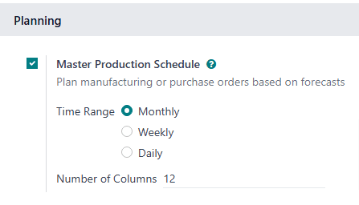
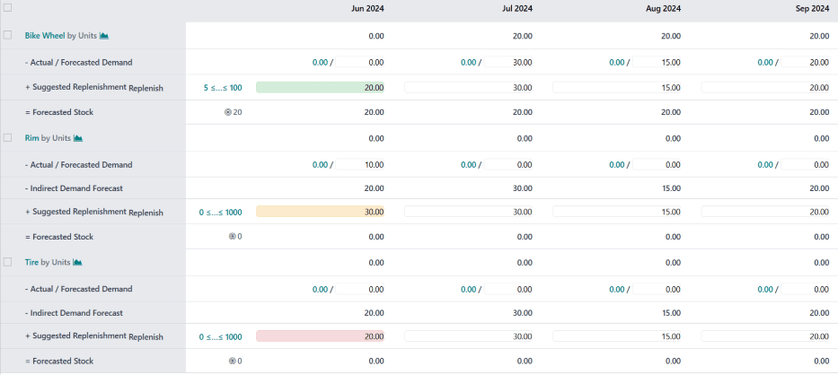
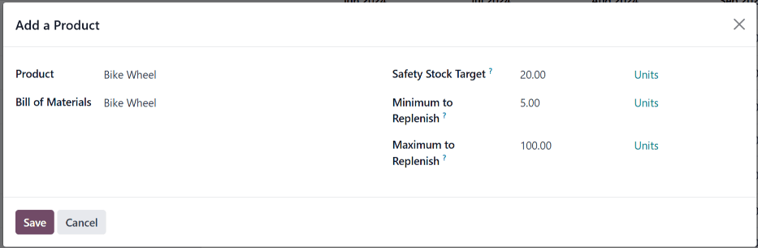

==========================
Master production schedule
==========================

.. |SO| replace:: :abbr:`SO (sales order)`
.. |PO| replace:: :abbr:`PO (purchase order)`
.. |MO| replace:: :abbr:`MO (manufacturing order)`
.. |SOs| replace:: :abbr:`SOs (sales orders)`
.. |POs| replace:: :abbr:`POs (purchase orders)`
.. |MOs| replace:: :abbr:`MOs (manufacturing orders)`
.. |MPS| replace:: :abbr:`MPS (Master Production Schedules)`
.. |BoM| replace:: :abbr:`BoM (Bill of Materials)`
.. |RfQ| replace:: :abbr:`RfQ (Request for Quotation)`
.. |RfQs| replace:: :abbr:`RfQs (Requests for Quotation)`

In Odoo's *Manufacturing* app, the *master production schedule* (MPS) is used to manually plan
manufacturing orders (MOs) and purchase orders (POs), based on forecasted quantities of products and
components.

By considering the impact of confirmed |MOs| and |POs|, along with manually adjusted demand
forecasts, the |MPS| can be used to manage long-term product replenishment. This ensures the
continued availability of the necessary products and components.

Since the |MPS| allows for manual intervention, it is useful for replenishing products where the
demand of existing sales orders (SOs) does **not** reflect probable future demand.

.. example::
   A retail store sells artificial *Christmas trees* during the holiday season. It is currently
   September, and the store has less than ten Christmas tree |MOs| confirmed for the month of
   December.

   Despite the number of confirmed |MOs|, the procurement manager knows that the demand for
   Christmas trees in December is going to be much higher, once the holiday season starts. As a
   result, they manually enter a greater demand in the |MPS|, so they can properly replenish the
   product in time for the increase in customer demand.

.. important::
   It is essential to remember that the |MPS| is a **MANUAL** tool. Adding a product to the |MPS|
   does not cause it to be manufactured or purchased automatically. The |MPS| simply suggests the
   amount of the product that should be replenished, but requires user input to create the |MOs| or
   |POs| that are used to replenish it.

   For this reason, it is recommended that the |MPS| **NOT** be used alongside reordering rules for
   the same product. Because reordering rules are an automated workflow, they conflict with the
   manual replenishment method of |MPS|. Using both, in unison, can lead to inaccurate forecasts and
   the creation of unnecessary replenishment orders.

Enable and configure |MPS|
==========================

To use the |MPS| feature, navigate to :menuselection:`Manufacturing app --> Configuration -->
Settings`, and tick the :guilabel:`Master Production Schedule` checkbox in the :guilabel:`Planning`
section. Finally, click :guilabel:`Save`.

After enabling the :guilabel:`Master Production Schedule` feature, two new fields appear under it on
the :guilabel:`Settings` page: :guilabel:`Time Range` and :guilabel:`Number of Columns`.

The :guilabel:`Time Range` field is used to select the period of time over which planning takes
place, and offers three options: :guilabel:`Monthly`, :guilabel:`Weekly`, and :guilabel:`Daily`. For
example, if :guilabel:`Monthly` is selected, the |MPS| plans the production requirements of products
and components on a monthly basis.

The :guilabel:`Number of Columns` field is used to specify the quantity of the selected
:guilabel:`Time Range` units shown on the |MPS| page. For example, if the :guilabel:`Time Range`
field is set to :guilabel:`Monthly`, and `12` is entered in the :guilabel:`Number of Columns` field,
the |MPS| shows one column for the next 12 months, starting with the current month.

If the values of the :guilabel:`Time Range` or :guilabel:`Number of Columns` fields are altered,
click :guilabel:`Save` again to save the changes.

|MPS| dashboard
===============

To open the |MPS|, navigate to :menuselection:`Manufacturing app --> Planning --> Master Production
Schedule`. The |MPS| view appears as follows:

The grey column on the left side of the screen shows a section for every product added to the |MPS|,
with each product section being broken down into smaller rows. The information shown in the rows
depends on the filters selected in the :guilabel:`Search...` bar drop-down menu at the top of the
page. The default categories that appear in the rows are:

- :guilabel:`[Product] by [unit]` :icon:`fa-area-chart`: the forecasted stock quantity at the
  beginning of each time period. :guilabel:`[Product]` and :icon:`fa-area-chart` are selectable
  buttons which open the product's page, or the forecast report for the product, respectively.
- :guilabel:`- Forecasted Demand`: the demand forecast, which is entered manually. This represents
  an estimate of the demand for the product during each time period.
- :guilabel:`- Indirect Demand Forecast`: while this is a default category, it **only** appears for
  products that are components of other products. It represents the demand for the component from
  existing MOs.
- :guilabel:`+ Suggested Replenishment`: the quantity of the product that is suggested to be
  replenished through |MOs| or |POs|. To the right of the category title is a
  :guilabel:`Replenish` button, which is used to manually replenish the product, based on the
  quantity suggested to be replenished.

  .. figure:: use_mps/replenish-button.png
     :align: center
     :alt: The Replenish button on the "+ Suggested Replenishment" row.

     The "Replenish" button on the "+ Suggested Replenishment" row.

- :guilabel:`= Forecasted Stock`: the quantity of the product forecasted to be in stock at the end
  of each time period, assuming that suggested replenishment numbers are fulfilled.

Altogether, these default categories form an equation:

.. math::
   \text{Forecasted Demand} + \text{Suggested Replenishment} = \text{Forecasted Stock}

In the case of components, the :guilabel:`Indirect Demand Forecast` is taken into account as well.

The :guilabel:`- Forecasted Demand` and :guilabel:`+ Suggested Replenishment` fields can be edited
for any of the time periods to the right of the product column. Doing so changes the equation, and
updates the value displayed in the :guilabel:`Forecasted Stock` field.

Changing the value in the :guilabel:`+ Suggested Replenishment` field also makes an :icon:`fa-times`
:guilabel:`(reset)` button appear to the left of the field. Click the :icon:`fa-times`
:guilabel:`(reset)` button next to the field to reset its value back to the one calculated by the
|MPS|.

.. important::
   While the |MPS| can be used with only the default categories enabled, it is advisable to also
   enable the :guilabel:`Actual Demand` category. This is done by clicking the :icon:`fa-caret-down`
   :guilabel:`(down arrow)` on the right side of the :guilabel:`Search...` bar, and enabling the
   :guilabel:`Actual Demand` option under the :guilabel:`Rows` header.

   With the :guilabel:`Actual Demand` option enabled, the :guilabel:`- Forecasted Demand` category
   changes to the :guilabel:`- Actual / Forecasted Demand` category. In addition to the manually
   entered forecasted demand, this category also displays the confirmed demand for the product,
   which is based on confirmed |SOs|.

Each column to the right of the products column lists one unit of the time period selected in the
*Time Range* field on the *Manufacturing* app *Settings* page (ex. months). The number of time
period columns corresponds to the value entered in the *Number of Columns* field.

The first time period column represents the current time period. For example, if the |MPS| is
configured to use months, the first column displays data for the current month. On this first
column, the :guilabel:`+ Suggested Replenishment` field appears in one of five colors:

- :guilabel:`Green`: a replenishment order must be generated to keep stock at the :guilabel:`Safety
  Stock Target`.
- :guilabel:`Gray`: a replenishment order has already been generated to keep stock at the
  :guilabel:`Safety Stock Target`.
- :guilabel:`Yellow`: a replenishment order has already been generated, but the quantity it was
  created for is not enough to keep stock at the :guilabel:`Safety Stock Target`.
- :guilabel:`Red`: a replenishment order has already been generated, but the quantity it was created
  for puts the amount of stock above the :guilabel:`Safety Stock Target`.

The :guilabel:`+ Suggested Replenishment` field appears white, if no replenishment order has been
generated, and it is not necessary to generate one at the current moment.

Add a product
=============

To use |MPS| to manage the replenishment of a product, navigate to :menuselection:`Manufacturing app
--> Planning --> Master Production Schedule`. At the top of the |MPS| page, click :guilabel:`Add a
Product` to open the :guilabel:`Add a Product` pop-up window.

.. important::
   Products **must** be properly configured to be replenished through the |MPS|.

   In the case of manufactured products, the *Manufacture* route must be selected in the *Routes*
   section of the *Inventory* tab, on the product's form.

   In the case of products that are purchased, the *Buy* route must be selected in the *Routes*
   section of the *Inventory* tab, on the product's form. Additionally, a vendor and the price they
   sell the product for must also be specified on the *Purchase* tab.

On the pop-up window, select the product to add in the :guilabel:`Product` drop-down menu. If the
product is replenished through manufacturing, select the product's |BoM| in the :guilabel:`Bill of
Materials` field.

.. note::
   Selecting a BoM when adding a product to the |MPS| also adds any components listed on the BoM. If
   it is not necessary to manage the replenishment of components through the |MPS|, simply leave the
   :guilabel:`Bill of Materials` field blank.

If the database is configured with multiple warehouses, a :guilabel:`Production Warehouse` field
appears on the :guilabel:`Add a Product` pop-up window. Use this field to specify which warehouse
the product is replenished to.

In the :guilabel:`Safety Stock Target` field, specify the minimum quantity of the product that
should be kept available for orders at all times. For example, if there should always be 20 units of
the product available for order fulfillment, enter `20` in the :guilabel:`Safety Stock Target`
field.

In the :guilabel:`Minimum to Replenish` field, enter the minimum product quantity for orders created
to replenish the product. For example, if `5` is entered in this field, replenishment orders for the
product include a minimum of five units.

In the :guilabel:`Maximum to Replenish` field, enter the maximum product quantity for orders created
to replenish the product. For example, if `100` is entered in this field, replenishment orders for
the product include a maximum of 100 units.

Finally, click :guilabel:`Save` to add the product to the |MPS|. The product now appears on the
|MPS| page each time it is opened. If a |BoM| was selected in the :guilabel:`Bill of Materials`
field of the :guilabel:`Add a Product` pop-up window, any components listed on the |BoM| appear on
the page, as well.

Edit a product
--------------

After adding a product to the |MPS|, it may be necessary to change the replenishment values entered
on the :guilabel:`Add a Product` pop-up window. To do so, click the :guilabel:`# ≤…≤ #` button to
the immediate right of the :guilabel:`Replenish` button, on the :guilabel:`+ Suggested
Replenishment` row, below the product's name.

.. note::
   The first and second number displayed on the :guilabel:`# ≤…≤ #` button correspond to the values
   entered in the :guilabel:`Minimum to Replenish` and :guilabel:`Maximum to Replenish` fields when
   adding the product to the |MPS|.

   For example, if `5` was entered in the :guilabel:`Minimum to Replenish` field, and `100` was
   entered in the :guilabel:`Maximum to Replenish` field, the button appears as :guilabel:`5 ≤…≤
   100`.

Clicking the :guilabel:`# ≤…≤ #` button opens the :guilabel:`Edit Production Schedule` pop-up
window. This pop-up window is the same as the :guilabel:`Add a Product` pop-up window, except that
the :guilabel:`Product` and :guilabel:`Bill of Materials` fields cannot be edited.

On the :guilabel:`Edit Production Schedule` pop-up window, enter the desired values in the
:guilabel:`Safety Stock Target`, :guilabel:`Minimum to Replenish`, and :guilabel:`Maximum to
Replenish` fields. Then, click :guilabel:`Save` to save the changes.

Remove a product
----------------

To remove a product from the |MPS|, tick the checkbox to the left of its name. Then, click the
:icon:`fa-cog` :guilabel:`Actions` button at the top of the screen, and select :guilabel:`Delete`
from the resulting drop-down menu. Finally, click :guilabel:`Ok` on the :guilabel:`Confirmation`
pop-up window.

Deleting a product from the |MPS| removes it, along with all of its data. If the product is
re-added, its replenishment values must be reconfigured.

|MPS| replenishment
===================

Products in the |MPS| can be replenished in one of three ways:

- Click the :guilabel:`Replenish` button at the top of the screen to generate replenishment orders
  for every product below its :guilabel:`Safety Stock Target` for the current month.
- Click the :guilabel:`Replenish` button on the right side of the :guilabel:`+ Suggested
  Replenishment` row of a specific product, to generate a replenishment order for that specific
  product.
- Tick the checkbox to the left of the product name of one or more products. Then, click the
  :icon:`fa-cog` :guilabel:`Actions` button at the top of the screen, and select
  :guilabel:`Replenish` from the resulting drop-down menu. Doing so generates a replenishment order
  for each selected product.

The type of replenishment order generated corresponds to the route selected on the *Inventory* tab
of the product's form:

- If the *Buy* route is selected, an |RfQ| is generated to replenish the product. |RfQs| can be
  selected by navigating to the :menuselection:`Purchase` app. Any |RfQ| generated by the |MPS|
  lists :guilabel:`MPS` in its :guilabel:`Source Document` field.
- If the *Manufacture* route is selected, an |MO| is generated to replenish the product. |MOs| can
  be selected by navigating to :menuselection:`Manufacturing app --> Operations --> Manufacturing
  Orders`. Any |MO| generated by the |MPS| lists :guilabel:`MPS` in its :guilabel:`Source Document`
  field.
