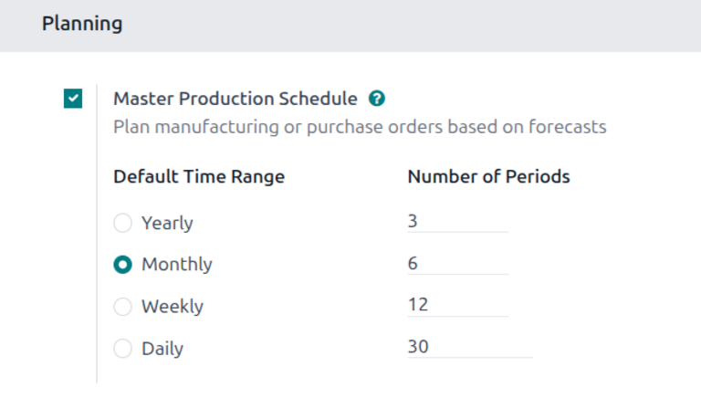
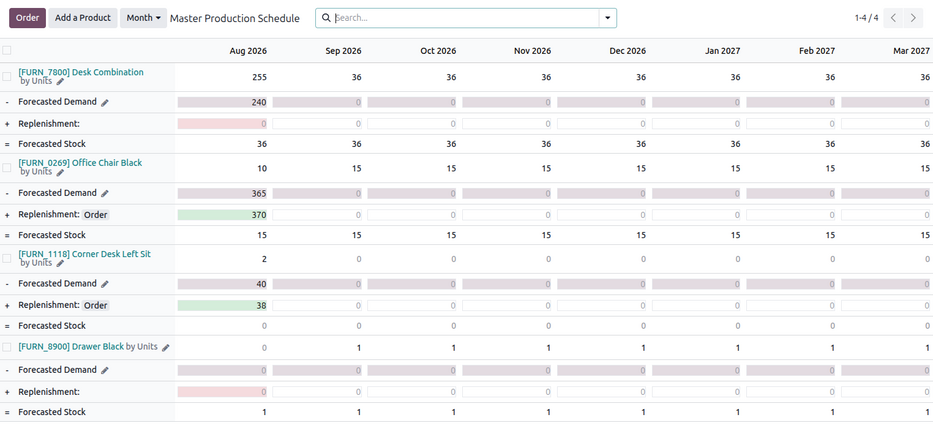
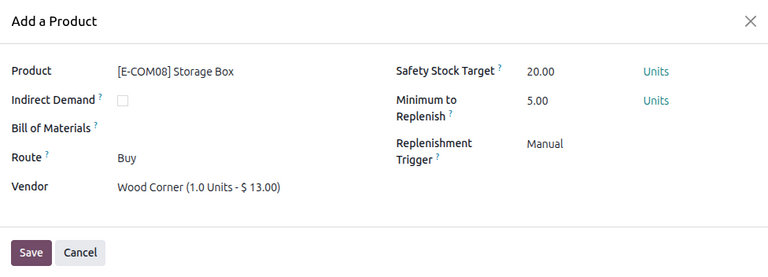

==========================
Master production schedule
==========================

.. |SO| replace:: :abbr:`SO (sales order)`
.. |PO| replace:: :abbr:`PO (purchase order)`
.. |MO| replace:: :abbr:`MO (manufacturing order)`
.. |SOs| replace:: :abbr:`SOs (sales orders)`
.. |POs| replace:: :abbr:`POs (purchase orders)`
.. |MOs| replace:: :abbr:`MOs (manufacturing orders)`
.. |MPS| replace:: :abbr:`MPS (Master Production Schedule)`
.. |BoM| replace:: :abbr:`BoM (Bill of Materials)`
.. |RfQ| replace:: :abbr:`RfQ (Request for Quotation)`
.. |RfQs| replace:: :abbr:`RfQs (Requests for Quotation)`

In Odoo **Manufacturing**, the Master Production Schedule (MPS) is used to plan long-term
replenishment for products against a manually-adjustable demand forecast. While Make-to-Order (MTO)
strategies or reordering rules are useful for immediately replenishing stock, products or components
with long lead times or variable seasonal demands may require longer-term planning against an
expected future demand to ensure continued availability of stock.

With the |MPS|, users can plan replenishment for specific products over future time periods,
generating suggested replenishment quantities based on forecasted demand and on user-specified stock
targets.

.. important::
   Adding a product to the |MPS| does **not** automatically create a purchase or manufacturing order
   for it. The |MPS| only suggests the amount of product to be replenished, requiring the user to
   actually create the replenishing |POs|/|MOs|.

   Because the |MPS| relies on manual replenishment, reordering rules should **not** be applied to
   products added to the |MPS|. Doing so creates inaccurate forecasts and unnecessary replenishment
   orders.

.. example::
   A retail store sells artificial *Christmas trees* during the holiday season. It is currently
   September and the store has fewer than ten Christmas tree |MOs| confirmed for the month of
   December. The procurement manager knows that the demand for Christmas trees peaks in December. As
   a result, they manually enter a greater demand in the |MPS| to properly replenish ahead of this
   future customer demand.

.. _manufacturing/mps/configuration:

Configuration
=============

To use the |MPS|, the feature must first be enabled. Navigate to :menuselection:`Manufacturing app
--> Configuration --> Settings` and select the :guilabel:`Master Production Schedule` checkbox in
the :guilabel:`Planning` section.

After enabling the feature, two new columns appear below:

- :guilabel:`Default Time Range`: Select the period of time over which the planning occurs, either
  on a :guilabel:`Yearly`, :guilabel:`Monthly`, :guilabel:`Weekly`, or :guilabel:`Daily` basis.
- :guilabel:`Number of Periods`: Specify the number of periods to display for each time range.

.. example::
   If the :guilabel:`Default Time Range` field is set to :guilabel:`Monthly`, and the
   :guilabel:`Number of Periods` field is set to `12`, the |MPS| shows one column for each of the
   next 12 months, starting with the current month.

Finally, click :guilabel:`Save` to load the changes.

.. _manufacturing/mps/dashboard:

|MPS| dashboard
===============

To open the |MPS|, navigate to :menuselection:`Manufacturing app --> Planning --> Master Production
Schedule`. The |MPS| is arranged as a grid with the time periods represented as columns and each
product :ref:`added to the MPS <manufacturing/mps/add-product>` as an individual grouping of rows.

By default, the group of rows for each product includes the following:

- :guilabel:`[Product] by [Unit] - [Company]`: The header row with the name of the product, its unit
  of measure, and its company (if applicable). By default, cells in this row display the product's
  starting stock quantity at the beginning of each time period. Clicking the :guilabel:`[Product]`
  link opens the product's forecasted report.
- :guilabel:`- Forecasted Demand`: The user's estimated demand for the product during each time
  period. Cells in this row can be entered manually.
- :guilabel:`- Indirect Demand Forecast`: The forecasted demand for the component from existing
  |MOs|. This row **only** appears if the product is a component of another product.
- :guilabel:`+ Replenishment`: The user-specified quantity of the product to be replenished through
  |MOs| or |POs|. Values in these cells are automatically suggested based on the *Safety Stock
  Targets* and replenishment minimums/maximums specified in the product's :ref:`schedule
  configurations <manufacturing/mps/add-product>`. However, users can also manually adjust these
  values. Clicking the :guilabel:`Order` button manually :ref:`replenishes
  <manufacturing/mps/replenish>` the product based on the quantity suggested or entered.
- :guilabel:`= Forecasted Stock`: The forecasted quantity of the product stock at the end of each
  time period, assuming that suggested replenishment numbers are fulfilled.

:ref:`Additional rows and filters <manufacturing/mps/additional-rows-filters>` can be selected in
their respective sections of the :guilabel:`Search...` bar drop-down menu at the top.

.. important::
   While the |MPS| can be used with only the default categories, it may be useful to enable the
   :guilabel:`Actual Demand` category in the :guilabel:`Search...` bar.

   With the :guilabel:`Actual Demand` option enabled, the :guilabel:`- Forecasted Demand` category
   changes to the :guilabel:`- Actual / Forecasted Demand` category, displaying both the confirmed
   demand for the product based on confirmed |SOs| and the forecasted demand.

Relationship between rows
-------------------------

Together, the starting stock, :guilabel:`- Forecasted Demand`, :guilabel:`- Indirect Demand
Forecast` (if applicable), :guilabel:`+ Replenishment`, and :guilabel:`= Forecasted Stock` values
define the following relation:

.. math::

   \begin{align}
   \text{Forecasted Stock} &= \text{Starting Stock} \\
   &- \text{Forecasted Demand} \\
   &- \text{Indirect Demand Forecast} \\
   &+ \text{Replenishment}
   \end{align}

The :guilabel:`- Forecasted Demand` and :guilabel:`+ Replenishment` cells can be manually adjusted
for any of the time periods. Doing so updates the value displayed in the :guilabel:`= Forecasted
Stock` cells according to the equation. Correspondingly, the starting stock quantity of each
subsequent time period is updated with the previous period's :guilabel:`= Forecasted Stock`.

.. tip::
   Changing the value in the :guilabel:`+ Replenishment` cell highlights the value and displays an
   :icon:`fa-times` :guilabel:`(reset)` button next to the cell to reset it back to the default
   value calculated by the |MPS|.

.. _manufacturing/mps/add-product:

Adding products to |MPS|
========================

To use |MPS| to manage the replenishment of a product, navigate to :menuselection:`Manufacturing app
--> Planning --> Master Production Schedule`. At the top of the |MPS| page, click :guilabel:`Add a
Product` to open the *Add a Product* pop-up window.

.. important::
   Products **must** be properly configured to be replenished through the |MPS|.

   For manufactured products, the *Manufacture* route must be selected in the *Routes* section of
   the *Inventory* tab on the product's form.

   For purchased products, the *Buy* route must be selected in the *Routes* section of the
   *Inventory* tab on the product's form. Additionally, a :ref:`vendor pricelist
   <purchase/manage_deals/vendor-pricelist>` must be configured on the *Purchase* tab.

Enter product details
---------------------

On the pop-up window, select the product to add in the :guilabel:`Product` drop-down menu.

Then, specify the following information about the product:

- :guilabel:`Indirect Demand`: Select this optional checkbox if the product can be hidden when the
  :guilabel:`To Forecast` filter is selected in the :guilabel:`Search...` bar drop-down menu.
- :guilabel:`Bill of Materials`: Select the product's |BoM| if the product is manufactured.
- :guilabel:`Route`: Select the replenishment route for the product (e.g., `Buy` for purchased
  products, `Manufacture` for manufactured products).
- :guilabel:`Vendor`: Select the vendor for the product. This field **only** appears if the
  :guilabel:`Buy` option was selected in the :guilabel:`Route` field.
- :guilabel:`Batch Size`: Split |MOs| into orders of this quantity. This field **only** appears if
  the :guilabel:`Manufacture` option was selected in the :guilabel:`Route` field. Toggle the
  :guilabel:`No Batch Size` checkbox to enter a batch size, or leave it un-toggled if no batch size
  should be specified.

.. note::
   Selecting a BoM when adding a product also adds any components listed on the BoM to the |MPS|. If
   it is not necessary to manage the replenishment of components through the |MPS|, leave the
   :guilabel:`Bill of Materials` field blank.

If the database is configured with multiple warehouses, a :guilabel:`Production Warehouse` field
appears on the :guilabel:`Add a Product` pop-up window to specify which warehouse the product is
replenished to.

Enter product replenishment options
~~~~~~~~~~~~~~~~~~~~~~~~~~~~~~~~~~~

Next, specify the product's replenishment options to configure how the |MPS| calculates suggested
replenishment quantities for each product. Enter the following information:

- :guilabel:`Safety Stock Target`: Specify the minimum quantity of the product to be available
  across all time periods.
- :guilabel:`Minimum to Replenish`: Specify the minimum quantity of the product to replenish for
  each period.
- :guilabel:`Maximum to Replenish`: Specify the maximum quantity of the product to replenish for
  each period. If the demand is higher than this maximum, the remaining quantity is automatically
  transferred to the next period. Toggle the :guilabel:`No Maximum` checkbox to enter a maximum
  value, or leave it un-toggled if no maximum should be specified.

If no minimum or maximum replenishment limits are set, the |MPS| suggests the replenishment quantity
needed to reach the :guilabel:`Safety Stock Target` while accounting for the starting stock and
forecasted demand. In other words, the suggested quantity in the replenishment row is calculated by
the following relation:

.. math::

   \begin{align}
   \text{Replenishment} &= \text{Safety Stock Target} \\
   &- \text{Starting Stock} \\
   &- \text{Forecasted Demand} \\
   &- \text{Indirect Demand Forecast}
   \end{align}

If minimum or maximum limits are set, the suggested replenishment quantity is always bounded by
these limits, regardless of the needed quantity to reach the :guilabel:`Safety Stock Target`.

Specify replenishment trigger
~~~~~~~~~~~~~~~~~~~~~~~~~~~~~

Finally, in the :guilabel:`Replenishment Trigger` field, specify how the product should be
replenished:

- :guilabel:`Manual`: Manually replenish the product from the |MPS|.
- :guilabel:`Automatic`: Automatically schedule a replenishment order for the product.
- :guilabel:`Never`: Never replenish the product from the |MPS|.

Click :guilabel:`Save` to add the product to the |MPS|. The product now appears on the |MPS| page,
along with any components (if applicable).

Edit a product
--------------

To edit the planning schedule for a product on the |MPS|, click the :icon:`fa-pencil`
:guilabel:`(Forecasted)` button next to the product's header row.

In the :guilabel:`Edit Production Schedule` pop-up window, enter the desired modifications. Then,
click :guilabel:`Save` to save the changes.

.. note::
   The :guilabel:`Product` and :guilabel:`Bill of Materials` fields cannot be edited.

Remove a product
----------------

To remove a product from the |MPS|, select the checkbox next to its name. Then, click the
:icon:`fa-cog` :guilabel:`Actions` button at the top of the screen, and select :guilabel:`Delete`
from the drop-down menu. On the :guilabel:`Confirmation` pop-up window, click :guilabel:`Ok`.

.. _manufacturing/mps/replenish:

Replenishing products with |MPS|
================================

Products in the |MPS| can be replenished in one of three ways:

- To replenish every product for the current time period, click the :guilabel:`Order` button at the
  top.
- To replenish a specific product, click the :guilabel:`Order` button next to the :guilabel:`+
  Replenishment` row of the product.
- To select and replenish multiple products, select the checkbox next to one or more products'
  header rows. Then, click the :icon:`fa-cog` :guilabel:`Actions` button at the top and select
  :guilabel:`Order` from the drop-down menu.

The type of replenishment order generated is determined by the route selected on the *Add a Product*
pop-up window when :ref:`adding a product <manufacturing/mps/add-product>` to the |MPS|.

- If the *Buy* route is selected, an |RfQ| is generated to purchase the product. Generated |RfQs|
  can be located by navigating to :menuselection:`Purchase app --> Orders --> Requests for
  Quotation`.
- If the *Manufacture* route is selected, an |MO| is generated to manufacture the product. Generated
  |MOs| can be located by navigating to :menuselection:`Manufacturing app --> Operations -->
  Manufacturing Orders`.

.. _manufacturing/mps/replenish/indicators:

Replenishment status indicators
-------------------------------

The :guilabel:`+ Replenishment` cells in the |MPS| are displayed using the following highlights,
depending on whether the replenished quantities match the suggested quantities:

- :guilabel:`Green`: The quantity is ready to be replenished.
- :guilabel:`Gray`: A replenishment order has already been generated, and its ordered quantity
  matches the suggested quantity for the time period.
- :guilabel:`Yellow`: A replenishment order has already been generated, but its ordered quantity is
  below the suggested quantity for the time period.
- :guilabel:`Red`: A replenishment order has already been generated, but its ordered quantity
  exceeds the suggested quantity for the time period.

.. _manufacturing/mps/additional-rows-filters:

Additional rows and filters
===========================

With the :guilabel:`Search...` bar drop-down menu, users may further customize the |MPS| by
configuring additional rows for products or by filtering existing records based on specific
criteria.

Rows
----

The following rows can be added to the |MPS| in addition to the default rows shown on the
:ref:`dashboard <manufacturing/mps/dashboard>`.

- :guilabel:`Actual Demand`: Changes the :guilabel:`- Forecasted Demand` row to :guilabel:`- Actual
  / Forecasted Demand`, comparing the product's confirmed demand and its forecasted demand.
- :guilabel:`Actual Demand Y-1`: Displays the :guilabel:`Actual Demand` one year before the current
  time period.
- :guilabel:`Actual Demand Y-2`: Displays the :guilabel:`Actual Demand` two years before the current
  time period.
- :guilabel:`Actual Replenishment`: Changes the :guilabel:`+ Replenishment` row to :guilabel:`+
  Actual / Replenishment`, comparing the product's replenished quantity and its suggested quantity.
- :guilabel:`Available to Promise`: Changes the :guilabel:`= Forecasted Stock` row to :guilabel:`=
  ATP / Forecasted Stock`, comparing the product's available stock (``Starting Stock - Actual Demand
  + Replenishment``) and its forecasted stock.

Filters
-------

Users can filter records from the |MPS| based on the following criteria:

- :guilabel:`To Forecast`: Filter by products that are manually or automatically replenished.
- :guilabel:`To Replenish`: Filter by products that are ready to be replenished (i.e., with at least
  one :guilabel:`+ Replenishment` cell highlighted in green).
- :guilabel:`Indirect Demand`: Filter by products configured with the *Indirect Demand* option.
- :guilabel:`Replenishment Too Low`: Filter by products with a replenished quantity below the
  suggested replenishment quantity (i.e., with at least one :guilabel:`+ Replenishment` cell
  highlighted in yellow).
- :guilabel:`Replenishment Too High`: Filter by products with a replenished quantity above the
  suggested replenishment quantity (i.e., with at least one :guilabel:`+ Replenishment` cell
  highlighted in red).
- :guilabel:`Manually Replenished`: Filter by products with the *Replenishment Trigger* set to
  *Manual*.
- :guilabel:`Automatically Replenished`: Filter by products with the *Replenishment Trigger* set to
  *Automatic*.
- :guilabel:`Not Replenished from MPS`: Filter by products with the *Replenishment Trigger* set to
  *Never*.
