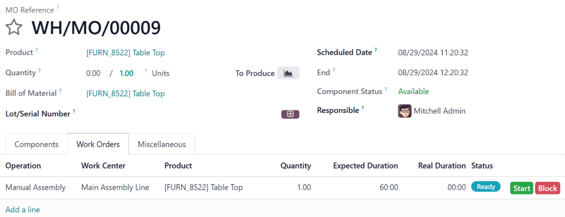
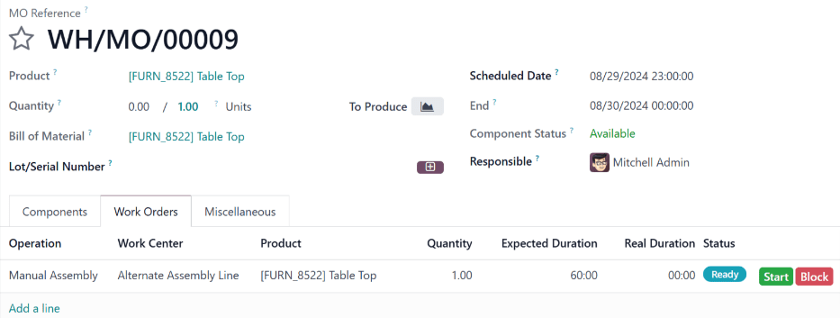

====================
Work center time off
====================

.. |MO| replace:: :abbr:`MO (manufacturing order)`

In Odoo, *work centers* are used to carry out manufacturing operations at specific locations.
However, if a work center cannot be used for some reason, work orders begin to pile up at the work
center until it is operational again.

As a result, it is necessary to make the work center unavailable in Odoo so new work orders are
routed to alternative work centers that are operational. Using Odoo's **Time Off** app, it is
possible to designate a work center as being unavailable for a set period of time. Doing so ensures
manufacturing operations can continue until the impacted work center is available again.

Configuration
=============

Before a work center can be designated as unavailable, the Odoo platform must be properly
configured. First, it is necessary to enable :ref:`developer mode <developer-mode>`. This allows the
*Time Off* smart button to appear on each work center's *Working Hours* page.

Next, install the **Time Off** app. This is the app used for managing time off for all resources
within Odoo, including employees and work centers.

To do so, navigate to the :menuselection:`Apps` app, then search `Time Off` in the search bar. The
card for the :guilabel:`Time Off` app should be the only one that appears on the page. Click the
:guilabel:`Install` button on the card to install the app.

The last step is to properly configure work centers. For this workflow, it is necessary to have at
least two work centers: one that is made unavailable, and a second that receives the work orders
that the other cannot accept. If no second work center is configured, Odoo cannot route work orders
away from the unavailable work center, and they pile up in its queue.

To create a work center, navigate to :menuselection:`Manufacturing app --> Configuration --> Work
Centers --> New`.

.. seealso::
   For a full guide to work center creation, refer to the documentation on :doc:`work centers
   <../advanced_configuration/using_work_centers>`.

Make sure both work centers have the same equipment listed under the :guilabel:`Equipment` tab. This
ensures operations carried out at one work center can also be performed at the other.

On the work center that is made unavailable, select the second work center from the
:guilabel:`Alternative Workcenters` drop-down menu. Now, Odoo knows to send work orders to the
second work center when the first is unavailable for any reason.

.. image:: work_center_time_off/alternative-work-center-selection.png
   :align: center
   :alt: A work center form configured with an alternative work center.

Add time off for a work center
==============================

With configuration completed, time off can now be assigned to a work center. Begin by navigating to
:menuselection:`Manufacturing app --> Configuration --> Work Centers`, and selecting the affected
work center. Click the :icon:`oi-arrow-right` :guilabel:`(Internal link)` button on the right side
of the :guilabel:`Working Hours` drop-down menu, to open the working hours page for the work center.

.. image:: work_center_time_off/working-hours-button.png
   :align: center
   :alt: The Working Hours "External link" button on the work center form.

The working hours page displays the standard working hours for the work center. With developer mode
activated, a :icon:`fa-plane` :guilabel:`Time Off` smart button appears at the top of the page.
Click it to open the :guilabel:`Resource Time Off` page.

On this page, click :guilabel:`New` to configure a new time-off entry. On the time-off form, note
the :guilabel:`Reason` for the work center closure (e.g. broken equipment, maintenance, etc.),
select the affected work center as the :guilabel:`Resource`, and choose a :guilabel:`Start Date` and
:guilabel:`End Date` to specify the period during which the work center is unavailable.

Alternative work center planning
================================

Once a work center is within its specified time-off period, work orders sent to it can be
automatically routed to an alternative work center using the *Plan* button.

Begin by creating a new manufacturing order (MO), by navigating to :menuselection:`Manufacturing app
--> Operations --> Manufacturing Orders --> New`. On the |MO| form, specify a :guilabel:`Product`
that uses the unavailable work center for one of its operations. Click :guilabel:`Confirm` to
confirm the |MO|.

On the confirmed |MO|, select the :guilabel:`Work Orders` tab. By default, the unavailable work
center is specified in the :guilabel:`Work Center` column. There is also a :guilabel:`Plan` button
at the top left of the page.

Click :guilabel:`Plan`, and the work center listed in the :guilabel:`Work Center` column of the
:guilabel:`Work Orders` tab is automatically changed to the alternative work center.

   Before clicking :guilabel:`Plan`, the work order is scheduled at :guilabel:`Main Assembly Line`.

   After clicking :guilabel:`Plan`, the work order is rescheduled at :guilabel:`Alternative Assembly
   Line`.

Once the time-off period for the unavailable work center ends, Odoo recognizes the work center is
available again. At this point, clicking the :guilabel:`Plan` button does not route work orders to
an alternative work center unless the first one is at capacity.
