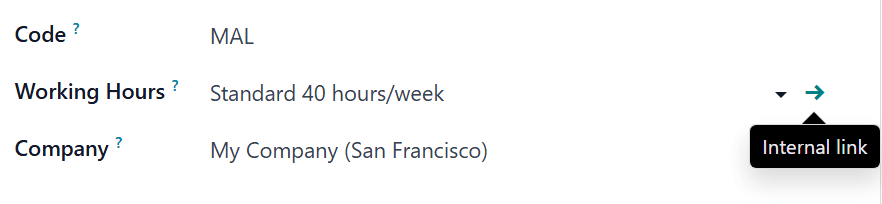

============================================
Make work centers unavailable using Time Off
============================================

In Odoo, *work centers* are used to carry out manufacturing operations at specific locations.
However, if a work center cannot be used for some reason, work orders begin to pile up at the work
center until it is operational again.

As a result, it is necessary to make the work center unavailable in Odoo so that the platform routes
new work orders to alternative work centers that are operational. Using Odoo *Time Off*, it is
possible to designate a work center as being unavailable for a set period of time. Doing so ensures
that manufacturing operations can continue until the impacted work center is available again.

Configuration
=============

Before a work center can be designated as unavailable, the Odoo platform must be properly
configured. First, it is necessary to enable :ref:`developer mode <developer-mode>`. This allows the
:guilabel:`Time Off` smart button to appear on each work center's :guilabel:`Working Hours` pop-up
window.

Enable developer mode by going to :menuselection:`Settings`, scrolling to the bottom of the page,
and clicking :guilabel:`Activate the developer mode` under the :guilabel:`Developer Tools` heading.

.. image:: work_center_time_off/developer-mode-button.png
   :align: center
   :alt: The "Activate the developer mode" button.

Next, install the *Time Off* app. This is the app used for assigning time off to all resources
within Odoo, including employees and work centers. Navigate to :menuselection:`Apps`, then type
`Time Off` in the :guilabel:`Search...` bar. The card for the :guilabel:`Time Off` module should be
the only one that appears on the page. Click the green :guilabel:`Install` button on the card to
install the app.

.. image:: work_center_time_off/time-off-install-card.png
   :align: center
   :alt: The Time Off module installation card.

The last step is to properly configure work centers. For this workflow, it is necessary to have at
least two work centers: one that is made unavailable and a second that receives the work orders that
the other cannot accept. If no second work center is configured, Odoo cannot route work orders away
from the unavailable work center and they will pile up in its queue.

To create a work center, navigate to :menuselection:`Manufacturing --> Configuration --> Work
Centers --> Create`.

Make sure that both work centers have the same equipment listed under the :guilabel:`Equipment` tab.
This ensures that operations carried out at one work center can also be performed at the other.

.. image:: work_center_time_off/work-center-equipment-tab.png
   :align: center
   :alt: The equipment tab on a work center form.

For the work center that will be made unavailable, select the second work center on the
:guilabel:`Alternative Workcenters` drop-down menu. Now, Odoo knows to send work orders to the
second work center when the first is unavailable for any reason.

Add time off for a work center
==============================

With configuration completed, time off can now be assigned to the work center that will be made
unavailable. Begin by navigating to :menuselection:`Manufacturing --> Configuration --> Work
Centers` and selecting the affected work center. Click :guilabel:`Edit`, and then the :guilabel:`↗
(external link)` button next to the :guilabel:`Working Hours` drop-down menu.

A pop-up appears, titled :guilabel:`Open: Working Hours`. The standard working hours for the work
center are listed here, along with various other details about it. Since developer mode was enabled,
there is a :guilabel:`Time Off` button in the top right of the pop-up. Click it to be taken to the
:guilabel:`Resource Time Off` page.

.. image:: work_center_time_off/time-off-button.png
   :align: center
   :alt: The Time Off button on the Working Hours pop-up.

On this page, click :guilabel:`Create` to configure a new time-off entry. On the time-off form, note
the :guilabel:`Reason` for the work center closure (broken, maintenance, etc.), select the affected
work center as the :guilabel:`Resource`, and choose a :guilabel:`Start Date` and :guilabel:`End
Date` to specify the period during which the work center will be unavailable. Click :guilabel:`Save`
and the time off for the work center is logged in Odoo.

.. image:: work_center_time_off/time-off-form.png
   :align: center
   :alt: The "Resource Time Off" form.

Route orders to an alternative work center
==========================================

Once a work center is within its specified time-off period, work orders sent to it can be
automatically routed to an alternative work center using the :guilabel:`Plan` button.

Begin by creating a new manufacturing order by selecting :menuselection:`Operations -->
Manufacturing Orders --> Create`. On the manufacturing order form, specify a :guilabel:`Product`
that uses the unavailable work center for one of its operations. Click :guilabel:`Confirm` to
confirm the work order.

On the confirmed work order, select the :guilabel:`Work Orders` tab. By default, the unavailable
work center is specified in the :guilabel:`Work Center` column. There is also a green
:guilabel:`Plan` button on the top left of the page.

.. image:: work_center_time_off/mo-plan-button.png
   :align: center
   :alt: The Plan button on a manufacturing order.

Click :guilabel:`Plan` and the work center listed under the :guilabel:`Work Orders` tab is
automatically changed to the alternative work center.

.. image:: work_center_time_off/work-center-planning.png
   :align: center
   :alt: The selected work center updates automatically after clicking the Plan button.

Once the time-off period for the unavailable work center ends, Odoo recognizes that the work center
is available again. At this point, clicking the :guilabel:`Plan` button does not route work orders
to an alternative work center unless the first one is at capacity.
