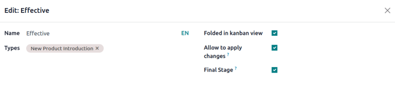

.. _plm/eco/eco-type:

.. |BOM| replace:: :abbr:`BoM (Bill of Materials)`
.. |BOMs| replace:: :abbr:`BoMs (Bills of Materials)`
.. |ECO| replace:: :abbr:`ECO (Engineering Change Order)`
.. |ECOs| replace:: :abbr:`ECOs (Engineering Change Orders)`

========
ECO type
========

An *ECO type* is assigned to *engineering change orders* (ECOs) to organize and track changes to
products and bills of materials (BoMs). Each |ECO| type separates |ECOs| into a project in Gantt
view, ensuring collaborators and stakeholders **only** view and assist with relevant |BOM|
improvements.

For example, an electronic chip manufacturer might use 'New Product Introduction', 'Product
Improvement', 'Component Change', and 'Firmware Update' |ECO| types. Then, designers and engineers
can focus on |ECOs| in the 'New Product Introduction' and 'Product Improvement' projects, avoiding
unrelated supplier change or firmware update |ECOs|.

Create ECO type
===============

To access and manage ECO types, navigate to :menuselection:`PLM app --> Configuration --> ECO
Types`.

Create a new ECO type by clicking :guilabel:`New`. On the new :guilabel:`ECO Types` form, fill in
the following information:

- :guilabel:`Name`: the name of the |ECO| type, which will organize all of the |ECOs| of this *type*
  in a project.
- :guilabel:`Email Alias`: if this optional field is filled, emails submitted to this email address
  automatically generate |ECOs| in the left-most stage of this |ECO| type.

.. example::
   The `Formulation change` |ECO| type is used to organize and track related |ECOs| in a single
   project. Configuring the :guilabel:`Email Alias` field generates |ECOs| in the `Formulation
   change` project sent to the email address, `pawlish-change@pawlished-glam.odoo.com`.

   .. image:: eco_type/create-eco-type.png
      :align: center
      :alt: Example of an ECO type.

Edit ECO type
=============

Modify existing |ECO| type names and email aliases by navigating to the :menuselection:`PLM app -->
Configuration --> ECO Types` page. There, click on the desired |ECO| type from the list.

On the form for each |ECO| type, proceed to edit the :guilabel:`Name` and :guilabel:`Email Alias`
fields.

.. _plm/eco/stage-config:

Stages
======

Within an |ECO| type project, *stages* are like milestones and are used to identify the progress of
the |ECO| before the changes are ready to be applied. (e.g. 'Feedback', 'In Progress', 'Approved',
'Complete')

Additionally, required approvers can be added to each stage, ensuring that changes to the production
|BOM| cannot proceed until the approver reviews and approves the |ECO|. Doing so prevents errors on
the production |BOM| by enforcing at least one review of suggested changes before they're applied on
a production |BOM|.

For best practice, there should be at least one *verification* stage, which is a stage with a
required approver, and one *closing* stage, which stores |ECOs| that have been either canceled or
approved for use as the next production |BOM|.

Create stage
------------

To add a stage, go to the :menuselection:`PLM` app and select the intended project for an |ECO| type
from the :guilabel:`PLM Overview` dashboard.

Then, on the :guilabel:`Engineering Change Orders` project pipeline for the |ECO| type, click the
:guilabel:`+ Stage` button. Doing so reveals a text box to fill in the name of the stage. After
filling it in, click the :guilabel:`Add` button to finish adding the stage.

.. example::
   A new `Assigned` stage separates assigned |ECOs| from the unassigned ones in the `New` stage.
   Adding another stage helps the product manager track unassigned tasks.

   .. image:: eco_type/create-stage.png
      :align: center
      :alt: Create a new stage in a project for an ECO type.

Verification stage
------------------

Click an ECO type from :menuselection:`PLM app --> Overview` to open a kanban view of |ECOs| of this
type.

To configure a verification stage, hover over the intended stage, and select the :guilabel:`⚙️
(gear)` icon. Then, click :guilabel:`Edit` to open a pop-up window.

Configure the verification stage in the edit stage pop-up window, by checking the box for
:guilabel:`Allow to apply changes`.

Then, add an approver in the :guilabel:`Approvers` section, by clicking :guilabel:`Add a line`, and
specifying the :guilabel:`Role` of the reviewer, their :guilabel:`User`, and :guilabel:`Approval
Type`.

Make sure at least one approver is configured with the :guilabel:`Approval Type`: :guilabel:`Is
required to approve`.

The approver listed is automatically notified when |ECOs| are dropped in the stage specified in the
pop-up window. Once finished, click :guilabel:`Save & Close`.

.. example::
   In the |ECO| type `New Product Introduction`, the verification stage `Validated` is configured by
   clicking the :guilabel:`⚙️ (gear)` icon, and selecting :guilabel:`Edit`. Doing so opens the
   :guilabel:`Edit: Validated` pop-up window.

   By adding the `Engineering manager` as an approver, only |ECOs| approved by this user can proceed
   to the next stage, and have the changes applied on the production |BOM|.

   Additionally, check the :guilabel:`Allow to apply changes` option to ensure proper behavior.

   .. image:: eco_type/verification-stage.png
      :align: center
      :alt: Show "Allow to apply changes" option is checked.

Closing stage
-------------

Configure a closing stage by opening the :guilabel:`Edit: [stage]` pop-up window. To do so, hover
over the intended stage and click the :guilabel:`⚙️ (gear)` icon that appears in the top-right
corner. Then, click :guilabel:`Edit` from the drop-down menu.

On the :guilabel:`Edit: [stage]` pop-up window, select the check boxes for :guilabel:`Folded in
kanban view`, :guilabel:`Allow to apply changes` and :guilabel:`Final Stage`.

.. example::
   The closing stage, `Effective` is configured by checking the :guilabel:`Folded in kanban view`,
   :guilabel:`Allow to apply changes`, and :guilabel:`Final Stage` options

