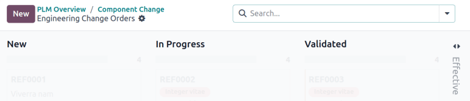

.. _plm/eco/eco-type:

.. |BOM| replace:: :abbr:`BoM (Bill of Materials)`
.. |BOMs| replace:: :abbr:`BoMs (Bills of Materials)`
.. |ECO| replace:: :abbr:`ECO (Engineering Change Order)`
.. |ECOs| replace:: :abbr:`ECOs (Engineering Change Orders)`

====================
ECO types and stages
====================

Engineering change orders (ECOs) are categorized by the type of change they represent and their
statuses are tracked via stages. Both |ECO| types and stages are defined by the user and can be
customized to the specific needs of a business or industry.

ECO types
=========

Each |ECO| type separates |ECOs| into different projects in the :guilabel:`PLM Overview`, ensuring
collaborators and stakeholders only view and assist with relevant |BOM| improvements.

.. example::
   An electronic chip manufacturer uses five |ECO| types: `New Product Introduction`, `BOM Updates`,
   `Component Change`, `Product Improvement`, and `Firmware Update`. In their configuration,
   engineers can spend time exclusively on |ECOs| in the `Component Change` and `Firmware Update`
   types, while designers see |ECOs| in the `New Product Introduction` type, allowing each
   discipline to focus only on those changes that require their domain expertise.

   .. image:: eco_type/eco-type-example.png
      :alt: Example of several custom ECO types.

Create an ECO type
------------------

To access and manage ECO types, navigate to :menuselection:`PLM app --> Configuration --> ECO
Types`.

Create a new ECO type by clicking :guilabel:`New`. On the new :guilabel:`ECO Types` form, fill in
the following information:

- :guilabel:`Name`: the name of the |ECO| type, which will organize all of the |ECOs| of this *type*
  in a project.
- :guilabel:`Email Alias`: if this optional field is filled, emails submitted to this email address
  automatically generate |ECOs| in the left-most stage of this |ECO| type.

.. example::
   The `Formulation change` |ECO| type is used to organize and track related |ECOs| in a single
   project. Configuring the :guilabel:`Email Alias` field generates |ECOs| in the `Formulation
   change` project sent to the email address, `pawlish-change@pawlished-glam.odoo.com`.

   .. image:: eco_type/create-eco-type.png
      :alt: Example of an ECO type.

Edit ECO types
--------------

Modify existing |ECO| type names and email aliases by navigating to the :menuselection:`PLM app -->
Configuration --> ECO Types` page. There, click on the desired |ECO| type from the list.

On the form for each |ECO| type, edit the :guilabel:`Name` or :guilabel:`Email Alias` fields.

.. _plm/eco/stage-config:

Stages
======

Within the :guilabel:`Engineering Change Orders` Kanban view for a specific |ECO| type, *stages* are
milestones used to identify the progress of the |ECO| before the changes are ready to be applied. By
default, Odoo uses `New`, `In Progress`, `Validated`, and `Effective`, but these are fully
customizable to the specific life cycle of an |ECO| type.

.. note::
   The `Effective` stage is folded by default to avoid listing every single |ECO| that has gone into
   effect. See :ref:`Closing stage <plm/eco/closing-stage>` for more on this configuration.

:ref:`Verification stages <plm/eco/verification-stage>` require a designated user to approve,
ensuring that changes do not proceed until the |ECO| changes have been reviewed by the appropriate
stake holders. :ref:`Closing stages<plm/eco/closing-stage>` that can apply changes put |BOM| and
operations changes into immediate effect, changing all pending and future :abbr:`MO (Manufacturing
orders)` to the latest |BOM| version.

.. tip::
   The most common practice is to have at least one *verification* stage, which is a stage with a
   required approver, and one *closing* stage, which stores |ECOs| that have been either cancelled
   or approved for use as the next production |BOM|.

.. seealso::
   :doc:`Approvals<../management/approvals>`

.. _plm/eco/verification-stage:

Verification stages
-------------------

To configure a verification stage, hover over the intended stage, and select the :icon:`fa-gear`
:guilabel:`(Actions)`. Then, click :guilabel:`Edit` to open a pop-up window and check the box for
:guilabel:`Allow to apply changes`.

Next, add an approver in the :guilabel:`Approvers` section, by clicking :guilabel:`Add a line`, and
specifying the :guilabel:`Role` of the reviewer, the :guilabel:`User`, and an :guilabel:`Approval
Type` of :guilabel:`Is required to approve`. See :ref:`more about approval types.
<plm/approvals/approval-type>`

The approver listed is automatically notified when |ECOs| are dropped in the stage specified in the
pop-up window. Once finished, click :guilabel:`Save & Close`.

.. seealso::
   :doc:`../management/approvals`

.. _plm/eco/closing-stage:

Closing stages
--------------

Click an |ECO| type from :menuselection:`PLM app --> Overview` to open the Kanban view of |ECOs| of
this type.

To configure a closing stage that applies |BOM|, edit the stage and tick the boxes for
:guilabel:`Folded in kanban view`, :guilabel:`Allow to apply changes`, and :guilabel:`Final Stage`.
When ECO cards are placed in a stage that will *Allow to apply changes*, then any |BOM| and
operations changes validated in the |ECOs| will immediately be put into effect. To create a
cancelled stage, create or edit a stage and tick the boxes for :guilabel:`Folded in kanban view` and
:guilabel:`Final Stage`. |ECOs| in this stage are removed from the pipeline, but will not make
changes.

.. example::
   The closing stage, `Effective` is configured by checking the :guilabel:`Folded in kanban view`,
   :guilabel:`Allow to apply changes`, and :guilabel:`Final Stage` options

   .. image:: eco_type/closing-stage.png
      :alt: Configuration of the closing stage.
