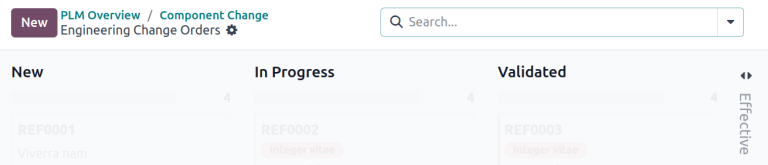
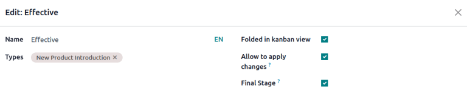

.. _plm/eco/eco-type:

.. |BOM| replace:: :abbr:`BoM (Bill of Materials)`
.. |BOMs| replace:: :abbr:`BoMs (Bills of Materials)`
.. |ECO| replace:: :abbr:`ECO (Engineering Change Order)`
.. |ECOs| replace:: :abbr:`ECOs (Engineering Change Orders)`

====================
ECO types and stages
====================

Engineering change orders (ECOs) are categorized by the type of change they represent and their
statuses are tracked via stages. Both |ECO| types and stages are defined by the user and can be
customized to the specific needs of a business or industry.

ECO types
=========

*Engineering change orders* (ECOs) require an |ECO| type to organize and track changes to products
and bills of materials (BoMs). Like a :doc:`product
type<../../inventory/product_management/configure/type>`, |ECO| types are highly customizable and
specific to the needs of individual businesses. Each |ECO| type separates |ECOs| into different
projects in the :guilabel:`PLM Overview`, ensuring collaborators and stakeholders only view and
assist with relevant |BOM| improvements.

.. example::
   An electronic chip manufacturer might use the default `New Product Introduction` type and change
   the default `BOM Updates` type to `Component Change`. Additionally, they require new `Product
   Improvement` and `Firmware Update` |ECO| types. With this configuration, engineers can focus
   exclusively on |ECOs| in the `Component Change` and `Firmware Update` types, and designers can
   focus on |ECOs| in the `New Product Introduction` type, allowing each discipline to focus only on
   those changes that require their domain expertise.

   .. image:: eco_type/eco-type-example.png
      :alt: Example of several custom ECO types

Create an ECO type
------------------

To access and manage ECO types, navigate to :menuselection:`PLM app --> Configuration --> ECO
Types`.

Create a new ECO type by clicking :guilabel:`New`. On the new :guilabel:`ECO Types` form, fill in
the following information:

- :guilabel:`Name`: the name of the |ECO| type, which will organize all of the |ECOs| of this *type*
  in a project.
- :guilabel:`Email Alias`: if this optional field is filled, emails submitted to this email address
  automatically generate |ECOs| in the left-most stage of this |ECO| type.

.. example::
   The `Formulation change` |ECO| type is used to organize and track related |ECOs| in a single
   project. Configuring the :guilabel:`Email Alias` field generates |ECOs| in the `Formulation
   change` project sent to the email address, `pawlish-change@pawlished-glam.odoo.com`.

   .. image:: eco_type/create-eco-type.png
      :alt: Example of an ECO type.

Edit ECO types
--------------

Modify existing |ECO| type names and email aliases by navigating to the :menuselection:`PLM app -->
Configuration --> ECO Types` page. There, click on the desired |ECO| type from the list.

On the form for each |ECO| type, edit the :guilabel:`Name` or :guilabel:`Email Alias` fields.

.. _plm/eco/stage-config:

Stages
======

Within the ::guilabel:`Engineering Change Orders` Kanban view for a specific |ECO| type, *stages*
are milestones used to identify the progress of the |ECO| before the changes are ready to be
applied. By default, Odoo uses `New`, `In-Progress`, `Validated`, and `Effective`, but these are
fully customizable to the specific life cycle of an |ECO| type.

.. note::
   The `Effective` stage is folded by default to avoid listing every single |ECO| that has gone into
   effect. See :ref:`Closing stage<plm/eco/closing-stage>` for more on this configuration.

Additionally, required approvers can be added to each stage, ensuring that changes to the production
|BOM| cannot proceed until the approver reviews and approves the |ECO|. Doing so prevents errors on
the production |BOM| by enforcing at least one review of suggested changes before they are applied
on a production |BOM|.

The most common practice is to have at least one *verification* stage, which is a stage with a
required approver, and one *closing* stage, which stores |ECOs| that have been either cancelled or
approved for use as the next production |BOM|.

.. seealso::
   :doc:`Approvals<../management/approvals>`

Create a new stage
------------------

To add a stage, go to the **PLM** app and select the |ECO| type project view from the :guilabel:`PLM
Overview` dashboard.

Then, on the :guilabel:`Engineering Change Orders` project pipeline for the |ECO| type, click the
:guilabel:`+ Stage` button. Doing so reveals a text box to fill in the name of the stage. After
filling it in, click the :guilabel:`Add` button to finish adding the stage.

.. example::
   A new `Assigned` stage separates assigned |ECOs| from the unassigned ones in the `New` stage.
   Adding another stage helps the product manager track unassigned tasks.

   .. image:: eco_type/create-stage.png
      :alt: Create a new stage in a project for an ECO type.

Use case: configuring verification and closing stages
-----------------------------------------------------

Verification stage
~~~~~~~~~~~~~~~~~~

To configure a verification stage, hover over the intended stage, and select the :icon:`fa-gear`
:guilabel:`(gear)`. Then, click :guilabel:`Edit` to open a pop-up window and check the box for
:guilabel:`Allow to apply changes`.

Next, add an approver in the :guilabel:`Approvers` section, by clicking :guilabel:`Add a line`, and
specifying the :guilabel:`Role` of the reviewer, the :guilabel:`User`, and an :guilabel:`Approval
Type` of :guilabel:`Is required to approve`. See :ref:`more about approval types.
<plm/approvals/approval-type>`

The approver listed is automatically notified when |ECOs| are dropped in the stage specified in the
pop-up window. Once finished, click :guilabel:`Save & Close`.

.. seealso::
   :doc:`../management/approvals`

.. _plm/eco/closing-stage:

Closing stage
~~~~~~~~~~~~~

Click an |ECO| type from :menuselection:`PLM app --> Overview` to open the Kanban view of |ECOs| of
this type.

To configure a closing stage, hover over the intended stage's name and click the :icon:`fa-gear`
:guilabel:`(gear)` icon that appears in the top-right corner. Then, select :guilabel:`Edit` from the
drop-down menu.

On the :guilabel:`Edit: [stage]` pop-up window, select the check boxes for :guilabel:`Folded in
kanban view`, :guilabel:`Allow to apply changes` and :guilabel:`Final Stage`.

.. example::
   The closing stage, `Effective` is configured by checking the :guilabel:`Folded in kanban view`,
   :guilabel:`Allow to apply changes`, and :guilabel:`Final Stage` options

