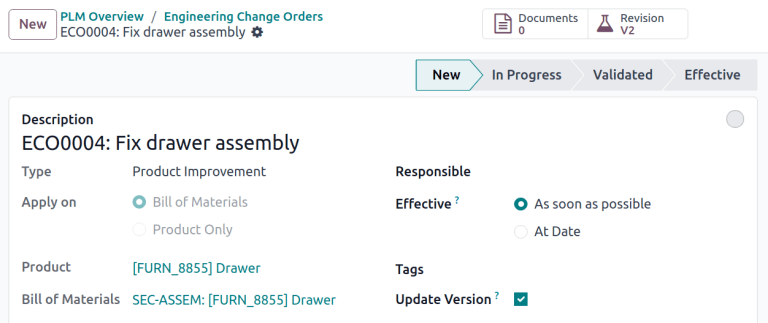
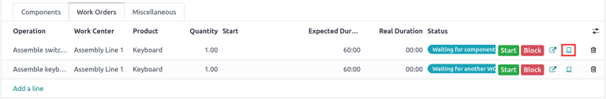
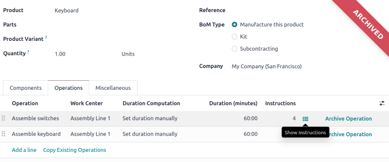

=========================
Engineering change orders
=========================

.. |BOM| replace:: :abbr:`BoM (Bill of Materials)`
.. |BOMs| replace:: :abbr:`BoMs (Bills of Materials)`
.. |ECO| replace:: :abbr:`ECO (Engineering Change Order)`
.. |ECOs| replace:: :abbr:`ECOs (Engineering Change Orders)`

.. _plm/eco:

Utilize *engineering change orders* (*ECOs*) to track, implement, and revert change versions made to
products, and :ref:`bills of materials <manufacturing/management/bill-configuration>`.

Engineering change orders can be created:

#. :ref:`directly in the ECO type <plm/eco/create-eco>`.
#. by an operator in the :ref:`tablet view <plm/eco/tablet-view>` of an operation.
#. automatically from feedback submitted to the :ref:`ECO type's email alias <plm/eco/eco-type>`.

.. _plm/eco/create-eco:

Create ECO
==========

To create a new |ECO|, begin by navigating to the *PLM* app. Then, select the |ECO| type card that
will be used to track the progress of the change. On the :guilabel:`Engineering Change Orders` page,
click the :guilabel:`New` button in the top-left corner.

.. note::
   Learn how to create new :ref:`ECO types <plm/eco/eco-type>` to categorize and organize change
   orders. Doing so ensures employees only view the |ECOs| related to their responsibilities,
   whether it involves new product introductions, targeted product line updates, or regulatory
   compliance fulfillment.

On the |ECO| form, fill in the following fields accordingly:

- :guilabel:`Description` is a brief summary of the improvement.
- :guilabel:`Type`: specifies the |ECO| type project for organizing the |ECOs|.
- :guilabel:`Apply on` determines if the |ECO| changes the :guilabel:`Bill of Materials` or the
  :guilabel:`Product Only`.
- :guilabel:`Product` indicates the product being improved.
- :guilabel:`Bill of Materials` specifies the changed |BOM|. It auto-populates if the product in
  :guilabel:`Product` field has an existing |BOM|. If multiple |BOMs| exist, select the intended
  radio options from the drop-down menu.
- :guilabel:`Company` field is used in multi-company databases. Specify if the change applies to
  products in a specific company, or leave blank if the change applies to all companies.
- :guilabel:`Responsible` represents the assignee in charge of this |ECO|. (Optional)
- :guilabel:`Effective` specifies when the |ECO| becomes live. Choosing :guilabel:`As soon as
  possible` means the |ECO| applies to the production |BOM| as soon as an authorized user
  :ref:`applies the changes <plm/eco/apply-changes>`.

  On the other hand, choosing :guilabel:`At Date`, and setting a specific date, leaves a date that
  makes it easier to track the version history of the |BOM|, and the specific date |BOMs|, used for
  production.
- :guilabel:`Tags` are assigned to |ECOs| for prioritization and organization. Create a new tag by
  typing the name in the field and selecting :guilabel:`Create` from the drop-down menu. (Optional)

After filling out the |ECO| form, click the :guilabel:`Start Revision` button to begin implementing
the changes.

By pressing :guilabel:`Start Revision`, three actions occur:

#. The :guilabel:`Documents` smart button appears, storing relevant files of the |BOM|.
#. A copy of the production |BOM| is stored in the newly-appeared :guilabel:`Revision` smart button
   of the |ECO|. The next available version number (e.g., `V2`, `V3`, ...) is also assigned to keep
   track of all |BOM| versions.
#. The stages of the |ECO| :guilabel:`Type` are displayed in the top-right corner of the |ECO|.

.. note::
   The :guilabel:`Revision` smart button is available **only** when the :guilabel:`Bill of
   Materials` radio button is selected in the :guilabel:`Apply on` field, and the :guilabel:`Start
   Revision` button has been pressed.

Change components
=================

To modify the components in a |BOM|, click the :guilabel:`Revision` smart button on an |ECO| to
access the new version of the |BOM|. Odoo distinguishes the non-production version of the |BOM| from
the current version, by flagging the test |BOM| with a large :guilabel:`Archived` tag.

.. example::
   After clicking the :guilabel:`Start Revision` button for an |ECO| for the product, `[D_0045
   Stool]`, make changes to the product's |BOM| by clicking the :guilabel:`Revision` smart button.
   Doing so opens the archived |BOM|, marked with a large red :guilabel:`Archived` flag.

   .. image:: engineering_change_orders/archived-bom.png
      :align: center
      :alt: Show the archived Bill of Materials.

On the new |BOM|, in the :guilabel:`Components` tab, proceed to modify the components list, by
changing the :guilabel:`Quantity` of existing components, adding new components using the
:guilabel:`Add a line` button, and removing components with the :guilabel:`🗑️ (trash)` icon.

.. _plm/eco/example-keyboard:

.. example::
   In version two of the |BOM| for a keyboard, the component quantities are reduced, and an
   additional component, `Stabilizers`, is added.

   .. image:: engineering_change_orders/version-2-bom.png
      :align: center
      :alt: Make changes to components by going to the new BoM with the *Revision* smart button.

Compare changes
---------------

Once the changes are complete, navigate back to the |ECO|, by clicking `ECO00X` in the breadcrumbs
located in the top-left corner. On the |ECO| form, a new :guilabel:`BoM Changes` tab displays the
differences between the current |BOM| and the new version.

Blue text indicates new components added to the revised |BOM| that are not in the production |BOM|.
Black text represents updates shared by both |BOMs|, while red text indicates components removed in
the revised |BOM|.

Changes and tests are encapsulated in the revised |BOM|, and do **not** affect the |BOM| currently
used in production. That is, until the :ref:`changes are applied <plm/eco/apply-changes>`.

.. example::
   View the summary of the differences between the current and revised keyboard |BOMs| in the
   :guilabel:`BoM Changes` tab of the |ECO|.

   .. image:: engineering_change_orders/bom-changes.png
      :align: center
      :alt: View summary of component changes in the *BoM Changes* tab.

Change operations
=================

To modify the operations in a |BOM|, click the :guilabel:`Revision` smart button on an |ECO| to
access the archived, new version of the |BOM|.

In the new |BOM| version, switch to the :guilabel:`Operations` tab to view and edit |BOM|
operations. To make changes, select each operation, which opens the corresponding :guilabel:`Open:
Operations` pop-up window.

.. note::
   The :guilabel:`Operations` tab is *not* available by default. To enable it, navigate to
   :menuselection:`Manufacturing app --> Configuration --> Settings`, and check the :guilabel:`Work
   Orders` box.

Make changes to any of the fields in the :guilabel:`Open: Operations` pop-up window, then click
:guilabel:`Save` once completed.

Create new operations by clicking the :guilabel:`Add a line` button, and remove new operations by
clicking the :guilabel:`Archive Operation` button.

Compare changes
---------------

Once the changes are complete, navigate back to the |ECO|, by clicking `ECO00X` in the breadcrumbs
located in the top-left corner.

On the |ECO| form, a new :guilabel:`Operation Changes` tab displays the differences between the
current production |BOM| and the new version.

Blue text indicates new operations added to the revised |BOM| that do not yet exist in the
production |BOM|. Black text represents updates shared by both |BOMs|, while red text indicates
operations removed in the revised |BOM|.

Modifications to the |BOM| in an |ECO| will **not** affect the |BOM| used in production. That is,
until the :ref:`changes are applied <plm/eco/apply-changes>`.

In the :guilabel:`Operation Changes` tab, each row of details, beneath the columns in the table,
reflect the following information:

- :guilabel:`Operation`: Name of the operation that was modified.
- :guilabel:`Step`: specifies the quality control point, visible when the operation includes
  detailed instructions.

.. note::
   To check for instructions, click the operation line item in the :guilabel:`Operations` tab of a
   |BOM|. Then, in the :guilabel:`Open: Operations` pop-up window, look for the
   :guilabel:`Instructions` smart button displayed at the top.

.. example::
   The `Assembly` :guilabel:`Operation` includes `10` detailed :guilabel:`Instructions` to complete
   it.

   .. image:: engineering_change_orders/instructions-smart-button.png
      :align: center
      :alt: Show *Instructions* smart button to check whether an operation has additional
            instructions.

- :guilabel:`Step Type` details the type of quality control for further instructions in the
  operation.
- :guilabel:`Type` corresponds with the colored text to specify how the revised |BOM| differs from
  the production |BOM|. Operation change types can be :guilabel:`Add`, :guilabel:`Remove`, or
  :guilabel:`Update`.
- :guilabel:`Work Center` specifies the work center at which the operation is performed.
- :guilabel:`Manual Duration Change` refers to the change in the :guilabel:`Default Duration` field
  in the :guilabel:`Open: Operations` pop-up window, which specifies the expected time for
  completing the operation.

.. example::
   The :guilabel:`Operation Changes` tab compares the production |BOM| with the revised |BOM| in the
   |ECO|.

   In the revised |BOM|, a new `Assembly` :guilabel:`Operation` at the :guilabel:`Work Center`
   `Assembly Line 1` is added. In addition, the expected duration of the operation is `20.00`
   minutes, as specified by the :guilabel:`Manual Duration Change`.

   To supplement the `Assembly` operation, two quality control point instructions are added:

   #. The first is the :guilabel:`Step` `QCP00039`, a :guilabel:`Step Type` to :guilabel:`Register
      Production` of components.
   #. The second :guilabel:`Step` is `QCP00034`, an `Instructions` :guilabel:`Step Type` that
      provides additional assembly details.

   .. image:: engineering_change_orders/operation-changes.png
      :align: center
      :alt: Show *Operation Changes* tab in an |ECO|.

.. _plm/eco/apply-changes:

Apply changes
=============

After verifying the changes, move the |ECO| to a :ref:`verification stage <plm/eco/stage-config>`,
which are stages that require approval before the revised changes can be applied to the production
|BOM|.

Once the approvers accept the changes, the :guilabel:`Apply Changes` button becomes available. Click
this button, and the |ECO| is automatically moved to a closing stage. The changes are applied, which
archives the original production |BOM|, and the revised |BOM| becomes the new production |BOM|.

Verify changes
--------------

To ensure the changes are live, from the |ECO| where the :guilabel:`Apply Changes` button was just
pressed, return to the revised |BOM| by clicking the :guilabel:`Revision` smart button.

On the revised |BOM|, the large red :guilabel:`Archived` flag is removed.

To further verify the changes, check the production |BOM| by going to :menuselection:`Manufacturing
app --> Products --> Products` and select the product.

Then, on the product form, click the :guilabel:`Bill of Materials` smart button, and select the
|BOM| from the list. In the :guilabel:`Miscellaneous` tab of the |BOM|, the :guilabel:`Version`
field is updated to match the version number shown on the :guilabel:`Revision` smart button of the
latest |ECO|.

.. example::
   After applying the changes of the |ECO| for the :ref:`keyboard <plm/eco/example-keyboard>`, view
   the version of the current keyboard |BOM| in the :guilabel:`Miscellaneous` tab. Here, the
   :guilabel:`Version` number has been updated to `2`, matching the `V2` that appears in the
   :guilabel:`Revision` smart button of the |ECO|.

   .. image:: engineering_change_orders/bom-version.png
      :align: center
      :alt: View current *BOM* version in the Miscellaneous tab.

.. _plm/eco/tablet-view:

Create ECO from tablet view
===========================

Operators can directly suggest clearer operation instructions, while performing manufacturing orders
(MOs) in the *Manufacturing* app.

To create |ECOs| in this manner, begin by navigating to :menuselection:`Manufacturing app -->
Operations --> Manufacturing Orders`. Then, select the desired :abbr:`MO (Manufacturing Order)` and
switch to the :guilabel:`Work Orders` tab. Then, click the :guilabel:`📱 (mobile phone)` icon for
the desired work order to open the *tablet view* of the operation.

.. important::
   The :guilabel:`📱 (mobile phone)` icon is **only** available for :abbr:`MOs (Manufacturing
   Orders)` with a :guilabel:`Confirmed` or :guilabel:`In Progress` status.

Next, add an instructional step, by clicking the :guilabel:`☰ (three horizontal lines)` icon in the
tablet view of an operation. Doing so opens the :guilabel:`Menu` of action items for a :abbr:`MO
(Manufacturing Order)`. Then, click the :guilabel:`Add a step` button.

.. image:: engineering_change_orders/additional-options-menu.png
   :align: center
   :alt: Open the *Add a Step* pop-up by clicking the three horizontal lines icon in tablet view.

Clicking the button reveals an :guilabel:`Add a step` pop-up window, where the proposed changes are
submitted.

In the :guilabel:`Title` field, enter a short step description. Next, in the :guilabel:`Instruction`
text field, type the instructions of the step in greater detail. Optionally, add an image to the
:guilabel:`Document` field. Once completed, finish by clicking the :guilabel:`Propose Change`
button.

.. example::
   To propose an additional check for broken components, enter the details in the :guilabel:`Add a
   Step` pop-up window. Doing so creates an instructional quality control point that will be
   reviewed in the following section.

   .. image:: engineering_change_orders/add-a-step.png
      :align: center
      :alt: Fill out the *Add a Step* form to suggest an additional quality control point.

Based on the inputs from the :guilabel:`Add a Step` pop-up window, an |ECO| is created with the
following information:

#. :guilabel:`Description` is the name of the operation, followed by the :abbr:`MO (Manufacturing
   Order)` number for reference.
#. The |ECO| :guilabel:`Type` is automatically assigned to `BOM Changes`.
#. :guilabel:`Product` and :guilabel:`Bill of Materials` fields are automatically populated, based
   on the |BOM| used in the :abbr:`MO (Manufacturing Order)`.
#. :guilabel:`Responsible` is the operator who submitted the feedback.

View ECO
--------

To review the proposed changes, navigate to the :menuselection:`PLM app --> Overview`. In the `BOM
Updates` |ECO| type card, the :guilabel:`X Engineering Changes` button represents the amount of
operational changes created from the tablet view.

Click on the :guilabel:`X Engineering Changes` button to open the kanban view of the |ECO| type. To
view the suggestion, select an |ECO| in the `New` stage.

On the |ECO|, view a summary of the proposed changes in the :guilabel:`Operation Changes` tab. Click
the :guilabel:`Revision` smart button to navigate to the revised |BOM| and look into the proposed
changes in greater detail.

.. example::
   An operator suggested another check for broken components by adding a step from the tablet view,
   while performing the `Assemble switches` operation for the :abbr:`MO (Manufacturing Order)`
   `WH/MO/00010` for the product, `Keyboard`.

   Then, this created |ECO| can be viewed by navigating to the `BOM Changes` ECO type found in
   :menuselection:`PLM app --> Overview`. By default, |ECOs| created from tablet view are set to
   spawn in the `New` stage.

   The :guilabel:`Responsible` field is assigned to the operator who made the suggestion, allowing
   the employee revising the |BOM| to seek further clarification from the person who proposed the
   changes.

   .. image:: engineering_change_orders/view-bom-change.png
      :align: center
      :alt: Find the new ECO in the "BOM Changes" ECO type, in the *New* stage.

On the revised |BOM|, switch to the :guilabel:`Operations` tab, and select the :guilabel:`☰ (three
horizontal lines)` icon. Doing so opens a list of :guilabel:`Steps` to perform the operation, with
the newest instruction titled `New Step Suggestion:`, followed by the user-entered title. Click the
line item to view the suggested changes.

On the :ref:`quality control point <quality/quality_management/quality-control-points>` form, ensure
the following form fields are accurately filled out to give detailed instructions for operators:

- :guilabel:`Title`: rename to give a concise description of the new instruction.
- :guilabel:`Control per`: using the drop-down menu, determine whether this instruction applies
  broadly for the :guilabel:`Product`, specifically for this :guilabel:`Operation` *only*, or a
  particular :guilabel:`Quantity` of the product.
- :guilabel:`Type`: categorizes the control point type. From the drop-down menu, select
  :guilabel:`Instructions` to detail an instruction for the worker. To receive input from the
  workers, select the :guilabel:`Take a Picture`, :guilabel:`Register Consumed Materials`,
  :guilabel:`Print Label`, or other :ref:`quality check options
  <quality/quality_management/quality-control-points>`.

.. seealso::
   :ref:`Configure quality control points <quality/quality_management/quality-control-points>`

Once the quality control point is configured, return to the :guilabel:`Steps` list using the
breadcrumbs. Finally, drag the last quality control line item to its intended order of instructions.

.. example::
   Drag and reorder the `Check for broken switches` instruction, by clicking and dragging its "6
   dots" icon to move it from the bottom to the second position.

   .. image:: engineering_change_orders/reorder.png
      :align: center
      :alt: Drag and reorder instructions by selecting the "6 dots" icon on the far left.

