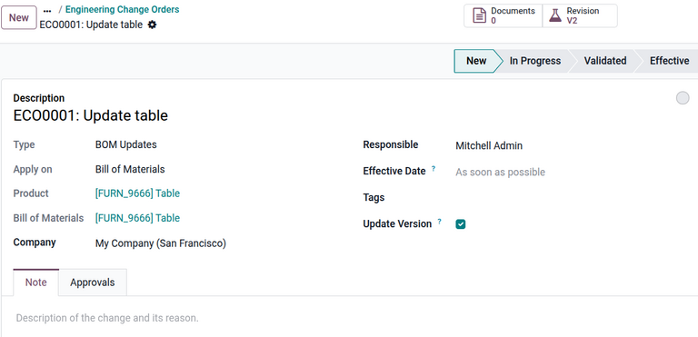

=========================
Engineering change orders
=========================

.. |BOM| replace:: :abbr:`BoM (Bill of Materials)`
.. |BOMs| replace:: :abbr:`BoMs (Bills of Materials)`
.. |ECO| replace:: :abbr:`ECO (Engineering Change Order)`
.. |ECOs| replace:: :abbr:`ECOs (Engineering Change Orders)`

Use *engineering change orders* (ECOs) to track, implement, and revert change versions made to
products and :doc:`bills of materials <../../manufacturing/basic_setup/bill_configuration>`.

Engineering change orders can be created in three ways:

#. Directly in the :ref:`ECO type <plm/engineering_change_orders/create-eco>`.
#. Automatically during an :ref:`update instructions request in Shop Floor
   <plm/engineering_change_orders/shop-floor>`
#. Automatically from feedback submitted to the :ref:`ECO type's email alias
   <plm/eco_type/create-type>`.

Create ECO
==========

Engineers and Shop Floor operators can suggest changes in two ways.

.. _plm/engineering_change_orders/create-eco:

Create ECO in PLM
-----------------

To create a new |ECO|, begin by navigating to the **PLM** app. Click the :guilabel:`# Engineering
Changes` button on the |ECO| type that should be used to track the progress of the change. On the
:guilabel:`Engineering Change Orders` page, click the :guilabel:`New` button in the top-left corner.

.. note::
   :doc:`ECO types <eco_type>` categorize and organize change orders. Doing so can ensure that
   employees only view the |ECOs| related to their responsibilities, whether it involves new product
   introductions, targeted product line updates, or regulatory compliance fulfillment.

On the |ECO| form, fill in the following fields accordingly:

- :guilabel:`Description`: Enter a brief summary of the improvement.
- :guilabel:`Type`: Specify the |ECO| type project for organizing the |ECOs|.
- :guilabel:`Apply on`: Specify if the |ECO| changes the version of the :guilabel:`Bill of
  Materials` or the :guilabel:`Product Only`.
- :guilabel:`Product`: Indicate the product being improved.
- :guilabel:`Bill of Materials`: Specify the changed |BOM|. This field auto-populates if the product
  in the :guilabel:`Product` field has an existing |BOM|. If multiple |BOMs| exist, select the
  intended |BOM| from the drop-down menu.

   .. important::
      A :guilabel:`Product` must be selected before the :guilabel:`Bill of Materials` options are
      available.

- :guilabel:`Company`: In multi-company databases, specify if the change applies to products in a
  specific company, or leave blank if the change applies to all companies.

   .. note::
      The :guilabel:`Company` field is only available when multiple companies are enabled. See
      :doc:`../../../general/companies/multi_company`.

- :guilabel:`Responsible`: Assign a user to be in charge of this |ECO|. (Optional)
- :guilabel:`Effective Date`: Specify when the |ECO| becomes live. If nothing is entered in this
  field, the |ECO| will go into effect :guilabel:`As soon as possible`, or as soon as an authorized
  user :ref:`applies the changes <plm/engineering_change_orders/apply-changes>`. Otherwise, specify
  a date and time.
- :guilabel:`Tags` are assigned to |ECOs| for prioritization and organization. Create a new tag by
  typing the name in the field and selecting :guilabel:`Create` from the drop-down menu. (Optional)
- :guilabel:`Update Version`: Select this checkbox to update the version of the |BOM| or product
  when the |ECO| becomes effective.

After completing the |ECO| form, click the :guilabel:`Start Revision` button to begin implementing
the changes.

When clicking :guilabel:`Start Revision`, three actions occur:

#. The :icon:`fa-file-text-o` :guilabel:`Documents` smart button appears, storing the relevant files
   of the |BOM|.
#. A copy of the production |BOM| is stored in the :icon:`fa-flask` :guilabel:`Revision` smart
   button of the |ECO|. The next available version number (e.g., `V2`, `V3`, ...) is also assigned
   to keep track of all |BOM| versions.
#. The stages of the |ECO| :guilabel:`Type` are displayed at the top of the |ECO|.

.. note::
   The :guilabel:`Revision` smart button is available **only** when the :guilabel:`Bill of
   Materials` radio button is selected in the :guilabel:`Apply on` field and the :guilabel:`Start
   Revision` button has been pressed.

.. _plm/engineering_change_orders/shop-floor:

Create ECO in Shop Floor
------------------------

|ECOs| can also be created from the *Shop Floor* module during the manufacturing process.

Open the :menuselection:`Shop Floor` module. Open a work order from the *Overview* or a work center
view.

In the work order card, click the :icon:`fa-ellipsis-v` :guilabel:`(vertical ellipsis)` button in
the bottom corner. The *Options* pop-up window opens.

Click the :icon:`fa-edit` :guilabel:`Update Instructions` button. Then, select :guilabel:`Add/Modify
Step`. Then, select one of the options from this menu:

- :guilabel:`Update Instructions`: Select a step to update its instructions.
- :guilabel:`Delete a Step`: Select a step to delete.
- :guilabel:`Add a Step`: To add a step, select the step that should come before it.

Complete the form for the suggestion, then click :guilabel:`Propose Change`. An |ECO| is created for
the suggested change.

.. example::
   An operator suggested adding a quality check step to the `Assembly` operation for :abbr:`MO
   (Manufacturing Order)` `WH/MO/00001` (`Table`) to verify the leg angles post-installation.

:ref:`Review proposed changes <plm/engineering_change_orders/view-eco>` in the **PLM** app.

Change components
=================

To modify the components in a |BOM|, click the :icon:`fa-flask` :guilabel:`Revision` smart button on
an |ECO| to access the new version of the |BOM|. Odoo distinguishes the non-production version of
the |BOM| from the current version by flagging the test |BOM| with a large :guilabel:`Archived` tag.

.. example::
   After clicking the :guilabel:`Start Revision` button for an |ECO| for the `Table` product, make
   changes to the product's |BOM| by clicking the :guilabel:`Revision` smart button. Doing so opens
   the archived |BOM|, marked with a large red :guilabel:`Archived` flag.

   .. image:: engineering_change_orders/archived-bom.png
      :alt: Show the archived Bill of Materials.

On the new |BOM|, in the *Components* tab, modify the components list by changing the
:guilabel:`Quantity` of existing components, adding new components using the :guilabel:`Add a line`
link, and removing components with the :icon:`fa-trash-o` :guilabel:`(Delete row)` icon.

.. _plm/engineering_change_orders/example:

.. example::
   In version two of the |BOM| for a table, the table top component is changed to a `Fancy Table
   Top`, the `Bolt` components are removed, and 10 `Wood Plug` components are added.

   .. image:: engineering_change_orders/version-2-bom.png
      :alt: A revised BOM for a table.

Change operations
=================

To modify the operations in a |BOM|, click the :icon:`fa-flask` :guilabel:`Revision` smart button on
an |ECO| to access the archived, new version of the |BOM|. Odoo distinguishes the non-production
version of the |BOM| from the current version by flagging the test |BOM| with a large
:guilabel:`Archived` tag.

In the new |BOM| version, open the *Operations* tab to view and edit |BOM| operations. To make
changes, select each operation, which opens an *Open: Operations* pop-up window.

.. note::
   The *Operations* tab is **not** available by default. To enable it, navigate to
   :menuselection:`Manufacturing app --> Configuration --> Settings`, and select the :guilabel:`Work
   Orders` checkbox.

Modify any of the fields in the *Open: Operations* pop-up window. Create new operations by clicking
the :guilabel:`Add a line` button. Remove operations by clicking the :icon:`fa-trash-o`
:guilabel:`(Delete row)` icon.

When changes are complete, click :guilabel:`Save`.

Compare changes and costs
=========================

Changes and tests are encapsulated in the revised |BOM|, and do **not** affect the |BOM| currently
used in production until the :ref:`changes are applied
<plm/engineering_change_orders/apply-changes>`.

To compare a revised |BOM| to the previous version, navigate to the |ECO| for that |BOM| in either
of these ways:

#. From the revised |BOM|, click the |ECO| name (for example, `ECO0005: Improve...`) in the
   breadcrumbs located in the top-left corner. Then, click the :icon:`fa-exchange`
   :guilabel:`Review` smart button. This smart button only appears after changes are made to the
   |BOM|.
#. From the :guilabel:`PLM Overview`, click the :guilabel:`# Engineering Changes` button on the
   :guilabel:`BOM Updates` Kanban card. Click the Kanban card for the appropriate |ECO| to open it,
   then click the :icon:`fa-exchange` :guilabel:`Review` smart button at the top of the |ECO| form.

Clicking the :icon:`fa-exchange` :guilabel:`Review` smart button on the |ECO| form opens the *ECO
Changes Summary* report. On this page, all changes are displayed. The changes are color-coded:

- **Green** text indicates the component or operation was added to the |BOM|.
- **Red** text indicates the component or operation was removed from the |BOM|.
- **Blue** text indicates that the component or operation was modified.

The change type (:guilabel:`Add`, :guilabel:`Remove`, or :guilabel:`Update`) appears next to the
change.

This report also lists the costs associated with changes to the |BOM|. Costs are pulled from the
:guilabel:`Cost` field on the product form and the :guilabel:`Costing Information` on the work
center form. Costs are listed in the :guilabel:`BoM Cost` field for each change.

The list of component changes appears first in the report:

- :guilabel:`Components`: Lists the name of the component.
- :guilabel:`Description`: Displays a description of the product if one is included on the product
  form.
- :guilabel:`Quantity`: Displays the quantity and unit of measure being changed.

The list of :guilabel:`Operations` changes appears after the component changes. The name of the
operation is listed for every operation change. If instructions are updated as part of the change,
its name and type is included on its own line. The :guilabel:`Duration` change is also listed.

Finally, the total cost change appears at the bottom of the report. If total cost change is less
than the previous |BOM|, the cost change appears in **green**. If the total cost change is more than
the previous |BOM|, the cost change appears in **red**.

.. example::
   View the summary of the differences between the current and revised table |BOMs| in the *ECO
   Changes Summary* report of the |ECO|.

   .. image:: engineering_change_orders/bom-changes.png
      :alt: View summary of component changes in the ECO Changes Summary report.

.. _plm/engineering_change_orders/apply-changes:

Apply changes
=============

After verifying the changes, move the |ECO| to a :ref:`verification stage
<plm/eco_type/stage-config>`, which are stages that require approval before the revised changes can
be applied to the production |BOM|.

Approvers can :guilabel:`Approve` or :guilabel:`Reject` the changes.

After the approvers approve the changes, the :guilabel:`Apply Changes` button becomes available.

.. note::
   The :guilabel:`Apply Changes` button may be in a different stage than the approval stage.

Click :guilabel:`Apply Changes` to automatically move the |ECO| to a closing stage. The changes are
applied, which archives the original production |BOM|, and the revised |BOM| becomes the new
production |BOM|.

Verify changes
--------------

To ensure the changes are live, from the |ECO| where the :guilabel:`Apply Changes` button was
pressed, return to the revised |BOM| by clicking the :guilabel:`Revision` smart button.

On the revised |BOM|, the large red :guilabel:`Archived` flag is removed.

To further verify the changes, check the production |BOM| by going to :menuselection:`Manufacturing
app --> Products --> Bills of Materials` and opening the bill of materials.

In the :guilabel:`Miscellaneous` tab of the |BOM|, the :guilabel:`Version` field is updated to match
the version number shown on the :guilabel:`Revision` smart button of the latest |ECO|.

.. example::
   After applying the changes of the |ECO| for the :ref:`table
   <plm/engineering_change_orders/example>`, view the version of the current table |BOM| in the
   :guilabel:`Miscellaneous` tab. Here, the :guilabel:`Version` number has been updated to `2`,
   matching the `V2` that appears in the :guilabel:`Revision` smart button of the |ECO|.

   .. image:: engineering_change_orders/bom-version.png
      :alt: View current BOM version in the Miscellaneous tab.

.. _plm/engineering_change_orders/view-eco:

View changes
============

To review proposed changes, navigate to the :menuselection:`PLM app --> Overview`. In the |ECO| type
card, the :guilabel:`# Engineering Changes` button represents the number of operational changes
created.

Click on the :guilabel:`# Engineering Changes` button to open the Kanban view of the |ECO| type. To
view the suggestion, select an |ECO| in the `New` stage.

On the |ECO|, view a summary of the proposed changes in two ways:

- From the :icon:`fa-flask` :guilabel:`Revision` smart button
- From the :icon:`fa-exchange` :guilabel:`Review` smart button

.. example::
   An operator suggested verifying the angle of the table legs after they had been installed by
   adding a step while performing the `Assembly` operation for the :abbr:`MO (Manufacturing Order)`
   `WH/MO/00001` for the product, `Table`.

   Then, this created |ECO| can be viewed by navigating to the `BOM Changes` ECO type found in
   :menuselection:`PLM app --> Overview`.

   The :guilabel:`Responsible` field is assigned to the operator who made the suggestion, allowing
   the employee revising the |BOM| to seek further clarification from the person who proposed the
   changes.

   .. image:: engineering_change_orders/view-bom-change.png
      :alt: Find the new ECO in the "BOM Changes" ECO type, in the "New" stage.

On the revised |BOM|, switch to the :guilabel:`Operations` tab and select the operation.

.. example::
   Continuing the previous example, after the responsible engineer opens the *Operations* tab, a
   list of *Instructions* to perform the operation displays. The newest instruction is titled `New
   Step Suggestion:`, followed by the user-entered title. Click the line item to view the suggested
   changes.

   .. image:: engineering_change_orders/show-instructions.png
      :alt: Open the operation from the list to view its instructions.
