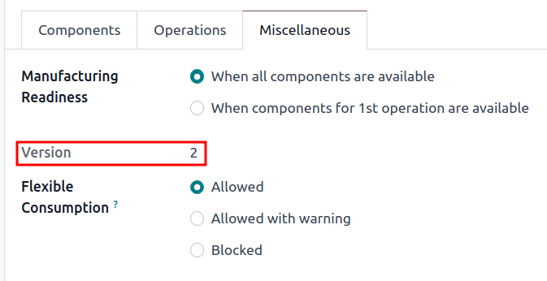
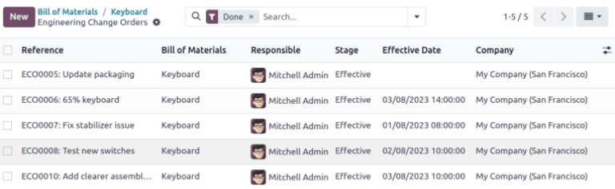

===============
Version control
===============

.. |BOM| replace:: :abbr:`BoM (Bill of Materials)`
.. |BOMs| replace:: :abbr:`BoMs (Bills of Materials)`
.. |ECO| replace:: :abbr:`ECO (Engineering Change Order)`
.. |ECOs| replace:: :abbr:`ECOs (Engineering Change Orders)`

Use Odoo's *Product Lifecycle Management (PLM)* to manage previous versions of bills of materials
(BoMs). Store former assembly instructions, component details, and past product design files while
keeping the past details out of the production |BOM|.

Easily revert to previous |BOM| versions, when needed. Additionally, use *PLM* to trace which |BOM|
version was active on specific dates for recalls or customer complaints.

Every |BOM| version is stored in an *engineering change order* (ECO) for organized testing and
improvements without disrupting normal manufacturing operations.

.. seealso::
   :ref:`Engineering change order <plm/eco>`

Current BoM version
===================

To see the current version of the |BOM| used in production, go to :menuselection:`PLM app --> Master
Data --> Bill of Materials`, and select the desired |BOM| from the list. Then, switch to the
:guilabel:`Miscellaneous` tab, where the currently live :guilabel:`Version` of the |BOM| is
displayed.

.. note::
   |BOMs| can also be accessed from :menuselection:`Manufacturing app --> Products --> Bill of
   Materials`.

Version history
===============

To manage all former, current, and future versions of a |BOM|, begin by navigating to
:menuselection:`Manufacturing app --> Products --> Bills of Materials` and click the desired |BOM|.

From the |BOM| page, click the :guilabel:`ECO` smart button, and switch to list view by selecting
the :guilabel:`≣ (four horizontal lines)` icon on the top right corner.

.. note::
   The :guilabel:`ECO` smart button is visible on the |BOM| **only** if the *PLM* app is installed.

.. image:: version_control/eco-smart-button.png
   :align: center
   :alt: Show ECO smart button on a BoM.

In the list of |ECOs| for the product, navigate to the search bar at the top, and click the
:guilabel:`▼ (down arrow)` icon on the right to access a drop-down menu of :guilabel:`Filters`.

Next, filter by :guilabel:`Done` |ECOs| to view: the revision history of the |BOM|, the
:guilabel:`Responsible` user who applied the change, and the :guilabel:`Effective Date` of the
|BOM|.

Click each |ECO| to view the past components, operations, and design files associated with the
|BOM|.

.. note::
   If the :guilabel:`Effective Date` field is empty, the :guilabel:`Effective` date of the |ECO| is
   automatically set to :guilabel:`As soon as possible` and no dates are recorded in the revision
   history of the |BOM|.

   .. image:: version_control/no-effective-date.png
      :align: center
      :alt: List of BOM effective dates.

.. tip::
   A workaround for checking when the |BOM| went live is by navigating to the chatter, and hovering
   over the time the |ECO| was moved to the :ref:`closing stage <plm/eco/stage-config>`.

Design files
============

Attach computer-aided design (CAD) files, PDFs, images, or other design material to the |BOM|
itself.

To do so, navigate to :menuselection:`PLM app --> Master Data --> Bill of Materials`, and select the
desired |BOM|. On the |BOM|, navigate to the *chatter*, and click the :guilabel:`📎 (paperclip)`
icon.

The files associated with the |BOM| are displayed in the :guilabel:`Files` section. To add more
design files, select the :guilabel:`Attach files` button.

.. image:: version_control/attach-files.png
    :align: center
    :alt: Show paperclip icon in the chatter to attach files to a BoM.

Manage design files in an ECO
-----------------------------

Add, modify, and remove files in an |ECO|. Once the |ECO| is approved and applied, the new files are
automatically linked to the production |BOM|. Archived files are removed from the |BOM|, but are
still accessible in the |ECO|.

To manage the design files in the |ECO|, begin by navigating to :menuselection:`PLM app --> Changes`
and choose the desired |ECO|. Next, open the :guilabel:`Attachments` page by clicking the
:guilabel:`Documents` smart button.

Hover over each attachment to reveal the :guilabel:`︙ (three vertical dots)` icon. From there,
choose whether to :guilabel:`Edit`, :guilabel:`Remove`, or :guilabel:`Download` the file. Any
changes made to these files are contained within the |ECO|, and will only apply to the production
|BOM| once the :ref:`changes are applied <plm/eco/apply-changes>`.

.. example::
   In the `Create 60% keyboard` |ECO|, the design files are from the original `100% keyboard` |BOM|.
   To replace the keyboard PDF, begin by selecting the :guilabel:`Documents` smart button.

   .. image:: version_control/documents-smart-button.png
      :align: center
      :alt: Show *Documents* smart button from an active ECO.

   On the :guilabel:`Attachments` page, hover over the `100% keyboard manual.pdf` design file, and
   click the :guilabel:`︙ (three vertical dots)` icon. Then, click the :guilabel:`Remove` option to
   archive the file.

   Next, on the same :guilabel:`Attachments` page, click the :guilabel:`Upload` button to upload the
   new design file, named `60% keyboard manual`.

   .. image:: version_control/attachments.png
      :align: center
      :alt: View of *Attachments* page from the *Documents* smart button. Displays one archived and
            one newly added attachment.

.. note::
   Archived files are **not** permanently deleted — they can still be accessed in the previous
   |ECO|, or as an archived file in the latest |ECO|, where the archival occurred.

Apply rebase
============

Odoo simplifies merge conflict resolution for concurrent |ECOs| on the same product.

Conflicts can occur when the production |BOM| is updated while other |ECOs| are modifying the
previous version. Differences between the new and previous production |BOMs| are displayed in the
:guilabel:`Previous Eco Bom Changes` tab, visible only in this scenario.

To resolve conflicts and retain |ECO| changes, click the :guilabel:`Apply Rebase` button.

.. example::
   Two |ECOs|, `ECO0011` and `ECO0012`, are created when the current |BOM| version is `5`. In
   `ECO0011`, a new component, `Space stabilizer`, is added, and the changes are applied. This means
   the current |BOM| version has become `6`.

   .. image:: version_control/branch-change.png
      :align: center
      :alt: Apply changes to an ECO to update the production BOM.

   This means `ECO0012` is modifying an outdated |BOM|. As shown in the :guilabel:`Previous Eco Bom
   Changes` tab, the |BOM| is missing the `Space stabilizer`.

   To ensure the changes applied by `ECO0011` are kept when the changes occur in `ECO0012`, click
   the :guilabel:`Apply Rebase` button to apply the previous |ECO| changes, without affecting the
   changes already made to `ECO0012`.

   .. image:: version_control/merge-change.png
      :align: center
      :alt: Click the *Apply Rebase* button to update the BOM to match the production BOM.

