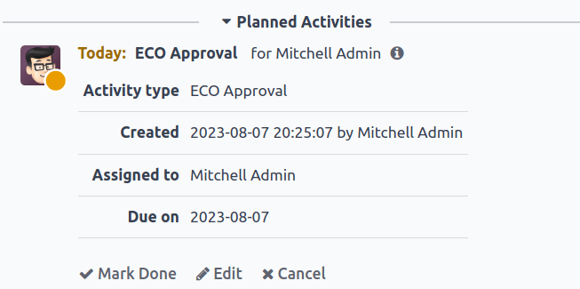
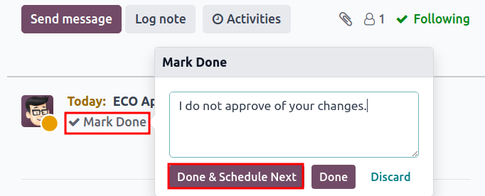

=========
Approvals
=========

.. |ECO| replace:: :abbr:`ECO (Engineering Change Order)`
.. |ECOs| replace:: :abbr:`ECOs (Engineering Change Orders)`

.. _plm/approvals:

Notify stakeholders and managers automatically by assigning approvers to stages of :ref:`engineering
change orders <plm/eco>` (ECOs) under review. Changes can only be applied after the assigned
approver accepts them. Approvals ensure reviews by team members, which prevents mistakes and
premature actions.

.. seealso::
   :ref:`Stage configuration <plm/eco/stage-config>`

Add approver
============

To add an approver, first go to the :menuselection:`PLM app`, and click on the project card of an
ECO type to open the Gantt view of the |ECOs|.

On the :guilabel:`Engineering Change Orders` page, hover over the intended stage, and select the
:guilabel:`⚙️ (gear)` icon. Then, click :guilabel:`Edit` to open a pop-up window.

.. note::
   Approvers can be added to any stage, but it's strongly recommended to assign them to the
   *verification* stage, which comes before the *closing* stage, where |ECOs| are applied, and the
   :abbr:`BoM (Bill of Materials)` version is updated.

   See the documentation about :ref:`stage types <plm/eco/stage-config>` for more information.

.. _plm/approvals/approval-type:

In the :guilabel:`Edit` stage pop-up window, click the :guilabel:`Add a line` button, located under
:guilabel:`Approvals`. Then, type in the approver's position (or title) under :guilabel:`Role` (e.g.
`Engineering Manager`, `Quality Team`, etc.), and select the relevant :guilabel:`User` from the
drop-down menu.

Next, set the :guilabel:`Approval Type` to :guilabel:`Is required to approve`, :guilabel:`Approves,
but the approval is optional`, or :guilabel:`Comments only`.

.. example::
   Assign the `CTO`, "Mitchell Admin," as a required approver for |ECOs| in the `Validated` stage in
   the `New Product Introduction` ECO type.

   Approvals from the quality and marketing teams are **not** required to apply changes to the |ECO|
   because their :guilabel:`Approval Type` is set to :guilabel:`Approves, but the approval is
   optional` and :guilabel:`Comments only`, respectively.

   .. image:: approvals/approvers.png
      :align: center
      :alt: Set an approver that "Is required to approve" ECOs in the "Validated" stage.

Manage approvals
================

Approvers can easily track their to-do approvals by navigating to the :menuselection:`PLM app`, and
looking at the card for an ECO type, which shows the count of open tasks assigned to them.

Here's what each button on an ECO project card does:

#. The :guilabel:`# Engineering Changes` button displays a count of in-progress |ECOs| of this ECO
   type. Clicking the button opens the Gantt view of the :guilabel:`Engineering Change Orders` page.
#. :guilabel:`My Validations` displays a count of |ECOs| the approver must accept or reject.
   Clicking on this button displays |ECOs| pending approval or rejected (marked with the red
   :guilabel:`Blocked` state).
#. The :guilabel:`All Validations` button shows the count of |ECOs| awaiting approval or rejected by
   any approver. Clicking it reveals these pending |ECOs|.
#. :guilabel:`To Apply` displays a count of |ECOs| to which the user needs to apply changes.
   Clicking on the button displays all the |ECOs| to approve, and apply changes to, in the
   verification stage.

   |ECOs| marked with the green :guilabel:`Done` stage have already been approved, and the user just
   needs to click on the |ECO| to enter the form view, and click the :guilabel:`Apply Changes`
   button.

.. image:: approvals/validation-overview.png
   :align: center
   :alt: Display count of validations to-do and buttons to open filtered list of ECOs.

Approve ECOs
------------

Navigate to an |ECO| in a verification stage, while logged in as the assigned approver, to see the
:guilabel:`Approve`, :guilabel:`Reject`, and :guilabel:`Apply Changes` buttons.

To approve the |ECO|, and apply the changes onto the production :abbr:`BoM (Bill of Materials)`,
click :guilabel:`Approve`, and then :guilabel:`Apply Changes`.

Note that the :guilabel:`Apply Changes` button will **not** work unless the :guilabel:`Approve`
button was clicked first. Additionally, the chatter logs the history of the clicked buttons.

.. warning::
   When the :guilabel:`Approval Type` is **not** set to :guilabel:`Is required to approve`, approval
   from the associated user is not needed before applying changes with the :guilabel:`Apply Changes`
   button. Thus, the :guilabel:`Apply Changes` button **will work** without requiring the
   :guilabel:`Approve` button to be clicked first.

Automated activities
--------------------

When an |ECO| is moved to a verification stage, a planned activity is automatically created for
assigned approvers to review the |ECO|. Approvers receive a notification in their activities inbox,
accessible through the :guilabel:`🕘 (clock)` icon at the top of the page.

In the to-do task list, the :guilabel:`Engineering Change Order (ECO)` notification displays the
number of activities marked :guilabel:`Late`, :guilabel:`Today`, and :guilabel:`Future`. Clicking on
each of these buttons shows a filtered Gantt view of the respective |ECOs|.

.. example::
   Scheduled activities are shown as a number on the :guilabel:`🕘 (clock)` icon, with `5` |ECOs|
   pending approval :guilabel:`Today`. Currently, there are `0` :guilabel:`Late` or
   :guilabel:`Future` |ECOs|.

    .. image:: approvals/todo-list.png
       :align: center
       :alt: Show scheduled approvals notifications for the user.

By clicking a pending |ECO|, a *planned activity* for :guilabel:`ECO Approval` is recorded in the
chatter. Click on the :guilabel:`i (Info)` icon to view additional information, including the
approval's :guilabel:`Created` date, the approver :guilabel:`Assigned to` it, and the due date.

Follow-up activities
~~~~~~~~~~~~~~~~~~~~

When |ECOs| are rejected, tasks need to be assigned to project members for required modifications
before |ECO| approval. To create tasks with deadlines, navigate to the rejected |ECO| form, and go
to the chatter.

Select the :guilabel:`Mark Done` button in the :guilabel:`Planned Activities` section of the chatter
to close the activity, and open a pop-up window for creating tasks.

         close the planned activity.

In the :guilabel:`Mark Done` window, click :guilabel:`Done & Schedule Next` to open a new
:guilabel:`Schedule an Activity` window. Next, set the :guilabel:`Assigned to` team member and the
:guilabel:`Due Date` for completing the changes. Provide task details in the :guilabel:`Summary`
field and the text box. Click the :guilabel:`Schedule` button to close the window.

After closing the window, on the |ECO| form, move the |ECO| back one stage. Doing so ensures that
when the team member completes the changes, and returns the |ECO| to the verification stage, a new
:guilabel:`ECO Approval` task is created for the approver.

.. example::
   The approver creates an activity for the :guilabel:`Responsible` of the |ECO|, `Laurie Poiret`,
   that details the changes required for the approver to :guilabel:`Accept` the |ECO|. Clicking the
   :guilabel:`Schedule` button creates a planned activity for Laurie due on `08/15/2023`.

   .. image:: approvals/schedule-an-activity.png
      :align: center
      :alt: Create a scheduled activity for follow-up changes to a rejected ECO.
