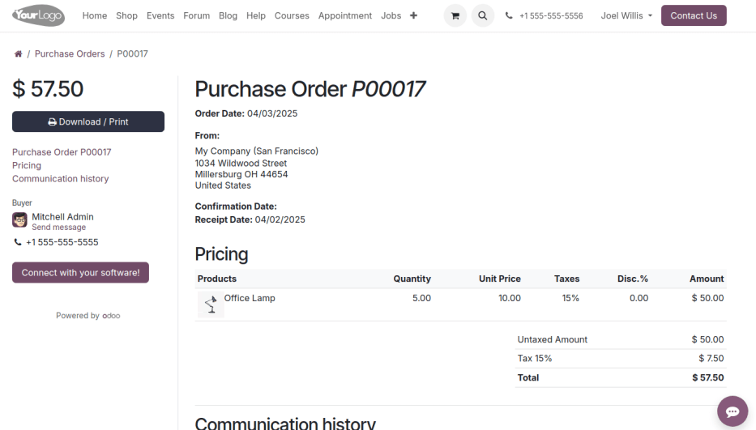
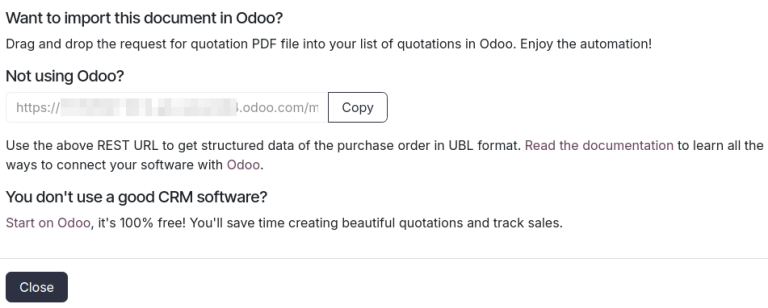
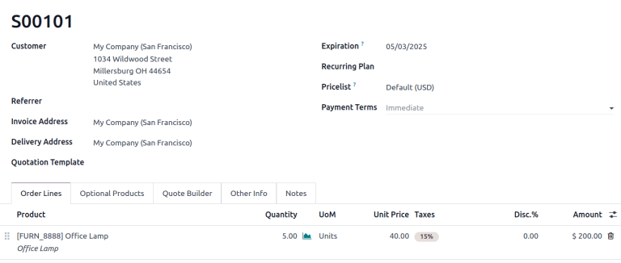

==================================
EDI purchase-to-sales order import
==================================

.. |EDI| replace:: :abbr:`EDI (Electronic Data Exchange)`
.. |PO| replace:: :abbr:`PO (purchase order)`
.. |SO| replace:: :abbr:`SO (sales order)`

Electronic data interchange (EDI) enables companies using different software systems to exchange
information in a standardized, structured format.

In Odoo, a *purchase order* (PO) can be exported as an XML file and imported as a *sales order* (SO)
into another Odoo database, removing the need for manual entry of products, quantities, prices, and
other key information.

.. note::
   Exported XMLs follow the `Order-X schema <https://fnfe-mpe.org/factur-x/order-x/>`_, a standard
   commonly used in European countries. When exchanging data between two Odoo databases, this schema
   remains compatible.

   However, implementing custom developments for software that does not support the Order-X schema
   may introduce additional complexity.

Roles and configuration
=======================

To facilitate the |EDI| workflow, two companies are involved: the buyer (the company placing the
order) and the seller (the company fulfilling the order). Each company has specific roles and
configurations.

Buyer database
--------------

The buyer database is responsible for creating and confirming purchase orders. Prerequisites include
:ref:`installing <general/install>` the **Purchase** app and adding vendors (the sellers in this
workflow) as :doc:`portal users <../../../general/users/portal>`.

Seller database
---------------

The seller database is responsible for receiving and processing sales orders. The only prerequisite
is :ref:`installing <general/install>` the **Sales** app.

Workflow
========

Buyer's process
---------------

To begin, the buyer (in their database) navigates to the :menuselection:`Purchase` app to create a
request for quotation (RFQ).

Set the :guilabel:`Vendor` to the portal user representing the seller, and :guilabel:`Confirm` the
:abbr:`RFQ (request for quotation)`. Doing so converts it into a :doc:`purchase order
<../manage_deals/rfq>`.

.. example::
   |PO| from the buyer's database. The :guilabel:`Vendor` is the seller's portal user account, Joel.

   .. image:: edi/po-database-view.png
      :alt: Example PO. The Vendor is the seller's portal user account, Joel.

Seller's process
----------------

Once the |PO| is confirmed, it appears on the seller's portal dashboard. The seller downloads the
XML file and uploads it to their database.

Download file
~~~~~~~~~~~~~

As the seller, log in to the buyer's database as the portal user. On the dashboard, scroll down and
click the :guilabel:`Our Orders` button. Doing so reveals a list of purchase orders the buyer's
database has addressed to the portal user.

Select the desired purchase order, and the click :guilabel:`Connect with your software!` button.

In the pop-up window, copy the provided URL, and paste it into a new browser tab to download the XML
file.

.. example::
   Joel's portal view of the PO. The first image displays the :guilabel:`Connect with your
   software!` button, and the second image displays a pop-up window with the :guilabel:`Copy`
   button.

.. example::
   :download:`XML file <edi/P00017.xml>` for PO00017

Upload file
~~~~~~~~~~~

Next, the seller logs in to their own Odoo database and opens :menuselection:`Sales` app. Click
:guilabel:`Upload` and select the downloaded XML file. Alternatively, users can drag and drop the
file into the :guilabel:`Quotations` dashboard.

Doing so automatically generates a sales order with the customer populated as the buyer and all
product lines, quantities, and prices pre-filled. This process ensures efficient and accurate data
exchange between the two databases.

   Uploaded SO in the seller's database.

.. seealso::
   :doc:`../../../sales/sales/sales_quotations/create_quotations`

