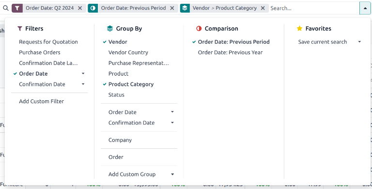
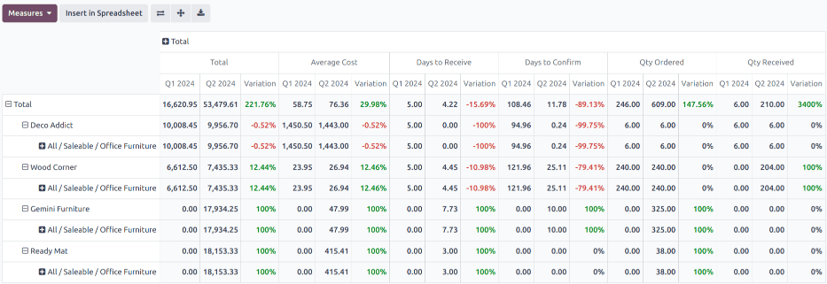

===========================
Procurement expenses report
===========================

.. |RFQ| replace:: :abbr:`RfQ (Request for Quotation)`
.. |RFQs| replace:: :abbr:`RfQs (Requests for Quotation)`
.. |POs| replace:: :abbr:`POs (Purchase Orders)`
.. |PO| replace:: :abbr:`PO (Purchase Order)`
.. |caret| replace:: :icon:`fa-caret-down` :guilabel:`(down)` icon
.. |per| replace:: procurement expenses report

With the *Purchase* application, users can monitor procurement expenses over time. This report helps
companies track and analyze spending, identify cost-saving opportunities, and ensure efficient
budget management.

Create procurement expenses report
==================================

To create a |per|, first navigate to :menuselection:`Purchase app --> Reporting --> Purchase` to
open the :guilabel:`Purchase Analysis` dashboard.

By default, the dashboard displays a line chart overview of the :guilabel:`Untaxed Total` of
:guilabel:`Purchase Orders` (POs) with a :guilabel:`Confirmation Date` for the current month, or of
Requests for Quotation (RFQs) with a status of *Draft*, *Sent*, or *Cancelled*.

Add filters and groups
----------------------

On the top-right, click the :icon:`oi-view-pivot` :guilabel:`(pivot)` icon to switch to pivot view.

.. tip::
   While the |per| can also be :ref:`viewed <purchase/view-results>` as a :icon:`fa-bar-chart`
   :guilabel:`(bar chart)`, :icon:`fa-line-chart` :guilabel:`(line chart)`, or :icon:`fa-pie-chart`
   :guilabel:`(pie chart)`, the pivot view provides the most detailed view of the data, and is the
   recommended starting point.

Remove any default filters from the :guilabel:`Search...` bar. Then, click the |caret| to open the
drop-down menu that contains the :guilabel:`Filters`, :guilabel:`Group By`, and
:guilabel:`Favorites` columns.

.. note::
   Unless otherwise specified, the report displays data from both |RFQs| and |POs|. This can be
   changed by selecting either :guilabel:`Requests for Quotation` or :guilabel:`Purchase Orders`
   under the :guilabel:`Filters` column.

Under the :guilabel:`Filters` column, select a time frame to use for comparison. The report can be
filtered by either :guilabel:`Order Date` or :guilabel:`Confirmation Date`. Choose one from the
list, and click the |caret| to specify the date range, either by month, quarter, or year.

Next, under the :guilabel:`Group by` column, select :guilabel:`Vendor`. Then, select
:guilabel:`Product Category`, which is also located in the :guilabel:`Group By` column.

.. note::
   The selections under the :guilabel:`Group By` heading can be altered, depending on the needs of
   the individual company. For example, selecting :guilabel:`Product`, instead of :guilabel:`Product
   Category`, provides a more in depth look at the performance of specific items, in place of an
   entire category.

Next, make a selection under the :guilabel:`Comparison` heading that appears. These options are only
available after the date range is selected under the :guilabel:`Filters` column, and vary based on
that range. :guilabel:`Previous Period` adds a comparison to the previous period, such as the last
month or quarter. :guilabel:`Previous Year` compares the same time period from the previous year.

.. note::
   While multiple time-based filters can be added at once, only one comparison can be selected at a
   time.

         report.

   The filter for Q2, comparison for **Previous Period**, and group-by for **Vendor** and **Product
   Category** were selected.

Add measures
------------

After selecting the :guilabel:`Filters`, :guilabel:`Group by`, and :guilabel:`Comparison` settings,
click out of the drop-down menu.

By default, the report displays data with the following measures: :guilabel:`Order`,
:guilabel:`Total`, :guilabel:`Untaxed Total`, and :guilabel:`Count`. Click :guilabel:`Measures` at
the top-left to open the drop-down list of available measures.

Click the following specific measures to include additional columns for the procurement expenses
report:

- :guilabel:`Total` and :guilabel:`Untaxed Total`: can include one or both measures. These are
  included for overall spending analysis.
- :guilabel:`Average Cost`: included to evaluate cost efficiency.
- :guilabel:`Days to Confirm` and :guilabel:`Days to Receive`: used to assess supplier performance.
- :guilabel:`Qty Ordered` and :guilabel:`Qty Received`: used to understand order efficiency.
- :guilabel:`Qty Billed` and :guilabel:`Qty to be Billed`: used to track order accuracy.

.. tip::
   Additional measures can be included in the report, if desired, to provide additional insights.
   For example, :guilabel:`Gross Weight` and :guilabel:`Volume` may be included for further
   logistics and management analysis.

After selecting all necessary measures, click out of the drop-down menu.

.. _purchase/view-results:

View results
============

After all of the filters and measures have been selected, the report generates in the selected view.

Click :guilabel:`Insert in Spreadsheet` to add the pivot view into an editable spreadsheet format
within the *Documents* app.

.. important::
   The :guilabel:`Insert in Spreadsheet` option is **only** available if the *Documents Spreadsheet*
   module is installed.

.. note::
   The |per| is also available in graph view. Click the :icon:`fa-area-chart` :guilabel:`(area
   chart)` icon to change to graph view. Click the corresponding icon at the top of the report to
   switch to a :icon:`fa-bar-chart` :guilabel:`(bar chart)`, :icon:`fa-line-chart` :guilabel:`(line
   chart)`, or :icon:`fa-pie-chart` :guilabel:`(pie chart)`.

.. seealso::
   To save this report as a *favorite*, see :ref:`search/favorites`.
