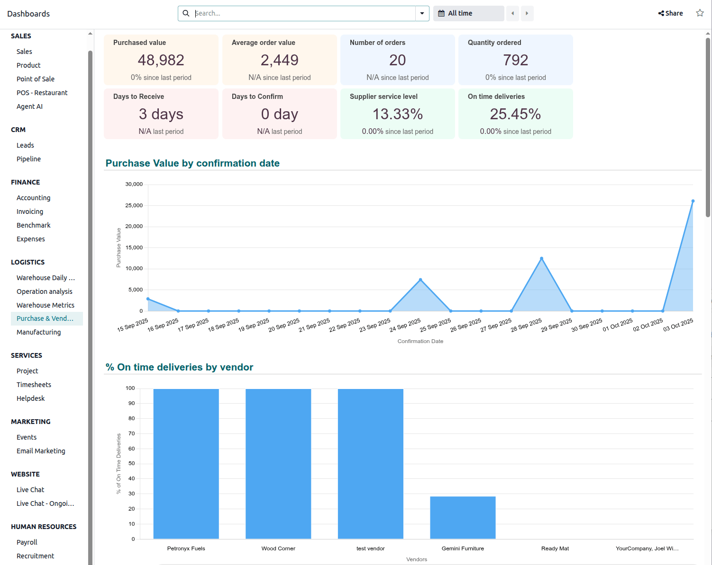

====================================
Purchase & Vendor analysis dashboard
====================================

The :guilabel:`Purchase & Vendor analysis` dashboard, available in the :doc:`Odoo Dashboards
<../../../productivity/dashboards>` app, offers various metrics to evaluate purchasing performance
and vendor reliability.

The dashboard tracks financial data like total and average purchase amounts and the number of
purchase orders. It also provides KPIs for supplier performance, such as the average time to receive
products and the percentage of quantities received on time. This makes it possible to rank vendors
and optimize procurement strategy accordingly.

To access the :guilabel:`Purchase & Vendor analysis` dashboard, go to the Dashboards app, then, in
the left panel, navigate to the :guilabel:`Logistics` section and click the name of the dashboard.
The dashboard opens in the main view.

.. seealso::
   - :ref:`Using Odoo dashboards <dashboards/use-dashboards>`
   - :ref:`Customizing Odoo dashboards <build_and_customize_dashboards/customize>`

.. note::
   - The :ref:`access rights <dashboards/access-and-sharing>` for Odoo dashboards are based on user
     groups, and are managed within the Dashboards app. By default, the :guilabel:`Purchase & Vendor
     analysis` dashboard is only visible to, and can only be accessed by, users with admin access to
     the **Inventory** app.

.. _purchase/dashboards/navigate:

Navigate the dashboard
======================

.. tip::
   - By default, this dashboard shows data for :guilabel:`All time`. To show data for a specific
     period, click :icon:`fa-calendar` :guilabel:`All time` above the dashboard and select or define
     the appropriate period.
   - For a more precise analysis, filter the dashboard by vendor via the search bar.

Eight cards at the top of the dashboard show the following information:

- :guilabel:`Purchased value`: indicates the total value of purchases during the selected period.
- :guilabel:`Average order value`: indicates the average purchase amount per order during the
  selected period.
- :guilabel:`Number of orders`: indicates the number of purchase orders during the selected period.
- :guilabel:`Quantity ordered`: indicates the quantity of products ordered during the selected
  period.
- :guilabel:`Days to receive`: indicates the average number of days between the order and receipt of
  purchased products (i.e., between the order deadline of the purchase order and the expected
  arrival of the purchase order line).

  .. note::
     The expected arrival date is not impacted by a change to the scheduled date on the receipt.

- :guilabel:`Days to Confirm`: indicates the average number of days before a purchase order is
  confirmed (i.e., between the creation date of the RFQ and the confirmation date of the purchase
  order).
- :guilabel:`Supplier service level`: indicates the quantity received versus the quantity purchased,
  as a percentage.

  .. note::
     This KPI is impacted by purchases with future expected receipts.

- :guilabel:`On time deliveries`: indicates the percentage of products received on time (based on
  the expected arrival date on purchase order lines)

The following charts are available:

- :guilabel:`Purchase Value by confirmation date`: shows the total value of confirmed purchases by
  date.
- :guilabel:`% On time deliveries by vendor`: shows the percentage of products received on time, by
  vendor (based on expected arrival on purchase order lines.)
- :guilabel:`Top vendors by amount`: shows the ranking of vendors by total value of purchase orders
  and number of purchase orders.
- :guilabel:`Top vendors by lead time in days`: shows the average number of days required to receive
  purchased products, by vendor (:guilabel:`Order deadline purchase order` - :guilabel:`Expected
  arrival purchase order line`).

  .. note::
     The expected arrival date is not impacted by a change to the scheduled date on the receipt.

- :guilabel:`Average product purchased cost by confirmation week`: shows the average unit cost of
  products purchased, by week in which the purchase order is confirmed.
- :guilabel:`Top purchase orders by value`: lists the ten purchase orders with the highest total
  value, in descending order.
- :guilabel:`Top 10 late receipts`: lists the ten receipts with the longest delay after the expected
  receipt date.
- :guilabel:`Top purchased products`: lists the ten products with the highest total purchase amount,
  in descending order.
- :guilabel:`Supplier Dependency Chart`: shows the percentage of purchases by buyer.
