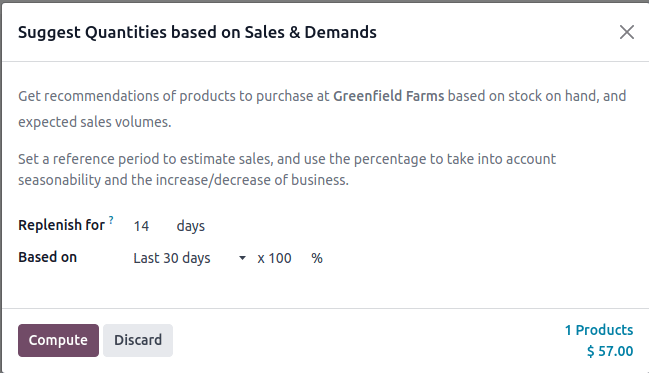
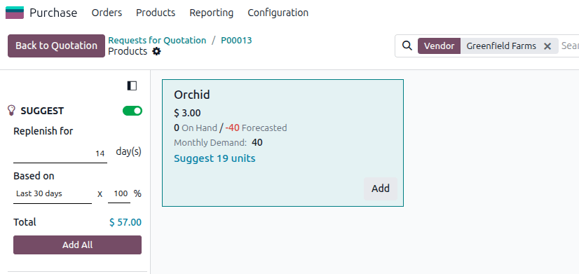
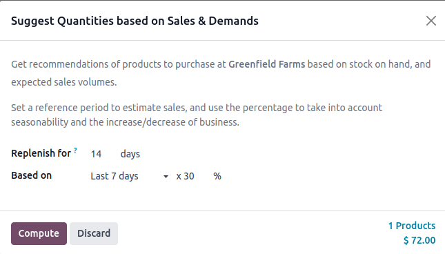
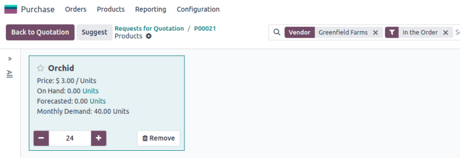

=============================================
Suggest quantities based on historical demand
=============================================

.. |RFQ| replace:: :abbr:`RFQ (request for quotation)`

For a straightforward push-based replenishment strategy the *Suggest* feature recommends quantities
to order on requests for quotations (RFQs) based on historical demand.

Key parameters:

- *Replenish for*: Number of days to cover future demand.
- *Based on*: Period used to calculate average daily demand (e.g., last 7 days, last 30 days, last 3
  months, last 12 months, or a past month/quarter).

Odoo sums all validated deliveries in the *Based on* period and divides that total by the number of
days in the *Based on* period to find the *average daily demand*.

.. math::
   Average~Daily~Demand = \frac{Validated~Deliveries}{Based~on~Days}

It then multiplies this average by the *Replenish for* days to calculate the recommended quantity.

.. math::
   Recommended~Quantity = Average~Daily~Demand \times Replenish~for~Days

.. example::

   In :ref:`example 1 <purchase/advanced/example-suggestion>`, the Odoo recommends `19` units to
   *Replenish for* `14` days *Based on* the past month's `40` delivered quantities. To see a
   breakdown of this, :ref:`skip to the section below <purchase/advanced/example-suggestion>`.

Prerequisite setup
==================

#. **Purchase** and **Inventory** apps must be installed
#. :ref:`Validate at least one delivery order <inventory/delivery/one-step>` for each product

   Ensures there is a past delivery record so the system can calculate average daily demand.

#. :ref:`Add a vendor to the vendor pricelist <purchase/manage_deals/vendor-pricelist>` with a
   purchase price for each product

   The *Suggest* feature is vendor-specific, so each product needs a matching vendor for accurate
   purchase quantity and price suggestions.

#. Set the *Product Type* to *Goods* and ensure the product is :ref:`Tracked by quantity
   <inventory/product_management/manufacture>`

   Ensures the system can manage stock levels and calculate recommended replenishment quantities for
   tangible items.

Suggest quantities to order
===========================

To suggest quantities based on past sales, navigate to the :menuselection:`Purchase` app. Create a
:guilabel:`New` |RFQ| or select an existing one.

In the |RFQ|, set the :guilabel:`Vendor` field to the chosen supplier.

In the :guilabel:`Products` tab, add desired products. Each product **must** include the same vendor
in its vendor pricelist.

Clicking :guilabel:`Catalog` in the :guilabel:`Products` tab displays the catalog of selected
products from the |RFQ|.

.. important::
   Verify that each product in the catalog is configured with the chosen vendor.

Within the :guilabel:`Catalog`, click the :guilabel:`Suggest` button to open the :guilabel:`Suggest
Quantities based on Sales & Demands` pop-up window, where the suggestion parameters are specified:

- :guilabel:`Replenish for`: Number of days intended to stock products
- :guilabel:`Based on`: Historical period used to calculate average daily demand (e.g.,
  :guilabel:`Last 30 Days`, :guilabel:`April 2024`)

- :guilabel:`Percentage`: Portion of historical demand to apply (e.g., 100%, 30%)

Once the parameters are confirmed, click :guilabel:`Compute` to calculate recommended quantities,
which are auto-filled in each product's quantities in the catalog. Adjust amounts if needed, then
click :guilabel:`Back to Quotation` to confirm the final numbers on the |RFQ|.

.. _purchase/advanced/example-suggestion:

Example 1
---------

A company needs to replenish orchids for 14 days, referencing the last 30 days of historical data at
100% capacity.

Historical Data:

- 20 units delivered 15 days ago in a `WH/OUT` operation.
- 20 units delivered 1 day ago
- Total: 40 units in the last 30 days

.. math::

   Average~Daily~Demand = 40 \divide 30 \approx 1.33 \text{units/day}

Over 14 days, at 100% of historical demand, the system suggests:

.. math::

   Suggested~Quantity = 1.33 \times 14 \approx 18.67 \text{rounded to 19 units}

   Suggestion to purchase 19 orchids.

Example 2
---------

The company needs to replenish orchids for the next 14 days, looking at the last 7 days of
historical data at 30% capacity.

Historical data:

- 20 units delivered 5 days ago
- 20 units delivered 2 days ago
- Total: 40 units in the last 7 days

This implies a total of 80 units sold in 14 days. Dividing 40 units by 14 yields an average daily
demand of 5.71 units/day (approximately).

.. math::

   Average~Daily~Demand = 40 \divide 14 \approx 5.71 \text{units/day}

Over 14 days, at 30% of historical demand, the system suggests:

.. math::

   Suggested~Quantity = 5.71 \times 14 \times 0.3 = 23.98 \text{rounded to 24 units}

   Suggestion to purchase 24 orchids.

Best practices
==============

#. Validate Historical Data

   Use accurate delivery orders to avoid incorrect forecasts. Suggested quantities rely on the
   *Scheduled Date* on the delivery order.

   .. image:: suggest/scheduled-date.png
      :alt: Example of scheduled date field.

#. Maintain Accurate Vendor Pricelists:

   Review and update vendor pricelists to reflect the latest pricing and supplier information to
   ensure correct suggestions.

#. Adjust for Seasonality:

   Reference prior months or quarters to capture seasonal fluctuations.

#. Review Suggestions Critically:

   Although the tool provides a baseline recommendation, always apply business judgment. Market
   changes, promotions, and upcoming events can affect actual demand.
