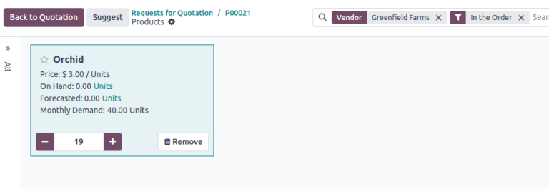
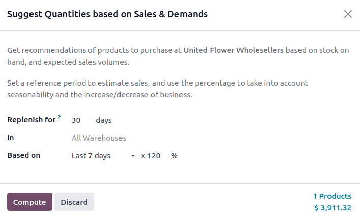
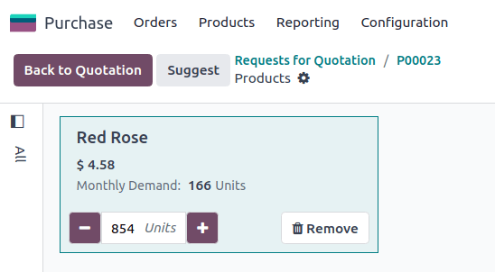

=============================================
Suggest quantities based on historical demand
=============================================

.. |RFQ| replace:: :abbr:`RFQ (request for quotation)`

For a straightforward push-based replenishment strategy, the *Suggest* feature recommends quantities
to order on requests for quotations (RFQs) based on historical demand.

Key parameters
==============

- *Replenish for*: future coverage window (days).
- *Based on*: period that defines historical demand: last 7 days, 30 days, 3 months, 12 months, or
  the same month or quarter the previous year.
- *Factor*: growth or decline factor (default 100%). After obtaining the total from the period,
  multiply the historical demand by this percentage to determine how much of the demand should be
  replenished. (e.g., input `120%` if sales are projected to grow 20% more than the previous period)

Demand calculation
==================

To find the *average daily demand*, Odoo sums all :ref:`validated deliveries
<inventory/delivery/one-step>`, :ref:`components consumed in manufacturing orders
<manufacturing/basic_setup/setup-components>` (MOs), or used to :doc:`resupply subcontractors
<../../manufacturing/subcontracting/subcontracting_resupply>` in the *Based on* period and divides
that total by the number of days in the *Based on* period. Lastly, that value is multiplied by the
*Factor* to determine volume.

.. tip::
   In a :ref:`multi-warehouse <purchase/advanced/example-wh-suggestion>` setup, an *In* field
   appears. Choose a specific warehouse or leave blank to use all warehouses to calculate demand
   accordingly.

.. math::
   :class: overflow-scroll

   Average~Daily~Demand = \frac{Delivered~or~Consumed~Items}{Based~on~Days} \times Factor

Recommended quantity
====================

To find the suggested quantity, Odoo multiplies the average by *Replenish for* days to get the
recommended quantity.

.. math::
   :class: overflow-scroll

   Recommended~Quantity = Average~Daily~Demand \times Replenish~for~Days

.. example::
   In :ref:`example 1 <purchase/advanced/example-suggestion>`, Odoo recommends `19` units to
   *Replenish for* `14` days *Based on* the past month's `40` delivered units.

Prerequisite setup
==================

#. **Purchase** and **Inventory** apps must be :ref:`installed <general/install>`.
#. :ref:`Validate at least one delivery order <inventory/delivery/one-step>` for each product.

   Ensures there is a past delivery record so the system can calculate average daily demand.

#. :ref:`Add a vendor to the vendor pricelist <purchase/manage_deals/vendor-pricelist>` with a
   purchase price for each product.

   The *Suggest* feature is vendor-specific, so each product needs a matching vendor for accurate
   purchase quantity and price calculations.

#. Set the *Product Type* to *Goods* and ensure the product is :ref:`Tracked by quantity
   <inventory/product_management/manufacture>`.

   Ensures the system can manage stock levels and calculate recommended replenishment quantities for
   tangible items.

Suggest quantities to order
===========================

To suggest quantities based on past sales, navigate to the :menuselection:`Purchase` app. Create a
:guilabel:`New` |RFQ| or select an existing one.

In the |RFQ|, set the :guilabel:`Vendor` field to the chosen supplier.

In the :guilabel:`Products` tab, click the :guilabel:`Catalog` button to view that vendor's items.

.. important::
   Verify that each product in the catalog is configured with the chosen vendor.

.. tip::
   By default, products listed in the product catalog are filtered by vendor.

   Remove the filter in the search bar to view all items or use the built-in :icon:`oi-group`
   :guilabel:`Group By` for :guilabel:`Product Category`.

Inside the :guilabel:`Catalog`, click :guilabel:`Suggest` in the upper-left corner to open the
:guilabel:`Suggest Quantities based on Sales & Demands` pop-up window. Complete its fields as
follows:

- :guilabel:`Replenish for`: Number of days intended to stock products.
- :guilabel:`Based on`: There are two inputs:

   #. Period: select the time frame that represents historical demand (e.g., :guilabel:`Last 30
      Days`, :guilabel:`April 2024`).

   #. Growth factor %: scale the demand up or down (e.g., 120% for 20% growth, 30% for 70% drop).

- The total in the lower-right corner shows the order value. Odoo multiplies the vendor's *Unit
  Price* by the suggested quantity.

Once the parameters are confirmed, click :guilabel:`Compute` to calculate recommended quantities,
which are auto-filled in each product's quantities in the catalog. Adjust amounts if needed, then
click :guilabel:`Back to Quotation` to confirm the final numbers on the |RFQ|.

.. _purchase/advanced/example-suggestion:

Recommend at 100% growth
------------------------

A company needs to replenish orchids for 14 days, referencing the last 30 days of historical data,
assuming the revenue growth is the same this month, at 100%.

Delivered/consumed within the period:

- 20 units delivered 15 days ago in a `WH/OUT` operation.
- 20 units delivered 1 day ago
- Total: 40 units in the last 30 days

Variables
~~~~~~~~~

- Replenish for: 14 days
- Based on: 30 days

  - total delivered/consumed in the period: 40 units

- Factor: 100%

.. math::

   Average~Daily~Demand = \frac{40}{30}  \approx 1.33 \text{ units/day}

Suggested quantity
~~~~~~~~~~~~~~~~~~

.. math::

   Suggested~Quantity = 1.33 \times 14 \approx 18.67 \text{ (rounded to 19 units)}

   Suggestion to purchase 19 orchids. Since the *Unit Price* is $3, :math:`$3 \times 19 = $57`,
   which is the total amount displayed in the :guilabel:`Suggest Quantities based on Sales &
   Demands` pop-up window.

Recommend at 120% growth
------------------------

To plan for ordering roses this month, the company reviews the previous week's sales. Since a local
event is coming up, the company expects 120% growth.

Variables
~~~~~~~~~

- Replenish for 30 days
- Based on: 7 days

  - total delivered/consumed in the past week: 166 units

- Factor: 120%

.. math::

   Average~Daily~Demand = \frac{166}{7} \times 1.20 \approx 28.46 \text{ units/day}

Suggested quantity
~~~~~~~~~~~~~~~~~~

.. math::

   Suggested~Quantity = 28.46 \times 30 \approx 853.8 \text{ (rounded to 854 units)}

   Suggestion to purchase 854 roses. Each rose costs $4.58 with the chosen vendor, so :math:`$4.58
   \times 854 = $3911.32`.

.. _purchase/advanced/example-wh-suggestion:

Recommend from specific warehouse
---------------------------------

When there are multiple warehouses in a company, analyze delivered or consumed quantities in a
specific warehouse to narrow the results. This is particularly helpful when multiple warehouses
serve different communities, franchises, or branch stores.

To do that, ensure :doc:`multiple warehouses are set up
<../../inventory/warehouses_storage/inventory_management/warehouses>` and deliveries or :abbr:`MOs
(manufacturing orders)` are validated in each warehouse.

Navigate to the suggestion window by going to the :menuselection:`Purchase` app, clicking the
desired |RFQ|, clicking the :guilabel:`Catalog` button in the product line, and then clicking
:guilabel:`Suggest` in the upper-left corner.

With multiple warehouses set up, the :guilabel:`In` field becomes available, where the specific
warehouse can be selected to analyze quantities consumed only in the specific warehouse, or leave
the field blank to observe quantities across all warehouses.

.. image:: suggest/in-field.png
   :alt: Show In field in the popup, displaying different warehouses to choose from.

Best practices
==============

#. Validate historical data

   Forecasts are based on validated delivery orders, manufacturing orders, and other inventory
   actions that consume quantities. For delivery orders, the *Effective Date* field is considered
   the date the quantities were consumed.

   .. image:: suggest/effective-date.png
      :alt: Example of effective date field.

#. Maintain accurate vendor pricelists

   Review and update vendor pricelists to reflect the latest pricing and supplier information to
   ensure correct suggestions.

#. Test sales projections based on seasonality

   Reference prior months or quarters to capture seasonal fluctuations and experiment with growth
   and decline factors to project sales.

#. Review suggestions critically

   Although the tool provides a baseline recommendation, always apply business judgment. Market
   changes, promotions, and upcoming events can affect actual demand.
