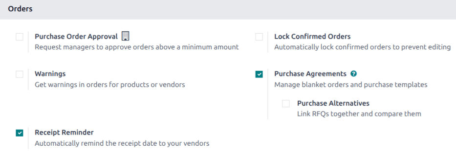
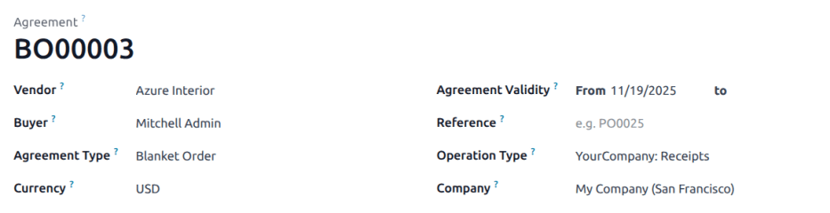
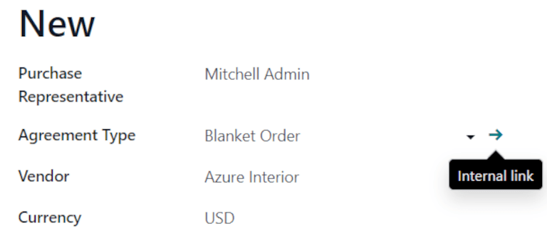
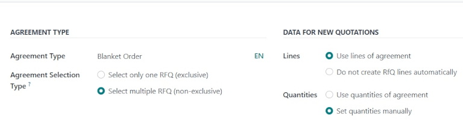
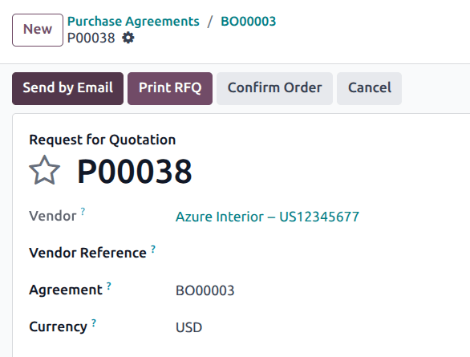
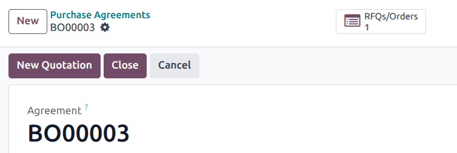
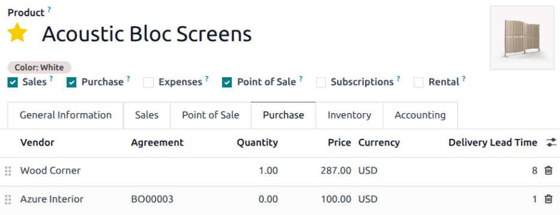

==============
Blanket orders
==============

.. _purchase/manage_deals/blanket-orders:

.. |SO| replace:: :abbr:`SO (Sales Order)`
.. |PO| replace:: :abbr:`PO (Purchase Order)`
.. |UoM| replace:: :abbr:`UoM (Unit of Measure)`
.. |RfQ| replace:: :abbr:`RfQ (Request for Quotation)`
.. |RfQs| replace:: :abbr:`RfQs (Requests for Quotation)`

Blanket orders are long-term purchase agreements between a company and a vendor to deliver products
on a recurring basis with predetermined pricing.

Blanket orders are helpful when products are consistently purchased from the same vendor, but in
different quantities, and at different times.

By simplifying the ordering process, blanket orders not only save time, they also save money, since
they can be advantageous when negotiating bulk pricing with vendors.

Create a new blanket order
==========================

To create blanket orders, enable the *Purchase Agreements* feature from the *Purchase* app settings.
Navigate to :menuselection:`Purchase app --> Configuration --> Settings`, and under the
:guilabel:`Orders` section, click the checkbox for :guilabel:`Purchase Agreements`. Then click
:guilabel:`Save` to implement the changes.

.. note::
   In addition to creating blanket orders, the *Purchase Agreements* setting also allows users to
   create alternative requests for quotation (RfQs).

To create a blanket order, go to :menuselection:`Purchase app --> Orders --> Blanket Orders`, and
click :guilabel:`New`. This opens a new blanket order form.

Configure the following fields in the new blanket order form to establish predetermined rules for
the recurring long-term agreement:

- :guilabel:`Purchase Representative`: the user assigned to this specific blanket order. By default,
  this is the user who created the agreement; the user can be changed directly from the drop-down
  menu next to this field.
- :guilabel:`Agreement Type`: the type of purchase agreement this blanket order is classified as. In
  Odoo, blanket orders are the only official purchase agreement.
- :guilabel:`Vendor`: the supplier to whom this agreement is tied, either once or on a recurring
  basis. The vendor can be selected directly from the drop-down menu next to this field.
- :guilabel:`Currency`: the agreed-upon currency to be used for this exchange. If multiple
  currencies have been activated in the database, the currency can be changed from the drop-down
  menu next to this field.
- :guilabel:`Agreement Deadline`: the date that this purchase agreement will be set to expire on. If
  this blanket order should not expire, leave this field blank.
- :guilabel:`Ordering Date`: the date that this blanket order should be placed on if a new quotation
  is created directly from the blanket order form. If a new quotation is created, this value
  automatically populates the *Order Deadline* field on the |RfQ|.
- :guilabel:`Delivery Date`: the expected delivery date that the products included in an |RfQ| are
  expected, if created directly from a blanket order form. If a new quotation is created, this value
  automatically populates the *Expected Arrival* field on the |RfQ|.
- :guilabel:`Source Document`: the source purchase order (PO) that this blanket order is tied to. If
  this blanket order should not be tied to any existing |PO|, leave this field blank.
- :guilabel:`Company`: the company assigned to this specific blanket order. By default, this is the
  company that the user creating the blanket order is listed under. If the database is not a
  multi-company database, this field **cannot** be changed, and defaults to the only company listed
  in the database.

Once all relevant fields have been filled out, click :guilabel:`Add a line` to add products under
the :guilabel:`Product` column. Then, in the :guilabel:`Quantity` column, change the quantity of
each product, and set a price in the :guilabel:`Unit Price` column.

.. important::
   When adding products to a new blanket order, the pre-existing prices of products are not
   automatically added to the product lines. Instead, the prices **must** be manually assigned, by
   changing the value in the :guilabel:`Unit Price` column to an agreed-upon price with the listed
   vendor. Otherwise, the price will remain `0`.

To view and change the default purchase agreement settings for blanket orders directly from the
blanket order form, click the :guilabel:`➡️ (right arrow)` icon that becomes visible when hovering
over the :guilabel:`Agreement Type` field, where :guilabel:`Blanket Order` is listed. This navigates
to the blanket order settings.

From here, the settings for blanket orders can be edited. Under the :guilabel:`Agreement Type`
section, the name of the :guilabel:`Agreement Type` can be changed, and the :guilabel:`Agreement
Selection Type` can be changed, as well. There are two options that can be activated for the type of
selection:

- :guilabel:`Select only one RfQ (exclusive)`: when a purchase order is confirmed, the remaining
  purchase orders are canceled.
- :guilabel:`Select multiple RfQ (non-exclusive)`: when a purchase order is confirmed, remaining
  purchase orders are **not** canceled. Instead, multiple purchase orders are allowed.

Under the :guilabel:`Data For New Quotations` section, the :guilabel:`Lines` and
:guilabel:`Quantities` fields can be edited. Doing so sets how new quotations should be populated
when using this purchase agreement.

There are two options that can be activated for :guilabel:`Lines`:

- :guilabel:`Use lines of agreement`: when creating a new quotation, the product lines pre-populate
  with the same products listed on the blanket order, if said blanket order is chosen for the new
  quotation.
- :guilabel:`Do not create RfQ lines automatically`: when creating a new quotation, **and**
  selecting an existing blanket order, the settings carry over to the new quotation, but the product
  lines do **not** populate.

And, there are two options that can be activated for :guilabel:`Quantities`:

- :guilabel:`Use quantities of agreement`: when creating a new quotation, the product quantities
  listed on the blanket order pre-populate on the product lines, if said blanket order is chosen for
  the new quotation.
- :guilabel:`Set quantities manually`: when creating a new quotation, **and** selecting an existing
  blanket order, the product lines pre-populate, but all quantities are set to `0`. The quantities
  **must** be manually set by the user.

Once any desired changes have been made, click :guilabel:`New` (via the breadcrumbs, at the top of
the page) to navigate back to the blanket order form. Then, click :guilabel:`Confirm` to save this
new purchase agreement.

Once confirmed, the blanket order's stage (in the upper-right corner) changes from :guilabel:`Draft`
to :guilabel:`Ongoing`, meaning this agreement can be selected and used when creating new |RfQs|.

.. tip::
   After creating and confirming a blanket order, products, quantities, and prices can still be
   edited, added, and removed from the purchase agreement.

Create a new |RfQ| from the blanket order
=========================================

After confirming a blanket order, new quotations can be created directly from the blanket order
form. |RfQs| using this form are pre-populated with information based on the rules set in the form.
Additionally, new quotations are automatically linked to this blanket order form, via the
:guilabel:`RFQs/Orders` smart button at the top-right of the form.

To create a new quotation from the blanket order form, click the :guilabel:`New Quotation` button.
This opens a new |RfQ|, that is pre-populated with the correct information, depending on the
settings configured on the blanket order form.

From the new |RfQ| form, click :guilabel:`Send by Email` to compose and send an email to the listed
vendor. Click :guilabel:`Print RFQ` to generate a printable PDF of the quotation; or, once ready,
click :guilabel:`Confirm Order` to confirm the |PO|.

Once the |PO| has been confirmed, click back to the blanket order form (via the breadcrumbs, at the
top of the page). From the blanket order form, there is now one |RfQ| listed in the
:guilabel:`RFQs/Orders` smart button at the top-right of the form. Click the :guilabel:`RFQs/Orders`
smart button to see the |PO| that was just created.

Replenishment
=============

Once a blanket order is confirmed, a new vendor line is added under the :guilabel:`Purchase` tab of
the products included in the order.

This makes blanket orders useful with :doc:`automated replenishment
<../../purchase/products/reordering>`, because information about the :guilabel:`Vendor`,
:guilabel:`Price`, and the :guilabel:`Agreement` are referenced on the vendor line. This information
dictates when, where, and at what price the product should be replenished.

.. seealso::
   :doc:`calls_for_tenders`
