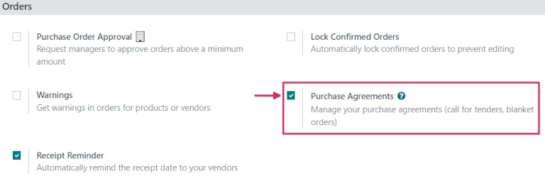
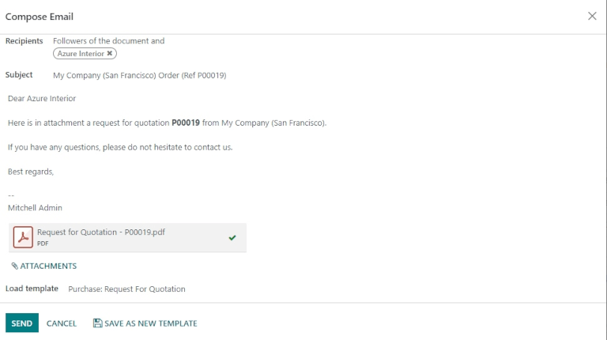
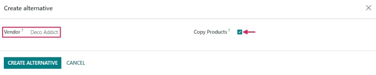
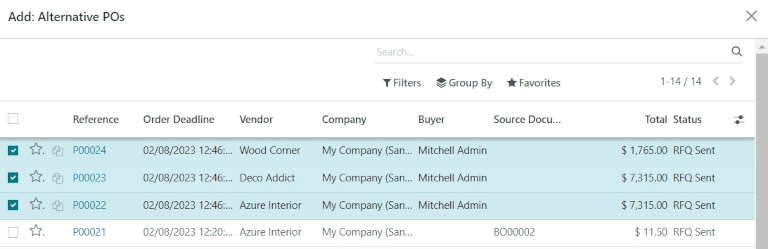
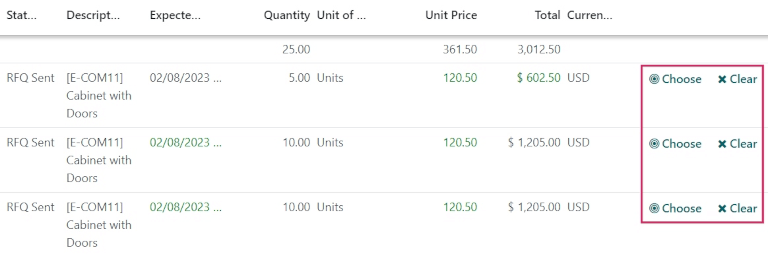
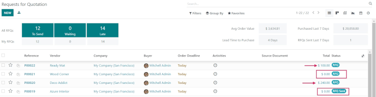
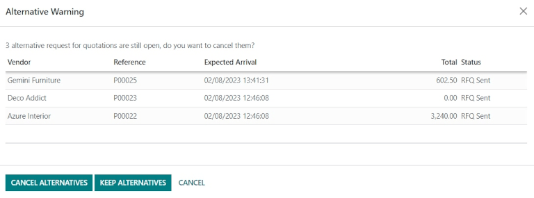

==============================================================
Create alternative requests for quotation for multiple vendors
==============================================================

Sometimes, companies might want to request offers from multiple vendors at the same time, by
inviting those vendors to submit offers for similar goods or services all at once. This helps
companies to select the cheapest (and fastest) vendors, depending on their specific business needs.

In Odoo, this can be done by adding alternative requests for quotation (RFQs) for different
vendors. Once a response is received from each vendor, the product lines from each :abbr:`RFQ
(Request for Quotation)` can be compared, and a decision can be made for which products to purchase
from which vendors.

Sometimes referred to as a *call for tender*, this process is primarily used by organizations in
the public sector, who are legally bound to use it when making a purchase. However, private
companies can also use alternative :abbr:`RFQs (Requests for Quotation)` to spend money efficiently,
as well.

.. seealso::
   :doc:`blanket_orders`

Configure purchase agreement settings
=====================================

To create alternative :abbr:`RFQs (Requests for Quotation)` directly from a quotation, the *Purchase
Agreements* feature first needs to be enabled in the settings of the *Purchase* app. To do this, go
to :menuselection:`Purchase --> Configuration --> Settings`, and under the :guilabel:`Orders`
section, click the checkbox next to :guilabel:`Purchase Agreements`. Doing so will enable the
ability to create alternative :abbr:`RFQs (Requests for Quotation)`, as well as the ability to
create *blanket orders*.

.. tip::
   To save time on a *call for tender*, custom vendors, prices, and delivery lead times can be set
   in the :guilabel:`Purchase` tab on a product form. To do so, navigate to
   :menuselection:`Purchase --> Products --> Products`, and select a product to edit. From the
   product form, click the :guilabel:`Purchase tab`, then click :guilabel:`Add a line`. From the
   drop-down menu, choose a vendor to set under the :guilabel:`Vendor` column, and set a
   :guilabel:`Price` and :guilabel:`Delivery Lead Time` if desired. Clicking the
   :guilabel:`additional options (two-dots)` icon provides additional visibility options to add to
   the line item.

Create an :abbr:`RFQ (Request for Quotation)`
=============================================

To create a new :abbr:`RFQ (Request for Quotation)`, navigate to the :menuselection:`Purchase` app,
and click :guilabel:`New`.

Then, add information to the :abbr:`RFQ (Request for Quotation)` form: add a vendor from the
drop-down next to the :guilabel:`Vendor` field, and click :guilabel:`Add a product` to select a
product from the drop-down menu in the :guilabel:`Product` column. Then, set the desired purchase
quantity in the :guilabel:`Quantity` column, and change the purchase price in the :guilabel:`Unit
Price` column, if desired.

Clicking the :guilabel:`additional options (two-dots)` icon provides additional visibility options
to add to the line item. Repeat these steps to add as many options as desired, including the
:guilabel:`UoM` (Units of Measure) to purchase the products in, and the :guilabel:`Expected Arrival`
date.

Once ready, click :guilabel:`Send by Email`. This causes a :guilabel:`Compose Email` pop-up window
to appear, wherein the message to the vendor can be customized. Once ready, click :guilabel:`Send`.
This turns the :abbr:`RFQ (Request for Quotation)` into a purchase order (PO), and sends an email
to the vendor listed on the purchase order form.

.. note::
   Sending emails to each vendor can be useful when creating alternative
   :abbr:`RFQs (Requests for Quotation)`, because vendors can confirm if their past prices still
   hold today, which can help companies choose the best offers for them.

Create alternatives to an :abbr:`RFQ (Request for Quotation)`
=============================================================

Once a :abbr:`PO (Purchase Order)` is created and sent by email to a vendor, alternative :abbr:`RFQs
(Requests for Quotation)` can be created and sent to additional, alternate vendors to compare
prices, delivery times, and other factors to make a decision from which vendors to order which
products.

To create alternative :abbr:`RFQs (Requests for Quotation)`, click the :guilabel:`Alternatives` tab
from the purchase order form, then click :guilabel:`Create Alternative`. When clicked, a
:guilabel:`Create alternative` pop-up window appears.

From this window, select a new/different vendor from the drop-down menu next to the
:guilabel:`Vendor` field to assign this alternative quotation to.

Next to this, there is a :guilabel:`Copy Products` checkbox that is selected by default. When
selected, the product quantities of the original :abbr:`PO (Purchase Order)` are copied to the
alternative. For this first alternative quotation, leave the checkbox checked. Once finished, click
:guilabel:`Create Alternative`. This creates (and navigates to) a new :abbr:`PO (Purchase Order)`.

Since the :guilabel:`Create Alternative` checkbox was left checked, this new purchase order form is
already populated with the same products, quantities, and other details as the previous, original
:abbr:`PO (Purchase Order)`.

.. note::
   When the :guilabel:`Copy Products` checkbox is selected while creating an alternative quotation,
   additional products do not need to be added on the purchase order form unless desired. However,
   if a chosen vendor is listed in the :guilabel:`Vendor` column under the :guilabel:`Purchase` tab
   on a product form included in the purchase order, the values set on the product form carry over
   to the :abbr:`PO (Purchase Order)`, and have to be changed manually, if desired.

Once ready, create a second alternative quotation by clicking the :guilabel:`Alternatives` tab, and
once again, click :guilabel:`Create Alternative`. This causes the :guilabel:`Create alternative`
pop-up window to appear again. This time, choose a different vendor from the drop-down menu next to
:guilabel:`Vendor`, and this time, *uncheck* the :guilabel:`Copy Products` checkbox. Then, click
:guilabel:`Create Alternative`.

.. tip::
   If an alternative quotation needs to be removed from the :guilabel:`Alternatives` tab, they can
   be individually removed by clicking on the :guilabel:`Remove (X)` icon at the end of their row.

This creates a third, new purchase order. But, since the product quantities of the original
:abbr:`PO (Purchase Order)` were *not* copied over, the product lines are empty, and new products
need to be added by clicking :guilabel:`Add a product`, and selecting the desired products from the
drop-down menu. Once the desired number of products are added, click :guilabel:`Send by Email`.

.. image:: calls_for_tenders/calls-for-tenders-blank-alternative.png
   :align: center
   :alt: Blank alternative quotation with alternatives in breadcrumbs.

This causes a :guilabel:`Compose Email` pop-up window to appear, wherein the message to the vendor
can be customized. Once ready, click :guilabel:`Send` to send an email to the vendor listed on the
purchase order form.

From this newest purchase order form, click the :guilabel:`Alternatives` tab. Under this tab, all
three purchase orders can be seen in the :guilabel:`Reference` column. Additionally, the vendors
are listed under the :guilabel:`Vendor` column, and the order :guilabel:`Total` and
:guilabel:`Status` of the orders are in the rows, as well.

Link a new :abbr:`RFQ (Request for Quotation)` to existing quotations
=====================================================================

Creating alternative quotations directly from a purchase order form under the
:guilabel:`Alternatives` tab is the easiest way to create and link quotations. However, separate
:abbr:`RFQs (Requests for Quotation)` can also be linked *after* the fact, even if they are created
completely separately at first.

To create a new :abbr:`RFQ (Request for Quotation)`, navigate to the :menuselection:`Purchase` app,
and click :guilabel:`New`.

Then, add information to the :abbr:`RFQ (Request for Quotation)` form: add a vendor from the
drop-down next to the :guilabel:`Vendor` field, and click :guilabel:`Add a product` to select a
product from the drop-down menu in the :guilabel:`Product` column. Then, set the desired purchase
quantity in the :guilabel:`Quantity` column, and change the purchase price in the
:guilabel:`Unit Price` column, if desired.

Once ready, click :guilabel:`Send by Email`. This causes a :guilabel:`Compose Email` pop-up window
to appear, wherein the message to the vendor can be customized. Once ready, click :guilabel:`Send`
to send an email to the vendor listed on the purchase order form.

Then, click the :guilabel:`Alternatives` tab once more. Since this new :abbr:`PO (Purchase Order)`
was created separately, there are no other orders linked yet. To link this order with the
alternatives created previously, click :guilabel:`Link to Existing RfQ` on the first line in the
:guilabel:`Vendor` column.

This causes an :guilabel:`Add: Alternative POs` pop-up window to appear. Select the three purchase
orders created previously, and click :guilabel:`Select`. All of these orders are now copied to this
:abbr:`PO (Purchase Order)` under the :guilabel:`Alternatives` tab.

.. tip::
   If a large number of purchase orders are being processed and the previous
   :abbr:`POs (Purchase Orders)` can't be located, try clicking :menuselection:`Group By -->
   Vendor` under the search bar at the top of the pop-up window to group by the vendors selected on
   the previous orders.

Compare product lines
=====================

When there are multiple :abbr:`RFQs (Requests for Quotation)` linked as alternatives, they can be
compared side-by-side in order to determine which vendors offer the best deals on which products.
To compare each quotation, go to the :menuselection:`Purchase` app, and select one of the
quotations created previously.

Then, click the :guilabel:`Alternatives` tab to see all the linked
:abbr:`RFQs (Requests for Quotation)`. Next, under the :guilabel:`Create Alternative` tab, click
:guilabel:`Compare Product Lines`. This navigates to a Compare Order Lines page.

The Compare Order Lines page, by default, groups by :guilabel:`Product`. Each product included in
any of the :abbr:`RFQs (Requests for Quotation)` is displayed in its own drop-down, along with all
of the :abbr:`PO (Purchase Order)` numbers in the :guilabel:`Reference` column.

Additional columns on this page include the :guilabel:`Vendor` from which products were ordered,
the :guilabel:`Status` of the quotation (i.e., RFQ, RFQ Sent); the :guilabel:`Quantity` of products
ordered from each vendor; the :guilabel:`Unit Price` per product and :guilabel:`Total` price of the
order, and more.

.. note::
   To remove product lines from the Compare Order Lines page, click :guilabel:`Clear` at the far
   right end of that product line's row. This removes this product as a chooseable option from the
   page, and changes the :guilabel:`Total` price of that product on the page to **0**. On the
   purchase order form in which that product was included, its ordered quantity is changed to
   **0**, as well.

Once the best offers have been identified, at the end of each row, individual products can be
selected by clicking :guilabel:`Choose`. Once all the desired products have been chosen, click
:guilabel:`Requests for Quotation` (in the breadcrumbs, at the top of the page) to navigate back to
an overview of all :abbr:`RFQs (Requests for Quotation)`.

Cancel (or keep) alternatives
=============================

Now that the desired products have been chosen, based on which vendors provided the best offer, the
other :abbr:`RFQs (Requests for Quotation)` (from which no products were chosen) can be canceled.

Under the :guilabel:`Total` column, at the far right of each row, the orders from which no products
were chosen have automatically had their total cost set to **0**. Although they haven't been
canceled yet, this means that they can ultimately be canceled without repercussions, *after* the
desired purchase orders have been confirmed.

To confirm a quotation that contains the chosen product quantities, click into one. Then, click
:guilabel:`Confirm Order`. This causes an :guilabel:`Alternative Warning` pop-up window to appear.
From there, either :guilabel:`Cancel Alternatives` or :guilabel:`Keep Alternatives` can be clicked.
If this :abbr:`PO (Purchase Order)` should *not* be confirmed, click :guilabel:`Cancel`.

:guilabel:`Cancel Alternatives` automatically cancels the alternative purchase orders.
:guilabel:`Keep Alternatives` keeps the alternative purchase orders open, so they can still be
accessed if any additional product quantities need to be ordered. Once all products are ordered,
:guilabel:`Cancel Alternatives` can be selected from whichever :abbr:`PO (Purchase Order)` is open.

To view a detailed form of one of the :abbr:`RFQs (Requests for Quotation)` listed, click the line
item for that quotation. This causes an :guilabel:`Open: Alternative POs` pop-up window to appear,
from which all details of that particular quotation can be viewed. Click :guilabel:`Close` when
finished.

From the :guilabel:`Alternative Warning` pop-up window, click :guilabel:`Keep Alternatives` to keep
all alternative quotations open for now. Then, click :guilabel:`Requests for Quotation` (in the
breadcrumbs, at the top of the page) to navigate back to an overview of all :abbr:`RFQs (Requests
for Quotation)`.

Click into the remaining quotation(s) that contain products that need to be ordered, and click
:guilabel:`Confirm Order`. This causes the :guilabel:`Alternative Warning` pop-up window to appear
again. This time, click :guilabel:`Cancel Alternatives` to cancel all other alternative :abbr:`RFQs`
linked with this quotation.

Finally, click :guilabel:`Requests for Quotation` (in the breadcrumbs, at the top of the page) to
navigate back to an overview of all :abbr:`RFQs (Requests for Quotation)`. The canceled orders can
be seen greyed out and listed with a :guilabel:`Cancelled` status under the :guilabel:`Status`
column at the far right of their rows.

Now that all product quantities have been ordered, the purchase process can be followed, and
continued to completion, until the products are received into the warehouse.
