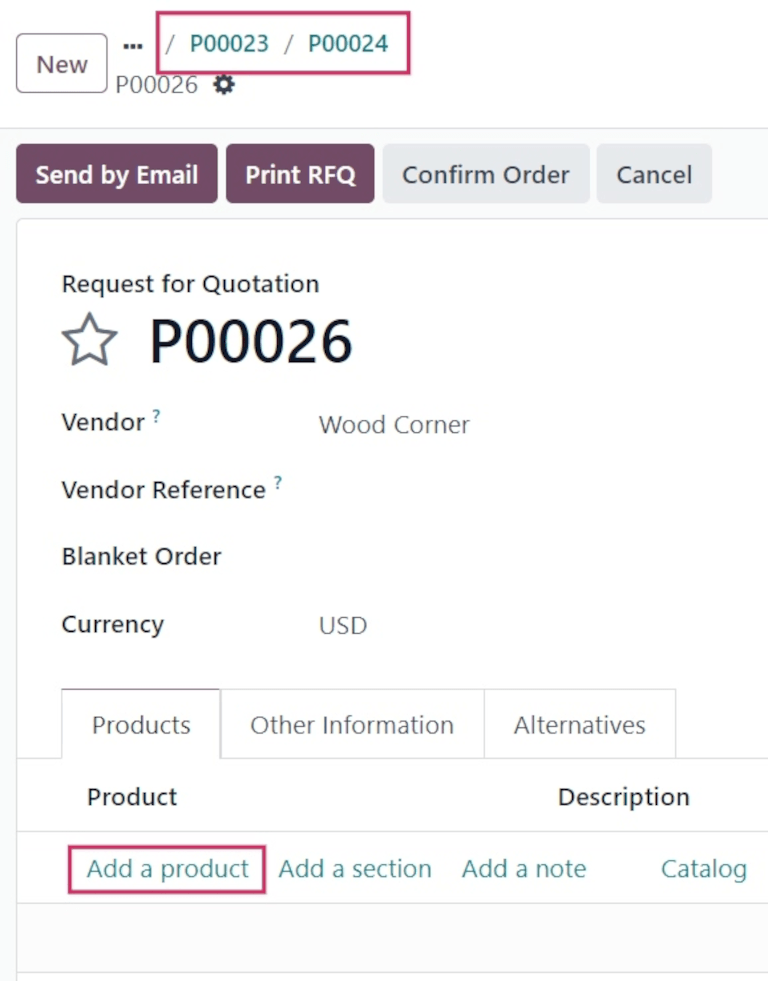

================
Call for tenders
================

.. _purchase/manage_deals/alternative-rfqs:

.. |PO| replace:: :abbr:`PO (Purchase Order)`
.. |POs| replace:: :abbr:`POs (Purchase Orders)`
.. |RfQ| replace:: :abbr:`RfQ (Request for Quotation)`
.. |RfQs| replace:: :abbr:`RfQs (Requests for Quotation)`

Sometimes, companies might want to invite vendors to submit offers for similar goods or services all
at once. This helps companies select the cheapest, fastest vendors for their specific business
needs.

In Odoo, this can be done by creating alternative requests for quotation (RfQs) for different
vendors. Once a response is received from each vendor, the product lines from each |RfQ| can be
compared, and a decision can be made for which products to purchase from which vendors.

.. note::
   Sometimes referred to as a *call for tender*, this process is primarily used by organizations in
   the public sector, who are legally bound to use it when making a purchase. However, private
   companies can also use alternative |RfQs| to spend money efficiently.

Configuration
=============

To create alternative |RfQs|, the *Purchase Agreements* feature **must** be enabled in the
*Purchase* app settings. To enable the feature, navigate to :menuselection:`Purchase app -->
Configuration --> Settings`. Under the :guilabel:`Orders` section, click the checkbox for
:guilabel:`Purchase Agreements`.

Then, click :guilabel:`Save` to apply the change.

.. image:: calls_for_tenders/calls-for-tenders-enabled-setting.png
   :align: center
   :alt: Purchase Agreements enabled in the Purchase app settings.

.. _purchase/manage_deals/create-rfq:

Create an |RfQ|
===============

To create a new |RfQ|, follow the instructions in the :doc:`rfq` documentation.

.. seealso::
   `Odoo Tutorial: Purchase Basics and Your First Request for Quotation
   <https://www.youtube.com/watch?v=o_uI718P1Dc>`_

.. _purchase/manage_deals/create-alternatives:

Create alternative |RfQs|
=========================

Once a |PO| is created and sent to a vendor, alternative |RfQs| can be created for additional
vendors to compare prices, delivery times, and other factors, to help make a decision for the order.

To create alternative |RfQs| from the original, click the :guilabel:`Alternatives` tab. Then, click
:guilabel:`Create Alternative`. When clicked, a :guilabel:`Create alternative` pop-up window
appears.

From this window, select an alternative vendor from the drop-down menu next to the
:guilabel:`Vendor` field, to whom the alternative quotation is assigned.

Next to this, there is a :guilabel:`Copy Products` checkbox that is selected by default. When
selected, the product quantities of the original |RfQ| are copied over to the alternative. For this
first alternative quotation, leave the checkbox checked. Once finished, click :guilabel:`Create
Alternative`. This opens a new |RfQ| form.

Since the :guilabel:`Create Alternative` checkbox was left checked, the new form is already
pre-populated with the same products, quantities, and other details as the previous, original |RfQ|.

.. note::
   When the :guilabel:`Copy Products` checkbox is selected while creating an alternative quotation,
   additional products do **not** need to be added, unless desired.

   However, if a chosen vendor is listed in the :guilabel:`Vendor` column under a specific product
   form included in the order, the values set on the product form carry over to the |RfQ|, and
   **must** be changed manually, if necessary.

Once ready, create a second alternative quotation by clicking the :guilabel:`Alternatives` tab,
followed by :guilabel:`Create Alternative`.

This opens the :guilabel:`Create alternative` pop-up window. Once again, choose a different vendor
from the drop-down menu next to :guilabel:`Vendor`. For this particular |RfQ|, however, *uncheck*
the :guilabel:`Copy Products` checkbox. Doing so removes all products on the new alternative |RfQ|,
leaving it blank. The specific products which should be ordered from this particular vendor can be
added in as needed.

Once ready, click :guilabel:`Create Alternative`.

.. tip::
   If an alternative quotation should be removed from the :guilabel:`Alternatives` tab, they can be
   individually removed by clicking on the :guilabel:`X (remove)` icon at the end of their row.

This creates a third, new |RfQ|. But, since the product quantities of the original |RfQ| were
**not** copied over, the product lines are empty, and new products can be added as needed by
clicking :guilabel:`Add a product`, and selecting the desired products from the drop-down menu.

Once the desired number of specific products are added, click :guilabel:`Send by Email`.

This opens a :guilabel:`Compose Email` pop-up window, wherein the message to the vendor can be
customized, and attachments can be added, if necessary. Once ready, click :guilabel:`Send`.

From this newest form, click the :guilabel:`Alternatives` tab. Under this tab, all three |RfQs| can
be seen in the :guilabel:`Reference` column. Additionally, the vendors are listed under the
:guilabel:`Vendor` column, and the order :guilabel:`Total` (and :guilabel:`Status`) of the orders
are in the rows, as well.

The date in the :guilabel:`Expected Arrival` column is calculated for each vendor, based on any
pre-configured lead times in the vendor and product forms.

.. _purchase/manage_deals/link-rfq:

Link new |RfQ| to existing quotations
=====================================

Even if a quotation is not created directly from the :guilabel:`Alternatives` tab of another |RfQ|,
it can still be linked to existing |RfQs|.

To do that, begin by creating a new |RfQ|. Navigate to :menuselection:`Purchase app --> New`. Fill
out the |RfQ|, according to the :ref:`previous instructions <purchase/manage_deals/create-rfq>`.

Then, once ready, click the :guilabel:`Alternatives` tab. Since this new |RfQ| was created
separately, there are no other orders linked yet.

However, to link this |RfQ| with existing alternatives, click :guilabel:`Link to Existing RfQ` on
the first line in the :guilabel:`Vendor` column.

This opens an :guilabel:`Add: Alternative POs` pop-up window. Select the desired previously-created
|RfQs|, and click :guilabel:`Select`. All of these orders are now copied to this |RfQ|, and can be
found under the :guilabel:`Alternatives` tab.

.. tip::
   If a large number of |POs| are being processed, and the previous |POs| can't be located, click
   the :icon:`fa-chevron-down` :guilabel:`(chevron)` icon to the right of the search bar, at the top
   of the pop-up window.

   Then, under the :guilabel:`Group By` section, click :guilabel:`Vendor`. Vendors are displayed in
   their own nested drop-down lists, and each vendor's list can be expanded to view open |POs| for
   that vendor.

.. _purchase/manage_deals/compare-product-lines:

Compare product lines
=====================

Alternative |RfQs| can be compared side-by-side, in order to determine which vendors offer the best
deals on the products included in the orders.

To compare alternative |RfQs|, navigate to the :menuselection:`Purchase` app, and select one of the
previously-created |RfQs|.

Then, click the :guilabel:`Alternatives` tab to see all linked |RfQs|. Next, under the
:guilabel:`Create Alternative` option, click :guilabel:`Compare Product Lines`. This navigates to
the :guilabel:`Compare Order Lines` page.

The :guilabel:`Compare Order Lines` page, by default, groups by :guilabel:`Product`. Each product
included in any of the |RfQs| is displayed in its own nested drop-down list, and features all of the
|PO| numbers in the :guilabel:`Reference` column.

.. note::
   To remove product lines from the :guilabel:`Compare Order Lines` page, click :guilabel:`Clear` at
   the far-right end of that product line's row.

   Doing so removes this specific product as a selectable option from the page, and changes the
   :guilabel:`Total` price of that product on the page to `0`.

   Additionally, on the |RfQ| form, in which that product was included, its ordered quantity is also
   changed to `0`.

Once the best offers have been identified, individual products can be selected by clicking the
:guilabel:`Choose` button at the end of each corresponding row.

Once all desired products have been chosen, click :guilabel:`Requests for Quotation` (in the
breadcrumbs, at the top of the page) to navigate back to an overview of all |RfQs|.

.. _purchase/manage_deals/cancel-keep-alternatives:

Cancel (or keep) alternatives
=============================

Once the desired products have been chosen from the :guilabel:`Compare Order Lines` page, the
remaining |RfQs|, from which no products were chosen, can be canceled.

The cost in the :guilabel:`Total` column for each product that wasn't chosen is automatically set to
`0`, indicated at the far-right of each corresponding row.

Although they haven't been canceled yet, this indicates that each of those orders can be canceled
without having an effect on the other live orders, once those orders have been confirmed.

To confirm an |RfQ| for which products were selected, click into an |RfQ|, and click
:guilabel:`Confirm Order`.

This causes a :guilabel:`What about the alternative Requests for Quotations?` pop-up window
to appear.

To view a detailed form of one of the |RfQs| listed, click the line item for that quotation. This
opens an :guilabel:`Open: Alternative POs` pop-up window, from which all details of that particular
|RfQ| can be viewed.

Once ready, click :guilabel:`Close` to close the pop-up window.

In the :guilabel:`What about the alternative Requests for Quotations?` pop-up window, two options
are presented: :guilabel:`Cancel Alternatives` and :guilabel:`Keep Alternatives`.

If this |PO| should **not** be confirmed, click :guilabel:`Discard`.

Selecting :guilabel:`Cancel Alternatives` automatically cancels the alternative |RfQs|. Selecting
:guilabel:`Keep Alternatives` keeps the alternative |RfQs| open, so they can still be accessed, if
any additional product quantities need to be ordered later.

Once all products are ordered, select :guilabel:`Cancel Alternatives` from whichever |PO|
is open at that time.

Finally, using the breadcrumbs at the top of the page, click :guilabel:`Requests for Quotation` to
navigate back to an overview of all |RfQs|.

The canceled orders can be seen, greyed out and listed with a :guilabel:`Cancelled` status, under
the :guilabel:`Status` column at the far-right of their respective rows.

Now that all product quantities have been ordered, the purchase process can be completed, and the
products can be received into the warehouse.

.. seealso::
   :doc:`blanket_orders`
