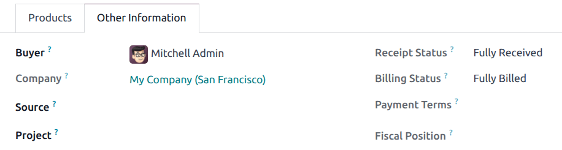
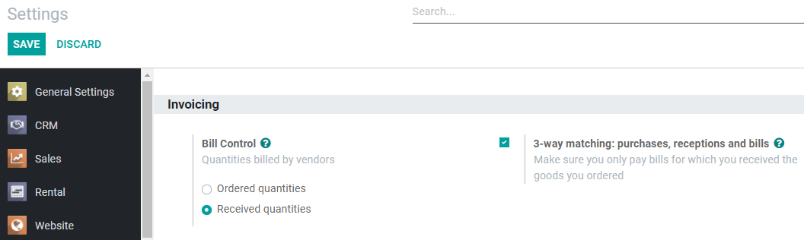
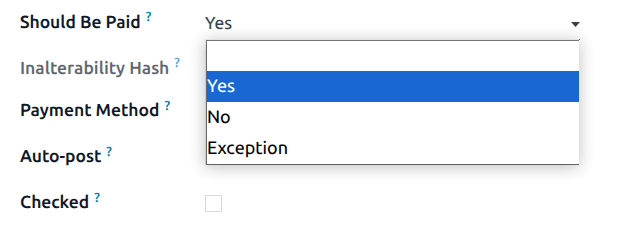

=================================================
Control and know when vendor bills should be paid
=================================================

With Odoo, you can define how your vendor bills are controlled. For each purchase order, you can
decide when the related vendor bill should be paid: either before or after you have received your
products. You can also check at a glance what is the billing status of each purchase order.

With the 3-way matching feature, Odoo compares the information appearing on the *Purchase Order*,
the *Vendor Bill* and the *Receipt*, and lets you know if you should pay the bill. This way you can
avoid paying incorrect or fraudulent vendor bills.

Vendor bills default control policy
===================================

As a first step, open your Purchase app and go to :menuselection:`Configuration --> Settings` to set
the default bill control policy for all the products created onwards.

.. image:: control_bills/control-bills-quantities-default-setting.png
   :align: center
   :alt: Vendor bills default control setting for new products in Odoo Purchase

By selecting *On ordered quantities*, you can create a vendor bill as soon as you confirm an order.
The quantities mentioned in the purchase order are used to generate the draft bill.

If you choose *On received quantities* instead, you can only create one once you have at least
received some of the products you have ordered. The quantities you have received are used to
generate the draft bill. If you try to create one without having received any product, you get an
error message.

.. image:: control_bills/control-bills-no-invoiceable-line.png
   :align: center
   :alt: No invoiceable line error message in Odoo Purchase

Change a specific product's control policy
------------------------------------------

If you want to modify a specific product's control policy, go to :menuselection:`Products -->
Products`, open it, click on *Edit* and go to the *Purchase tab*. There you can change a product's
default bill control policy.

.. image:: control_bills/control-bills-quantities-on-product.png
   :align: center
   :alt: Vendor bills default control setting for new products in Odoo Purchase

View a purchase order's billing status
======================================

Once you confirm an order, you can view its *Billing Status* by going to the *Other Information*
tab.

Below you can find a list of the different *Billing Status*, and when they are displayed, depending
on the products' bill control policy.

+--------------------+--------------------------------------------------------------------------+
| **Billing status** |                              **Conditions**                              |
|                    +------------------------------------------------+-------------------------+
|                    |            *On received quantities*            | *On ordered quantities* |
+--------------------+------------------------------------------------+-------------------------+
| *Nothing to Bill*  |       PO confirmed; no products received       |    *(Not applicable)*   |
+--------------------+------------------------------------------------+-------------------------+
| *Waiting Bills*    |  All/some products received; bill not created  |       PO confirmed      |
+--------------------+------------------------------------------------+-------------------------+
| *Fully Billed*     | All/some products received; draft bill created |    Draft bill created   |
+--------------------+------------------------------------------------+-------------------------+

Determine when to pay with 3-way matching
=========================================

First, go to :menuselection:`Configuration --> Settings` and activate *3-way matching*.

.. note::
   3-way matching is intended to work with the bill control policy set to *On received quantities*.

Should I pay the vendor bill?
-----------------------------

With the feature activated, your vendor bills now display the *Should Be Paid* field under the
*Other info* tab.

As you can't create a bill until you have received your products - and if you haven't received all
of them, Odoo only includes the products you have received in the draft bill - the *Should Be Paid*
status is set to *Yes* when you create one.

If you edit a draft bill to increase the billed quantity, change the price, or add other products,
the *Should Be Paid* status is set to *Exception*. It means Odoo notices the discrepancy, but that
you might have a valid reason to have done so.

Once the payment has been registered and mentions *Paid*, the *Should Be Paid* status is set to
*No*.

.. image:: control_bills/control-bills-paid-status.png
   :align: center
   :alt: Paid bill in Odoo Purchase

.. tip::
   The *Should Be Paid* status is set automatically by Odoo. However, you can change the status
   manually when you are viewing a bill in edit mode.