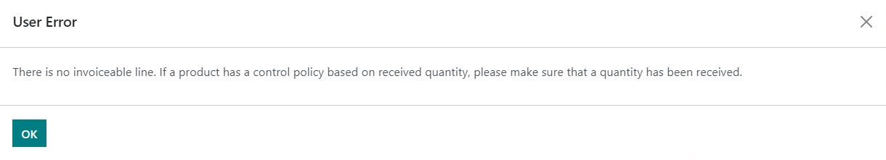
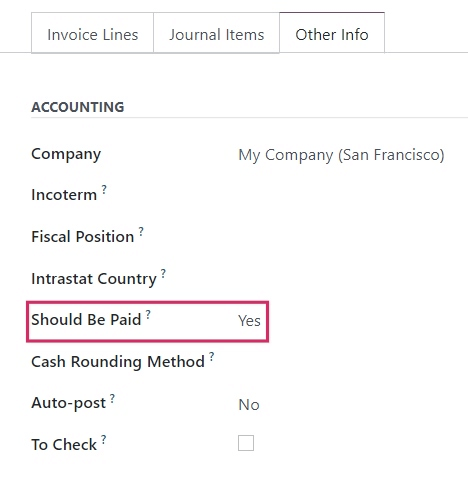
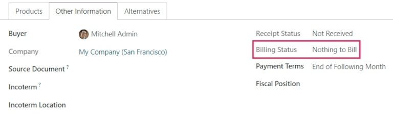

=====================
Bill control policies
=====================

In Odoo, the *bill control* policy determines the quantities billed by vendors on every purchase
order, for ordered or received quantities. The policy selected in the settings will act as the
default value and will be applied to any new product created.

Configuration
=============

To view the default bill control policy and make changes, go to :menuselection:`Purchase -->
Configuration --> Settings`, and scroll down to the :guilabel:`Invoicing` section. Here, there are
the two :guilabel:`Bill Control` policy options: :guilabel:`Ordered quantities` and
:guilabel:`Received quantities`.

The policy selected will be the default for any new product created. The definition of each policy
is as follows:

- :guilabel:`Ordered quantities`: creates a vendor bill as soon as a purchase order is confirmed.
  The products and quantities in the purchase order are used to generate a draft bill.
- :guilabel:`Received quantities`: a bill is created only *after* part of the total order has been
  received. The products and quantities *received* are used to generate a draft bill. An error
  message will appear if creation of a vendor bill is attempted without receiving anything.

.. note::
   If one or two products need a different control policy, the default bill control setting can be
   overridden by going to the :guilabel:`Purchase` tab in a product's template and modifying its
   :guilabel:`Control Policy` field.

Example flow: Ordered quantities
--------------------------------

To complete an example workflow using the *ordered quantities* bill control policy, first go to
:menuselection:`Purchase --> Configuration --> Settings`, scroll down to the :guilabel:`Invoicing`
section, and select :guilabel:`Ordered quantities`. Then, :guilabel:`Save` changes.

In the :guilabel:`Purchase` app, create a new :abbr:`RFQ (Request for Quotation)`. Fill out the
information on the quotation form, add products to the invoice lines, and click :guilabel:`Confirm
Order`. Then, click :guilabel:`Create Bill`. Since the policy is set to *ordered quantities*, the
draft bill can be confirmed as soon as it is created, without any products actually being received.

Example flow: Received quantities
---------------------------------

To complete an example workflow using the *received quantities* bill control policy, first go to
:menuselection:`Purchase --> Configuration --> Settings`, scroll down to the :guilabel:`Invoicing`
section, and select :guilabel:`Received quantities`. Then, :guilabel:`Save` changes.

In the :guilabel:`Purchase` app, create a new :abbr:`RFQ (Request for Quotation)`. Fill out the
information on the quotation form, add products to the invoice lines, and click :guilabel:`Confirm
Order`. Then, click on the :guilabel:`Receipt smart button`. Set the quantities in the
:guilabel:`Done` column to match the quantities in the :guilabel:`Demand` column, and
:guilabel:`Validate` the changes. Then, in the purchase order, click :guilabel:`Create Bill` and
:guilabel:`Confirm`. Since the policy is set to *received quantities*, the draft bill can be
confirmed *only* when at least some of the quantities are received.

3-way matching
==============

Activating :guilabel:`3-way matching` ensures that vendor bills are only paid once some or all of
the products included in the purchase order have actually been received. To activate it, go to
:menuselection:`Purchase --> Configuration --> Settings`, and scroll down to the
:guilabel:`Invoicing` section. Then, click :guilabel:`3-way matching: purchases, receptions, and
bills`.

.. note::
   3-way matching is *only* intended to work when the bill control policy is set to *received
   quantities*.

Pay vendor bills with 3-way matching
------------------------------------

When :guilabel:`3-way matching` is activated, vendor bills will display the :guilabel:`Should Be
Paid` field under the :guilabel:`Other Info` tab. When a new vendor bill is created, the field will
be set to :guilabel:`Yes`, since a bill can't be created until at least some of the products
included in a purchase order have been received.

.. note::
   If the total quantity of products from a purchase order has not been received, Odoo only includes
   the products that *have* been received in the draft vendor bill.

Draft bills can be edited to increase the billed quantity, change the price of the products in the
bill, and add additional products to the bill. If this is done, the :guilabel:`Should Be Paid` field
status will be set to :guilabel:`Exception`. This means that Odoo notices the discrepancy, but
doesn't block the changes or display an error message, since there might be a valid reason for
making changes to the draft bill.

Once payment has been registered for a vendor bill and displays the green :guilabel:`Paid` banner,
the :guilabel:`Should Be Paid` field status will be set to :guilabel:`No`.

.. tip::
   The :guilabel:`Should Be Paid` status on bills is set automatically by Odoo. However, the status
   can be changed manually by clicking the field's drop-down menu inside the :guilabel:`Other Info`
   tab.

View a purchase order's billing status
======================================

When a purchase order is confirmed, its :guilabel:`Billing Status` can be viewed under the
:guilabel:`Other Information` tab on the purchase order form.

Below is a list of the different statuses that a :guilabel:`Billing Status` could appear as and when
they are displayed, depending on the bill control policy used.

+------------------------------+--------------------------------------------------------------------------+
| :guilabel:`Billing Status`   |                              **Conditions**                              |
|                              +------------------------------------------------+-------------------------+
|                              |            *On received quantities*            | *On ordered quantities* |
+------------------------------+------------------------------------------------+-------------------------+
| :guilabel:`Nothing to Bill`  |       PO confirmed; no products received       |     *Not applicable*    |
+------------------------------+------------------------------------------------+-------------------------+
| :guilabel:`Waiting Bills`    |  All/some products received; bill not created  |       PO confirmed      |
+------------------------------+------------------------------------------------+-------------------------+
| :guilabel:`Fully Billed`     | All/some products received; draft bill created |    Draft bill created   |
+------------------------------+------------------------------------------------+-------------------------+
