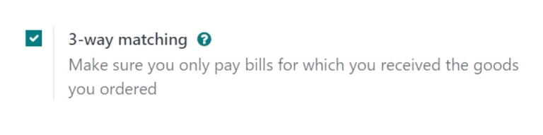

================
Control policies
================

.. _purchase/manage_deals/control-bills:

.. |PO| replace:: :abbr:`PO (Purchase Order)`
.. |POs| replace:: :abbr:`POs (Purchase Orders)`

In Odoo's **Purchase** app, the *Control Policy* determines the quantities billed by vendors on
every purchase order (PO). For example, choosing *On ordered quantities* means the bill is based on
ordered items, even if they have not been received yet.

The control policy is selected on the *Product* record.

Configuration
=============

To configure the control policy for a product, navigate to :menuselection:`Purchse app --> Prodcuts
--> Products`, then click on a product record to open it. Click to the :guilabel:`Purchase` tab.
Scroll to the :guilabel:`Vendor Bills` section. Under :guilabel:`Control Policy`, tick the radio
button for either :guilabel:`On ordered quantities` or :guilabel:`On recieved quantities`.

- :guilabel:`On ordered quantities`: Creates a vendor bill as soon as a |PO| is confirmed. The
  products and quantities in the |PO| are used to generate a draft bill.
- :guilabel:`On received quantities`: A bill is created only *after* part of the total order has
  been received. The products and quantities received are used to generate a draft bill. An error
  message appears if creation of a vendor bill is attempted without receiving anything.

The default control policy for a product is determined by the :guilabel:`Product Type`:

- **Services**: The default control policy is *On ordered quantities*.
- **Goods**: The default control policy is *On delivered quantities*

Pay vendor bills with 3-way matching
====================================

The *3-way matching* feature ensures vendor bills are only paid once some, or all, of the products
included in the |PO| have been received.

To activate *3-way matching*, navigate to :menuselection:`Purchase app --> Configuration -->
Settings`, and scroll down to the :guilabel:`Invoicing` section. Then, tick the checkbox for
:guilabel:`3-way matching` to enable the feature, and click :guilabel:`Save`.

When *3-way matching* is enabled, vendor bills display a :guilabel:`Should Be Paid` field under the
:guilabel:`Other Info` tab. When a new vendor bill is created, the field is set to :guilabel:`Yes`,
since a bill **cannot** be created until at least some of the products included in a |PO| have been
received.

To create a vendor bill from a |PO|, navigate to :menuselection:`Purchase app --> Orders -->
Purchase Orders`. From the :guilabel:`Purchase Orders` page, select the desired |PO| from the list.
Then, click :guilabel:`Create Bill`. Doing so opens a new draft :guilabel:`Vendor Bill` form, in the
:guilabel:`Draft` stage. Click the :guilabel:`Other Info` tab, and locate the :guilabel:`Should Be
Paid` field.

.. important::
   The |PO| selected from the list **must not** be billed yet, or an :guilabel:`Invalid Operation`
   pop-up window appears.

   .. image:: control_bills/control-bills-invalid-operation.png
      :alt: Invalid Operation pop-up window for billed Purchase Order.

Click the drop-down menu next to :guilabel:`Should Be Paid` to view the available options:
:guilabel:`Yes`, :guilabel:`No`, and :guilabel:`Exception`.

.. image:: control_bills/control-bills-should-be-paid.png
   :alt: Should Be Paid field status on draft vendor bill.

.. note::
   If the total quantity of products from a |PO| has not been received, Odoo only includes the
   products that *have* been received in the draft vendor bill.

Draft vendor bills can be edited to increase the billed quantity, change the price of the products
in the bill, and add additional products to the bill.

If the draft bill's information is changed, the :guilabel:`Should Be Paid` field status is set to
:guilabel:`Exception`. This means that Odoo notices the discrepancy, but does not block the changes
or display an error message, since there might be a valid reason for making changes to the draft
bill.

To process the vendor bill, select a date in the :guilabel:`Bill Date` field, and click
:guilabel:`Confirm`, followed by :guilabel:`Register Payment`.

This opens a :guilabel:`Register Payment` pop-up window. From this window, accounting information is
pre-populated based on the database's accounting settings. Click :guilabel:`Create Payment` to
process the vendor bill.

Once payment has been registered for a vendor bill, and the bill displays the green :guilabel:`Paid`
banner, the :guilabel:`Should Be Paid` field status is set to :guilabel:`No`.

.. tip::
   The :guilabel:`Should Be Paid` status on bills is automatically set by Odoo. However, the status
   can be manually changed by clicking the field's drop-down menu inside the :guilabel:`Other Info`
   tab.

View a purchase order's billing status
======================================

Once a |PO| is confirmed, its :guilabel:`Billing Status` can be viewed under the :guilabel:`Other
Information` tab on the |PO| form.

To view the :guilabel:`Billing Status` of a |PO|, navigate to :menuselection:`Purchase app -->
Orders --> Purchase Orders`, and select a |PO| to view.

Click the :guilabel:`Other Information` tab, and locate the :guilabel:`Billing Status` field.

.. image:: control_bills/control-bills-billing-status.png
   :alt: Billing status field on a purchase order form.

The table below details the different values the :guilabel:`Billing Status` field could read, and
when they are displayed, depending on the *Bill Control* policy used.

.. list-table::
   :header-rows: 1
   :stub-columns: 1

   * - Billing Status
     - On received quantities
     - On ordered quantities
   * - Nothing to Bill
     - PO confirmed; no products received
     - *Not applicable*
   * - Waiting Bills
     - All/some products received; bill not created
     - PO confirmed
   * - Fully Billed
     - All/some products received; draft bill created
     - Draft bill created

.. seealso::
   :doc:`manage`
