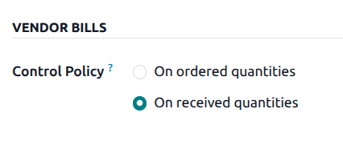
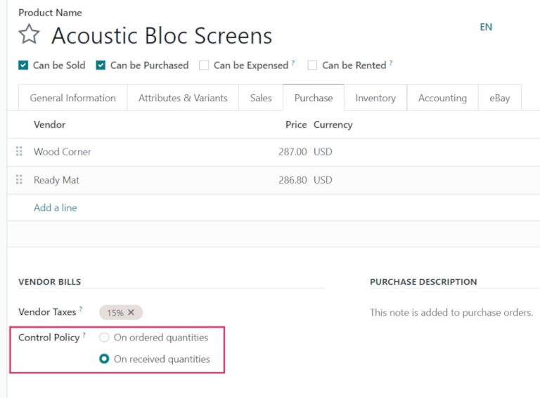
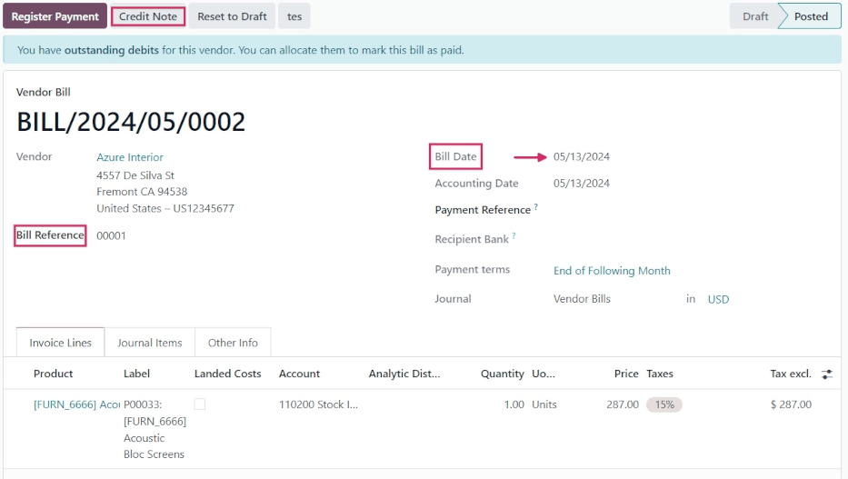
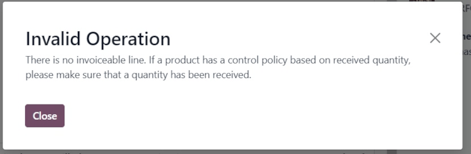
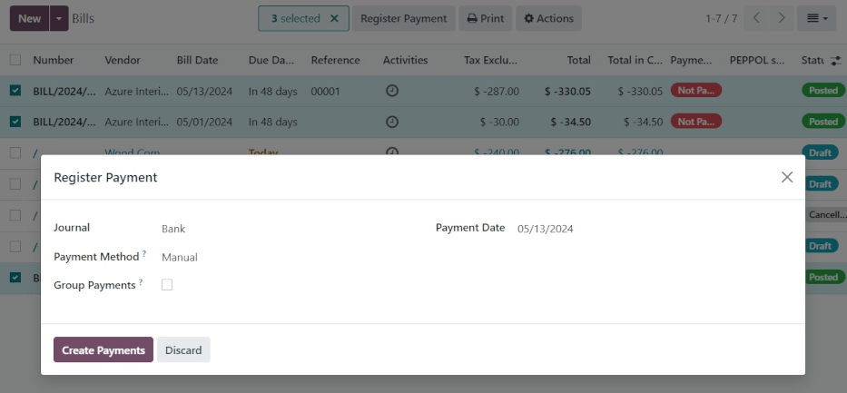

===================
Manage vendor bills
===================

.. _inventory/purchase/manage_deals/manage:

A *vendor bill* is an invoice received for products and/or services that a company purchases from a
vendor. Vendor bills record payables as they arrive from vendors, and can include amounts owed for
the goods and/or services purchased, sales taxes, freight and delivery charges, and more.

In Odoo, a vendor bill can be created at different points in the purchasing process, depending on
the *bill control* policy chosen in the *Purchase* app settings.

Bill control policies
=====================

To view and edit the default bill control policy and make changes to it, go to
:menuselection:`Purchase app --> Configuration --> Settings`, and scroll down to the
:guilabel:`Invoicing` section.

Here, there are two :guilabel:`Bill Control` policy options: :guilabel:`Ordered quantities` and
:guilabel:`Received quantities`. After a policy is selected, click :guilabel:`Save` to save changes.

The policy selected will be the default for any new product created. The definition of each policy
is as follows:

- :guilabel:`Ordered quantities`: creates a vendor bill as soon as a purchase order is confirmed.
  The products and quantities in the purchase order are used to generate a draft bill.
- :guilabel:`Received quantities`: a bill is only created **after** part of the total order has been
  received. The products and quantities **received** are used to generate a draft bill.

.. tip::
   If a product needs a different control policy, the default bill control policy can be overridden
   by going to the :guilabel:`Purchase` tab in a product's template, and modifying its
   :guilabel:`Control Policy` field.

3-way matching
--------------

*3-way matching* ensures vendor bills are only paid once some (or all) of the products included in
the purchase order have actually been received.

To activate it, go to :menuselection:`Purchase app --> Configuration --> Settings`, and scroll down
to the :guilabel:`Invoicing` section. Then, check the box next to :guilabel:`3-way matching:
purchases, receptions, and bills`, and click :guilabel:`Save` to save changes.

.. important::
   :guilabel:`3-way matching` is **only** intended to work with the :guilabel:`Bill Control` policy
   set to :guilabel:`Received quantities`.

   .. image:: manage/manage-three-way-matching.png
      :align: center
      :alt: Activated three-way matching feature in purchase settings.

Create and manage vendor bills on receipts
==========================================

When products are received into a company's warehouse, receipts are created. Once the company
processes the received quantities, they can choose to create a vendor bill directly from the
warehouse receipt form. Depending on the bill control policy chosen in the settings, vendor bill
creation is completed at different steps of the procurement process.

With the bill control policy set to ordered quantities
------------------------------------------------------

To create and manage vendor bills on receipts using the *ordered quantities* bill control policy,
first go to :menuselection:`Purchase app --> Configuration --> Settings`, scroll down to the
:guilabel:`Invoicing` section, and select :guilabel:`Ordered quantities` under :guilabel:`Bill
Control`. Then, click :guilabel:`Save` to save changes.

Next, go to the :menuselection:`Purchase` app, and click :guilabel:`Create` to create a new request
for quotation (RFQ). Doing so reveals a blank :abbr:`RFQ (request for quotation)` detail form.

On the blank detail form, add a vendor to the :abbr:`RFQ (request for quotation)` in the
:guilabel:`Vendor` field, and add products to the :guilabel:`Product` lines by clicking
:guilabel:`Add a line`.

Then, confirm the :abbr:`RFQ (request for quotation)` by clicking the :guilabel:`Confirm Order`
button above the detail form. Doing so turns the :abbr:`RFQ (request for quotation)` into a purchase
order.

Then, click the :guilabel:`Create Bill` button to create a vendor bill for the purchase order.

Clicking the :guilabel:`Create Bill` button reveals the :guilabel:`Draft Bill` page for the purchase
order.

On the :guilabel:`Draft Bill`, click the :guilabel:`Edit` button to modify the bill, and add a bill
date in the :guilabel:`Bill Date` field. If needed, add additional products to the
:guilabel:`Product` lines by clicking :guilabel:`Add a line` in the :guilabel:`Invoice Lines` tab.

Next, confirm the bill by clicking the :guilabel:`Confirm` button on the :guilabel:`Draft Bill`
page.

.. tip::
   Since the bill control policy is set to *ordered quantities*, the draft bill can be confirmed as
   soon as it is created, before any products have been received.

On the new :guilabel:`Vendor Bill`, add a :guilabel:`Bill Reference` number, which can be used to
match the bill with additional documents (such as the :abbr:`PO (purchase order)`). Then, click
:menuselection:`Confirm --> Register Payment`. Doing so causes a pop-up to appear, wherein a payment
:guilabel:`Journal` can be chosen; a :guilabel:`Payment Method` selected; and a :guilabel:`Recipient
Bank Account` can be selected from a drop-down menu.

Additionally, the bill :guilabel:`Amount`, :guilabel:`Payment Date`, and :guilabel:`Memo`
(:dfn:`Reference Number`) can be changed from this pop-up. Once ready, click :guilabel:`Create
Payment` to finish creating the :guilabel:`Vendor Bill`. Doing so causes a green :guilabel:`In
Payment` banner to display on the :abbr:`RFQ (request for quotation)` form.

.. note::
   Each vendor bill provides the option to either :guilabel:`Add Credit Note` or :guilabel:`Add
   Debit Note`. A *credit note* is typically issued when a vendor or supplier of goods get some
   quantity of products back from the customer to whom they were sold, while *debit notes* are
   reserved for goods returned from the customer/buyer to the vendor or supplier.

With the bill control policy set to received quantities
-------------------------------------------------------

.. warning::
   If the creation of a vendor bill is attempted without receiving any quantities of a product
   (while using the *received quantities* bill control policy), an error message appears, and
   settings must be changed before proceeding.

To create and manage vendor bills on receipts using the *received quantities* bill control policy,
first go to :menuselection:`Purchase app --> Configuration --> Settings`, scroll down to the
:guilabel:`Invoicing` section, and select :guilabel:`Received quantities` under :guilabel:`Bill
Control`. Then, click :guilabel:`Save` to save changes.

Next, go to the :menuselection:`Purchase` app, and click :guilabel:`Create` to create a new
:abbr:`RFQ (request for quotation)`. Doing so reveals a blank :abbr:`RFQ (request for quotation)`
detail form.

On the blank detail form, add a vendor to the :abbr:`RFQ (request for quotation)` in the
:guilabel:`Vendor` field, and add products to the :guilabel:`Product` lines by clicking
:guilabel:`Add a line`.

Then, confirm the :abbr:`RFQ (request for quotation)` by clicking the :guilabel:`Confirm Order`
button above the detail form. Doing so turns the :abbr:`RFQ (request for quotation)` into a purchase
order.

Finally, click the :guilabel:`Create Bill` button to create a bill for the purchase order.

.. note::
   Clicking :guilabel:`Create Bill` before any products have been received will cause a
   :guilabel:`User Error` pop-up to appear. The :guilabel:`Purchase Order` requires the receipt of
   at least partial quantity of the items included on the order to create a vendor bill.

Next, click the :guilabel:`Receipt` smart button to view the warehouse receipt form.

On the warehouse receipt form, click :menuselection:`Validate --> Apply` to mark the
:guilabel:`Done` quantities. Then, navigate back to the :menuselection:`Purchase Order` (via the
breadcrumbs), and click the :guilabel:`Create Bill` button on the purchase order form.

Doing so reveals the :guilabel:`Draft Bill` for the purchase order. On the :guilabel:`Draft Bill`,
click the :guilabel:`Edit` button, and add a :guilabel:`Bill Date`. If needed, add additional
products to the :guilabel:`Product` lines by clicking :guilabel:`Add a line`.

Next, click the :guilabel:`Confirm` button to confirm the :guilabel:`Draft Bill`.

.. note::
   Since the bill control policy is set to *received quantities*, the draft bill can **only** be
   confirmed when at least some of the quantities are received.

On the new :guilabel:`Vendor Bill`, add a :guilabel:`Bill Reference` number, which can be used to
match the bill with additional documents (such as the :abbr:`PO (purchase order)`). Then, click
:menuselection:`Confirm --> Register Payment`. Doing so causes a pop-up to appear, wherein a payment
:guilabel:`Journal` can be chosen; a :guilabel:`Payment Method` selected; and a :guilabel:`Recipient
Bank Account` can be selected from a drop-down menu.

Additionally, the bill :guilabel:`Amount`, :guilabel:`Payment Date`, and :guilabel:`Memo`
(:dfn:`Reference Number`) can be changed from this pop-up. Once ready, click :guilabel:`Create
Payment` to finish creating the vendor bill. Doing so causes a green **In Payment** banner to
display on the :abbr:`RFQ (request for quotation)` form.

Create and manage vendor bills in Accounting
============================================

Vendor bills can also be created directly from the *Accounting* app, **without** having to create a
purchase order first. To do this, go to :menuselection:`Accounting app --> Vendors --> Bills`, and
click :guilabel:`Create`. Doing so reveals a blank vendor bill detail form.

On this blank vendor bill detail form, add a vendor in the :guilabel:`Vendor` field, and add
products to the :guilabel:`Product` lines (under the :guilabel:`Invoice Lines` tab), by clicking
:guilabel:`Add a line`. Then, add a bill date in the :guilabel:`Bill Date` field, and any other
necessary information. Finally, click :guilabel:`Confirm` to confirm the bill.

From here, click the :guilabel:`Journal Items` tab to view (or change) the :guilabel:`Account`
journals that were populated based on the configuration on the corresponding :guilabel:`Vendor` and
:guilabel:`Product` forms.

Then, click :guilabel:`Add Credit Note` or :guilabel:`Add Debit Note` to add credit or debit notes
to the bill. Or, add a :guilabel:`Bill Reference` number (while in :guilabel:`Edit` mode).

Then, when ready, click :menuselection:`Register Payment --> Create Payment` to complete the
:guilabel:`Vendor Bill`.

.. tip::
   To tie the draft bill to an existing purchase order, click the drop-down menu next to
   :guilabel:`Auto-Complete`, and select a :abbr:`PO (purchase order)` from the menu. The bill will
   auto-populate with the information from the :abbr:`PO (purchase order)`.

   .. image:: manage/manage-auto-complete.png
      :align: center
      :alt: Auto-complete drop-down list on draft vendor bill.

Batch billing
=============

Vendor bills can be processed and managed in batches in the *Accounting* app.

To do this, go to :menuselection:`Accounting app --> Vendors --> Bills`. Then, click the
:guilabel:`checkbox` at the top left of the page, beside the :guilabel:`Number` column, under the
:guilabel:`Create` button. This selects all existing vendor bills with a :guilabel:`Posted` or
:guilabel:`Draft` :guilabel:`Status`.

From here, click the :guilabel:`Action` gear icon to export, delete, or send & print the bills;
click the :guilabel:`Print` icon to print the invoices or bills; or click :guilabel:`Register
Payment` to create and process payments for multiple vendor bills at once.

When :guilabel:`Register Payment` is selected, a pop-up appears. In this pop-up window, select the
appropriate journal in the :guilabel:`Journal` field, choose a payment date in the
:guilabel:`Payment Date` field, and choose a :guilabel:`Payment Method`. There is also the option to
:guilabel:`Group Payments` on this pop-up, as well.

When ready, click the :guilabel:`Create Payment` button, which creates a list of journal entries on
a separate page. This list of journal entries are all tied to their appropriate vendor bills.

.. note::
   The :guilabel:`Register Payment` option for vendor bills in batches will only work for journal
   entries whose :guilabel:`Status` is set to :guilabel:`Posted`.

.. seealso::
   :doc:`/applications/inventory_and_mrp/purchase/manage_deals/control_bills`
