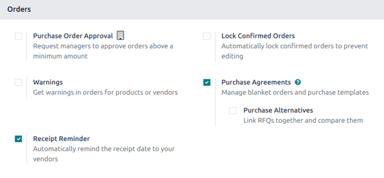
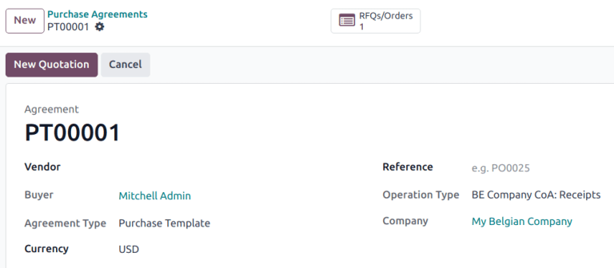

==================
Purchase templates
==================

.. |Pts| replace:: Purchase templates
.. |pt| replace:: purchase template
.. |RFQ| replace:: :abbr:`RFQ (request for quotation)`
.. |RFQs| replace:: :abbr:`RFQs (requests for quotation)`

*Purchase templates* are an agreement type that allow for the repeated creation of requests for
quotations (RFQs) for recurring purchases. Products can then be added and quantities can be changed,
as needed. |Pts| can be used for multiple vendors, saving time and simplifying the |RFQ| process.

|Pts| differ from *blanket orders* in that a :doc:`blanket order <blanket_orders>` is a large order
split into several deliveries, therefore all |RFQs| must be for the same vendor. |PTs| can be
replicated for multiple vendors, and can copy over quantities, which is useful when placing frequent
orders.

Configuration
-------------

First, navigate to :menuselection:`Purchase app --> Configuration --> Settings`. Under the
:guilabel:`Orders` section, tick the :guilabel:`Purchase Agreements` checkbox. Click
:guilabel:`Save` to save the changes.

Create a new template
---------------------

Navigate :menuselection:`Purchase app --> Orders --> Purchase Agreements` and click :guilabel:`New`.

Select a :guilabel:`Vendor` from the drop-down list.

.. tip::
   To make this template available to use with multiple vendors, leave the :guilabel:`Vendor` field
   blank.

In the :guilabel:`Agreement Type` field, select :guilabel:`Purchase Template` from the drop-down.

Confirm the information in the remaining fields is correct, or update as needed.

On the :guilabel:`Products` tab, click :guilabel:`Add a line`, and select the desired product.
Update the :guilabel:`Quantity`, and set the :guilabel:`Unit Price`.

.. important::
   When adding products to a new blanket order, the pre-existing prices of products are not
   automatically added to the product lines. Instead, the prices **must** be manually assigned, by
   changing the value in the :guilabel:`Unit Price` column to an agreed-upon price with the listed
   vendor. Otherwise, the price will remain `0`.

After adding all necessary products, click :guilabel:`Confirm`.

Create a new RFQ from a purchase template
=========================================

After confirming a |pt|, new quotations can be created directly from the |pt| form. |RFQs| using
this form are pre-populated with information based on the rules set in the form. Additionally, new
quotations are automatically linked to this |pt| form, via the :icon:`fa-list-alt`
:guilabel:`RFQs/Orders` smart button at the top of the form.

To :ref:`create a new quotation <purchase/manage_deals/create-new-rfq>`, click :guilabel:`New
Quotation`. This opens a new |RFQ|, that is pre-populated with the correct information, depending on
the settings configured on the |pt| form.

If there was no vendor identified on the |pt|, choose a :guilabel:`Vendor` from the drop-down list.
Products can be added to the |RFQ| by clicking :guilabel:`Add a product` in the :guilabel:`Products`
tab. To remove a product, click the :icon:`fa-trash-o` :guilabel:`(trash)` icon at the far-right of
the product line.

From the new |RFQ| form, click :guilabel:`Send by Email` to compose and send an email to the listed
vendor. Click :guilabel:`Print RFQ` to generate a printable PDF of the quotation; or, once ready,
click :guilabel:`Confirm Order` to confirm the purchase order.

After confirming the order, return to the |pt| via the breadcrumbs. The :icon:`fa-list-alt`
:guilabel:`RFQs/Orders` smart button has been updated to list the confirmed order.

