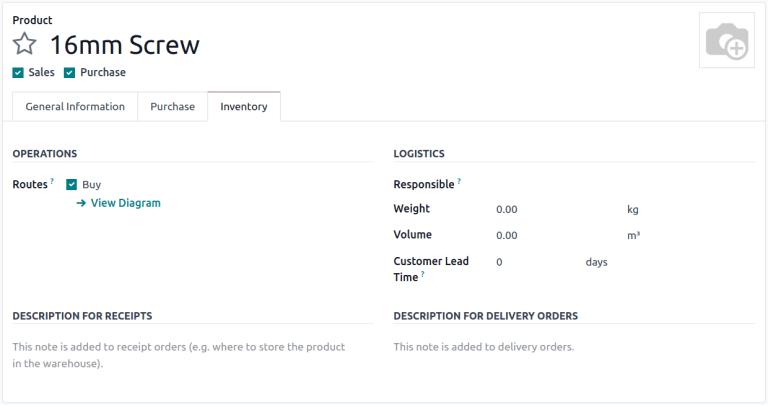
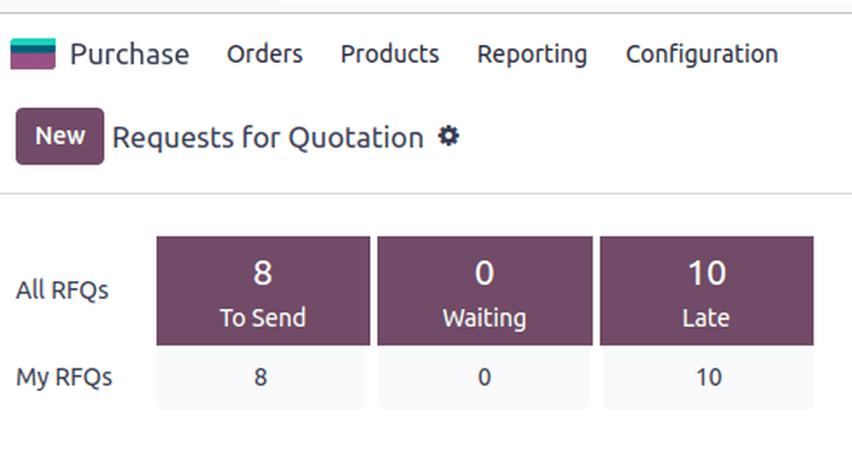

======================
Requests for quotation
======================

.. _purchase/manage_deals/rfq:

.. |PO| replace:: :abbr:`PO (Purchase Order)`
.. |POs| replace:: :abbr:`POs (Purchase Orders)`
.. |RFQ| replace:: :abbr:`RFQ (Request for Quotation)`
.. |RFQs| replace:: :abbr:`RFQs (Requests for Quotation)`

Odoo's requests for quotation (RFQs) feature in the **Purchase** app standardizes ordering products
from multiple vendors with varying prices and delivery times.

|RFQs| are documents companies send to vendors requesting product pricing. In Odoo, once the vendor
approves the |RFQ|, the purchase order (PO) is confirmed to align on lead times and pricing.

Configuration
=============

Product
-------

To auto-populate product information and prices on an |RFQ|, configure products by going to
:menuselection:`Purchase app --> Products --> Products`. Select an existing product, or create a new
one by selecting :guilabel:`New`. Doing so opens the product form, where sales and purchasing data
can be configured.

To configure purchasable products, tick the :guilabel:`Purchase` checkbox, under the product name.
Next, go to the :guilabel:`Inventory` tab, and enable the :guilabel:`Buy` route.

.. important::
   The :guilabel:`Inventory` tab and routes are only visible if using the :doc:`Inventory app
   <../../inventory>`.

.. seealso::
   :doc:`Configure product types and track quantities
   <../../../inventory_and_mrp/inventory/product_management/configure>`

.. _purchase/manage_deals/vendor-pricelist:

Vendor pricelist
----------------

In the :guilabel:`Purchase` tab of the product form, click :guilabel:`Add a line` to input the
vendor and their price, to have this information auto-populate on an |RFQ| each time the product is
listed.

.. seealso::
   :doc:`../products/pricelist`

Default columns include :guilabel:`Quantity`, :guilabel:`Unit Price`, and :guilabel:`Delivery Lead
Time`, but other columns like, :guilabel:`Vendor Product Code` or :guilabel:`Discount (%)`, can also
be enabled.

To enable or disable columns, click the :icon:`oi-settings-adjust` :guilabel:`(additional options)`
icon on the right side of the header row to reveal a drop-down menu of additional columns that can
be added (or removed) from the :guilabel:`Purchase` tab.

.. note::
   Alternatively, prices and delivery lead times for existing products can be added by going to
   :menuselection:`Purchase app --> Configuration --> Vendor Pricelists`. Click :guilabel:`New` in
   the top-left corner. In the :guilabel:`Vendor` section of the pricelist form that appears, add
   the product information as it pertains to the vendor.

Order products
==============

With products and prices configured, follow these steps to create and send |RFQs| to make purchases
for the company.

|RFQ| dashboard
---------------

To get started, navigate to :menuselection:`Purchase app --> Orders --> Requests for Quotation`.

The :guilabel:`Requests for Quotation` dashboard displays an overview of the company's |RFQs|,
|POs|, and their status. The top of the screen breaks down all |RFQs| in the company, as well as
individual ones (where the user is the buyer) with a summary of their status.

The top-right corner also provides a report of the company's recent purchases by total value, lead
times, and number of |RFQs| sent.

Additionally, the dashboard includes buttons for:

- :guilabel:`To Send`: orders in the |RFQ| stage that have not been sent to the vendor.
- :guilabel:`Waiting`: |RFQs| that have been sent by email, and are waiting on vendor confirmation.
- :guilabel:`Late`: |RFQs| or |POs| where the :guilabel:`Order Deadline` has passed.

In addition to view options, the :guilabel:`Requests for Quotation` dashboard provides
:guilabel:`Filters` and :guilabel:`Group By` options, accessible via the search bar drop-down menu.

.. seealso::
   :doc:`../../../essentials/search`

.. _purchase/manage_deals/create-new-rfq:

Create a new |RFQ|
------------------

To create a new |RFQ|, click the :guilabel:`New` button on the top-left corner of the
:guilabel:`Requests for Quotation` dashboard to reveal a new |PO| form.

Start by assigning a :guilabel:`Vendor`.

The :guilabel:`Vendor Reference` field points to the sales and delivery order numbers sent by the
vendor. This comes in handy once products are received, and the |PO| needs to be matched to the
delivery order.

With the :doc:`Purchase Agreements feature <blanket_orders>` activated, the :guilabel:`Blanket
Order` field appears, referring to long-term purchase agreements on recurring orders with set
pricing. To view and configure blanket orders, head to :menuselection:`Purchase app --> Orders -->
Purchase agreements`.

.. important::
   The :guilabel:`Purchase agreements` view only appears if the :guilabel:`Blanket Order` setting is
   enabled. To do so, navigate to :menuselection:`Purchase app --> Configuration --> Settings`, then
   tick the :guilabel:`Blanket Orders` checkbox.

Next, configure an :guilabel:`Order Deadline`, which is the date by which the vendor must confirm
their agreement to supply the products.

.. note::
   After the :guilabel:`Order Deadline` is exceeded, the |RFQ| is marked as late, but the products
   can still be ordered.

:guilabel:`Expected Arrival` is automatically calculated based on the :guilabel:`Order Deadline` and
vendor lead time. Tick the checkbox for :guilabel:`Ask confirmation` to ask the vendor to confirm
the shipping date by email.

With the :doc:`Storage Locations feature
<../../inventory/warehouses_storage/inventory_management/use_locations>` activated, the
:guilabel:`Deliver to` field appears, which specifies which warehouse operation (set in the
**Inventory** app) is used to receive the shipment.

Select the receiving warehouse address here, or select :guilabel:`Dropship` to indicate that this
order is to be shipped directly to the end customer. When :guilabel:`Dropship` is selected, the
:guilabel:`Dropship address` field is enabled. Contact names auto-populate here from the
**Contacts** app.

.. important::
   The :guilabel:`Dropship` options only appear if the :guilabel:`Dropshipping` setting is enabled
   in the **Inventory** app. To do so, navigate to :menuselection:`Inventory app --> Configuration
   --> Settings`, then tick the :guilabel:`Dropshipping` checkbox.

.. tip::
   To create |RFQs| using different currencies, each currency needs to be enabled in the
   **Invoicing** app settings. See :doc:`../../../sales/sales/products_prices/prices/currencies` to
   learn more.

Products tab
~~~~~~~~~~~~

In the :guilabel:`Products` tab, add the products to be ordered. Click :guilabel:`Add a product`,
and type in the product name, or select the item from the drop-down menu.

To create a new product and add it, type the new product name in the :guilabel:`Product` column,
select :guilabel:`Create [product name]` from the resulting drop-down menu and manually add the unit
price. Alternatively, select :guilabel:`Create and edit...` to be taken to the product form for that
new item.

:guilabel:`Catalog` can also be selected to navigate to a product menu from the chosen vendor. From
here, products can be added to the cart.

.. note::
   To make adjustments to products and prices, access the product form by clicking the
   :icon:`oi-arrow-right` :guilabel:`(right arrow)` icon that becomes available upon hovering over
   the :guilabel:`Product` name.

Send the |RFQ|
--------------

Clicking :guilabel:`Send by Email` reveals a :guilabel:`Compose Email` pop-up window, with a
:guilabel:`Purchase: Request for Quotation` template loaded, ready to send to the vendor's email
address (configured in the **Contacts** app).

After crafting the desired message, click :guilabel:`Send`. Once sent, the |RFQ| moves to the
:guilabel:`RFQ Sent` stage.

Clicking :guilabel:`Print RFQ` downloads a PDF of the |RFQ|.

.. seealso::
   :doc:`../../../essentials/contacts`

Confirm order
-------------

Clicking :guilabel:`Confirm Order` directly transforms the |RFQ| into an active |PO|.

.. tip::
   Odoo tracks communications on each order through the chatter of the |PO| form. This shows the
   emails sent between the user and the contact, as well as any internal notes and activities.
   Messages, notes, and activities can also be logged on the chatter.

Once an |RFQ| is confirmed, it creates a |PO|.

On the new |PO|, the :guilabel:`Order Deadline` field changes to :guilabel:`Confirmation Date`,
which displays the date and time the user confirmed the order.

Depending on the user's chosen configuration in the **Purchase** app settings, a *vendor bill* is
created once products have been ordered or received. For more information, refer to the
documentation on :doc:`managing vendor bills <manage>`.

.. note::
   After an order is placed, clicking :guilabel:`Receive Products` records the reception of new
   products into the database.

.. note::
   With the **Inventory** app installed, confirming a |PO| automatically creates a receipt document,
   with the product information and expected arrival dates automatically populated.

.. seealso::
   :doc:`manage`
