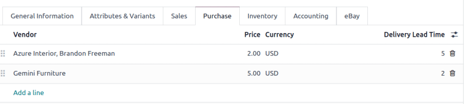
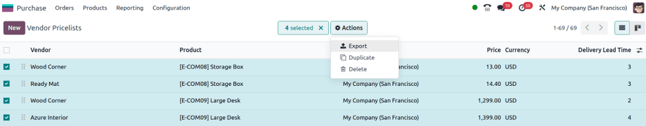
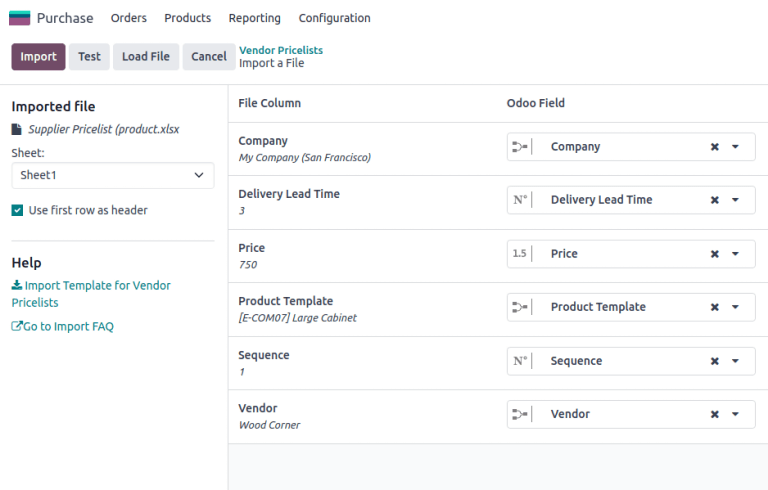

=======================
Import vendor pricelist
=======================

Set vendor prices to auto-populate requests for quotations (RFQs) or purchase orders (POs) with the
unit price, once the product is added, which reduces errors and saves time.

In Odoo, vendor pricelists can be :ref:`added individually <purchase/products/pricelist>` on the
product form, or :ref:`imported in bulk <purchase/products/import-pricelist>`, via an XLSX or CSV
file.

.. important::
   Please review this :doc:`import guide <../../../essentials/export_import_data>` before uploading
   vendor pricelists.

.. _purchase/products/pricelist:

On product form
===============

To manually add the vendor price on the product form, go to the :menuselection:`Purchase app -->
Products --> Products`, and click the desired product.

.. note::
   Product forms are accessible from multiple apps, such as **Sales**, **Inventory**, and
   **Manufacturing**.

In the :guilabel:`Purchase` tab of the product form, input the vendor and their price, to have this
information auto-populate on a request for quotation each time the product is listed.

.. seealso::
   :ref:`Vendor pricelist on product form <purchase/manage_deals/vendor-pricelist>`

.. _purchase/products/import-pricelist:

Import vendor pricelist
=======================

To import vendor pricelists, ensure the XLSX or CSV file is accurately completed. The best way to
obtain a correctly formatted template, including product names, references, and vendor details, is
to first :ref:`export a pricelist <purchase/products/export-price>` from the database.

Modify the exported file, as needed, then import it back into the Odoo database.

.. _purchase/products/export-price:

Export pricelist
----------------

To export a pricelist, go to :menuselection:`Purchase app --> Configuration --> Vendor Pricelists`.

On the page, tick the checkbox(es) for the desired vendor pricelists.

Then, click the :icon:`fa-cog` :guilabel:`Actions` button that appears, and choose :icon:`fa-upload`
:guilabel:`Export` from the drop-down menu.

In the resulting pop-up window, fields listed under the :guilabel:`Fields to export` section are
included in the exported file. To add more fields, find the desired field in the
:guilabel:`Available fields` section, and click the :icon:`fa-plus` :guilabel:`(plus)` icon to the
right of the field.

.. note::
   To update to existing records, tick the :guilabel:`I want to update data (import-compatible
   export)` checkbox, and refer to the section on the :ref:`External ID
   <purchase/products/external-id>` field.

   For details on commonly-used fields for importing vendor pricelists, see the :ref:`Common fields
   <purchase/products/common-fields>` section.

Select the desired :guilabel:`Export Format`: :guilabel:`XLSX` or :guilabel:`CSV`.

To save the selected fields as a template, click the :guilabel:`Template` field, and select
:guilabel:`New template` from the drop-down menu. Type the name of the new template, and click the
:icon:`fa-floppy-o` :guilabel:`(save)` icon. After that, the template is a selectable option when
clicking the :guilabel:`Template` field.

Finally, click :guilabel:`Export`.

.. note::
   With :ref:`developer mode <developer-mode>` turned on, the column names of the exported file
   display the *field name* with the *technical name* in parenthesis.

.. example::
   .. figure:: pricelist/export-data.png
      :alt: Exporting vendor pricelist.

      Export vendor pricelist in XLSX format. It includes :guilabel:`Product Template` and other
      fields in the :guilabel:`Fields to export` section.

.. _purchase/products/external-id:

External ID
~~~~~~~~~~~

*External ID* is a unique identifier used to update existing vendor pricelists. Without it, imported
records create new entries, instead of updating existing ones. Including this field in the XLSX or
CSV, indicates the line replaces an existing vendor pricelist in the Odoo database.

.. example::
   .. figure:: pricelist/duplicate-values.png
      :alt: Show 'Ready Mat' appear twice.

      `Ready Mat` appears twice because the external ID was omitted during the price update from
      `$790` to `$780`.

To look-up the :guilabel:`External ID` for a vendor pricelist, tick the :guilabel:`I want to update
data (import-compatible export)` checkbox at the top of the :guilabel:`Export Data` pop-up window.

.. note::
   Selecting :guilabel:`External ID` from the :guilabel:`Available fields` section with the
   :guilabel:`I want to update data (import-compatible export)` checkbox ticked results in an export
   file with two columns containing the external ID.

.. _purchase/products/common-fields:

Common fields
~~~~~~~~~~~~~

Below is a list of commonly-used fields when importing vendor pricelists:

.. list-table:: Field name definitions
   :header-rows: 1

   * - Field name
     - Used for
     - Field in Odoo database
     - Technical name of field
   * - Vendor
     - The only required field for creating a vendor pricelist record. This field specifies the
       vendor associated with the product.
     - :guilabel:`Vendor` field in the :ref:`vendor pricelist of the product form
       <purchase/products/pricelist>`.
     - `partner_id`
   * - Product Template
     - The Odoo product the vendor pricelist entry is related to.
     - :guilabel:`Product` field in the vendor pricelist.
     - `product_tmpl_id`
   * - Quantity
     - The minimum quantity required to receive the product at the specified price.
     - :guilabel:`Quantity` field in the vendor pricelist. (If not visible, enable it by clicking
       the :icon:`oi-settings-adjust` :guilabel:`(adjust)` icon, and tick the :guilabel:`Quantity`
       checkbox)
     - `min_qty`
   * - Unit Price
     - The purchase price for the product from the vendor.
     - :guilabel:`Price` field in the vendor pricelist.
     - `price`
   * - Delivery Lead Time
     - :ref:`Number of days <inventory/warehouses_storage/purchase-lt>` before receiving the product
       after confirming a purchase order.
     - :guilabel:`Delivery Lead Time` field on the vendor pricelist.
     - `delay`
   * - Sequence
     - Defines the order of vendors in the pricelist when multiple vendors are available. For
       example, if `Azure Interior` is listed first and Wood Corner second, their sequences would be
       `1` and `2`.
     - N/A
     - `sequence`
   * - Company
     - Name of company the product belongs to.
     - :guilabel:`Company` field in the vendor pricelist.
     - `company_id`
   * - :ref:`External ID <purchase/products/external-id>`
     - Unique ID of a record used to update existing vendor pricelists.
     - N/A
     - `id`

Import records
--------------

With a template downloaded, fill out the XLSX or CSV file with the necessary information. After
inputting everything, import the file back into the Odoo database, by going to
:menuselection:`Purchase app --> Configuration --> Vendor Pricelists`.

On the page, click the :icon:`fa-cog` :guilabel:`(gear)` icon in the top-left corner. In the
drop-down menu that appears, click :guilabel:`Import records`.

Then, click :guilabel:`Upload File` in the upper-left corner, and after selecting the XLSX or CSV
file, confirm the correct fields, and click :guilabel:`Import`.

.. seealso::
   - :doc:`../../../essentials/export_import_data`
   - :ref:`Common fields <purchase/products/common-fields>`

Formatting import file
~~~~~~~~~~~~~~~~~~~~~~

To understand how to format import files for vendor pricelists, consider the following example.

- `Storage Box` (:guilabel:`Reference`: `E-COM08`) is sold by `Wood Corner` for `$10`.
- `Large Desk` (:guilabel:`Reference`: `E-COM09`) has no records in the vendor pricelist.

An import file is created to do the following:

- Update the price for `Wood Corner` from `$10` to `$13`.
- Add pricelist for `Storage Box`: the vendor, `Ready Mat` intends to sell the product for `$14`.
- Add pricelist for `Large Desk`: vendor is `Wood Corner`, price is `$1299`.
- Add pricelist for `Large Desk`: vendor is `Azure Interior`, price is `$1399`.

.. list-table:: Vendor pricelist data
   :header-rows: 1

   * - id
     - company_id
     - delay
     - price
     - product_tmpl_id
     - sequence
     - partner_id
   * - product.product_supplierinfo_3
     - My Company (San Francisco)
     - 3
     - 13.00
     - [E-COM08] Storage Box
     - 4
     - Wood Corner
   * -
     - My Company (San Francisco)
     - 3
     - 14.00
     - [E-COM08] Storage Box
     - 5
     - Ready Mat
   * -
     - My Company (San Francisco)
     - 2
     - 1299.00
     - [E-COM09] Large Desk
     - 6
     - Wood Corner
   * -
     - My Company (San Francisco)
     - 4
     - 1399.00
     - [E-COM09] Large Desk
     - 7
     - Azure Interior

.. note::
   The *technical field name* was used to create this information.

.. note::
   Download the sample files for reference:

   - :download:`Sample XLSX import file <pricelist/pricelist-example.xlsx>`
   - :download:`Sample CSV import file <pricelist/pricelist-example.csv>`

