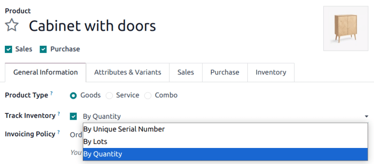
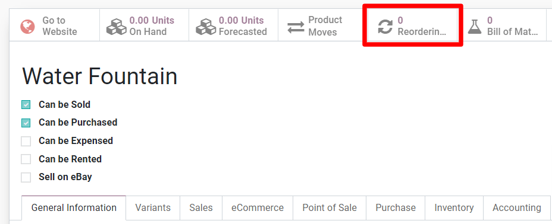
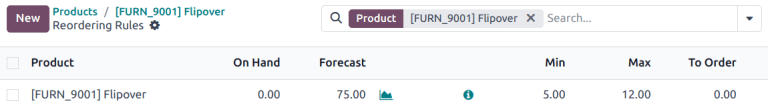

==========================
Configure reordering rules
==========================

For certain products, it is necessary to ensure that there is always a minimum amount available on
hand at any given time. By adding a reordering rule to a product, it is possible to automate the
reordering process so that a purchase order is automatically created whenever the amount on hand
falls below a set threshold.

.. important::
   The *Inventory* module must be installed to use reordering rules.

Configure products for reordering
=================================

Products must be configured in a specific way before a reordering rule can be added to them.

Starting from the :menuselection:`Inventory`, :menuselection:`Manufacturing`,
:menuselection:`Purchase`, or :menuselection:`Sales` module, navigate to :menuselection:`Products
--> Products` and then click :guilabel:`Create` to make a new product. Alternatively, find a product
that already exists in the database and click into it's product form.

Next, on the product form, enable reordering by checking the :guilabel:`Can be Purchased` option
underneathe the :guilabel:`Product Name` field. Finally, set the :guilabel:`Product Type` to
`Storable Product` under the :guilabel:`General Information` tab.

Add a reordering rule to a product
==================================

After properly configuring a product, a reordering rule can be added to it by selecting the now
visible :guilabel:`Reordering Rules` tab at the top of that product's form, and then clicking
:guilabel:`Create` on the :guilabel:`Reordering Rules` dashboard.

Once created, the reordering rule can be configured to generate purchase orders automatically by
defining the following fields:

- :guilabel:`Location` specifies where the ordered quantities should be stored once they are
  received and entered into stock.
- :guilabel:`Min Quantity` sets the lower threshold for the reordering rule while :guilabel:`Max
  Quantity` sets the upper threshold. If the stock on hand falls below the minimum quantity, a new
  purchase order will be created to replenish it up to the maximum quantity.

   .. example::
      If :guilabel:`Min Quantity` is set to `5` and :guilabel:`Max Quantity` is set to `25` and the
      stock on hand falls to four, a purchase order will be created for 21 units of the product.

- :guilabel:`Multiple Quantity` can be configured so that products are only ordered in batches of a
  certain quantity. Depending on the number entered, this can result in the creation of a purchase
  order that would put the resulting stock on hand above what is specified in the :guilabel:`Max
  Quantity` field.

   .. example::
      If :guilabel:`Max Quantity` is set to `100` but :guilabel:`Multiple Quantity` is set to order
      the product in batches of `200`, a purchase order will be created for 200 units of the
      product.

- :guilabel:`UoM` specifies the unit of measurement by which the quantity will be ordered. For
  discrete products, this should be set to `Units`. However, it can also be set to units of
  measurement like `Volume` or `Weight` for non-discrete products like water or bricks.

Manually trigger reordering rules using the scheduler
=====================================================

Reordering rules will be automatically triggered by the scheduler, which runs once a day by
default. To trigger reordering rules manually, navigate to :menuselection:`Inventory --> Operations
--> Run Scheduler`. On the pop-up window, confirm the manual action by clicking :guilabel:`Run
Scheduler`.

.. note::
   Manually triggering reordering rules will also trigger any other scheduled actions.

Manage reordering rules
=======================

To manage the reordering rules for a single product, navigate to that product page's form and select
the :guilabel:`Reordering Rules` tab at the top of the form.

To manage all reordering rules for every product, go to :menuselection:`Inventory --> Configuration
--> Reordering Rules`. From this dashboard, typical bulk actions in Odoo can be performed such as
exporting data or archiving rules that are no longer needed. As well, the :guilabel:`Filters`,
:guilabel:`Group By` or triple-dotted menu on the form are available to search for and/or organize
the reordering rules as desired.
