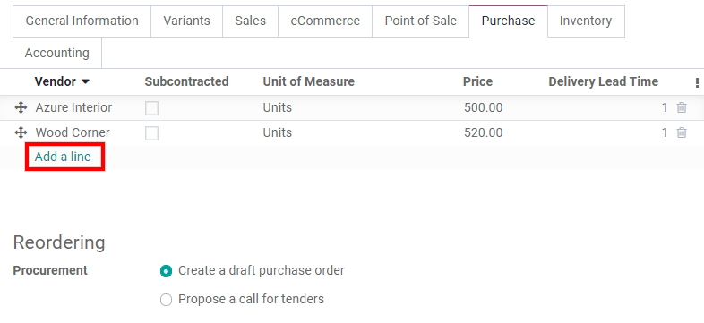
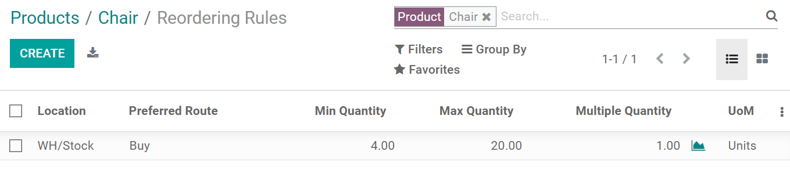

============================================
Don’t run out of stock with reordering rules
============================================

To make sure you never run out of stock, you can define *Reordering Rules* on products. Thanks to
them, Odoo can help you replenish your stock automatically when it reaches set quantities or
whenever a sales order is created.

.. important:: You need to install the *Inventory app* to use reordering rules.

Configure your storable product
===============================

Open or create a product with its *Product Type* set to *Storable Product*.

.. image:: reordering/reordering-storable-product.png
   :align: center
   :alt: Set the product type in Odoo

As you are purchasing this product from a vendor, go to the product's *Purchase tab* and add a
vendor by clicking on *Add a line*. You can add multiple vendors, but make sure to order them
correctly, since reordering rules always use the first vendor in a list. You can add a price, but it
isn't necessary for the reordering rule to work. In addition, you can add a minimum quantity you
must order to benefit from that price.

.. note::
   If the quantity Odoo has to reorder doesn't match the minimum quantity specified, Odoo selects
   the next vendor on your list. If you don't have another vendor on your list, the reordering rule
   won't work. For that purpose, you can add the same vendor multiple times with different prices
   for different quantities.

.. tip::
   By default, a draft purchase order is created. However, if you have enabled *Purchase
   Agreements*, you can *Propose a call for tenders* instead as shown in the image above. For more
   information, see :doc:`../manage_deals/agreements`

Next, make sure the correct route is selected under the Inventory tab of your product. If you
created your product within the Purchase app, the *Buy* route is selected by default. If you are
looking to dropship your product, select *Dropship*.

.. image:: reordering/reordering-product-routes.png
   :align: center
   :alt: Choose product routes in Odoo

Set up your reordering rule
===========================

Open your product and click on the *Reordering Rules* button.

.. image:: reordering/reordering-button.png
   :align: center
   :alt: Reordering rules button on a product in Odoo

Once you are on the product's reordering rules page, click on *Create*.

.. tip::
   You can access and create reordering rules from :menuselection:`Inventory --> Configuration -->
   Reordering Rules` and from :menuselection:`Inventory --> Operations --> Replenishment`. By
   default, the replenishment view presents a summary of all the products that you might need to
   purchase to fulfill your sales orders. From there, you can ask Odoo with a single click to order
   a product once or automate all orders for that product, future orders included.

Define quantities
-----------------

You can set a **minimum quantity** your stock should always have. Once set, if your stock goes below
the minimum quantity, and if you selected the Buy route, a request for quotation is automatically
generated to reach that minimum quantity, plus any additional quantity needed to fill in a sales
order for example.

If you set a **maximum quantity**, every time the product has to be replenished, enough products are
reordered to reach the maximum quantity.

If you want to order only the exact quantity needed to fill in a sales order for example, set both
both the minimum and maximum quantity to **zero**. The quantity mentioned in the sales order is then
used by the reordering rule.

You can also add a **quantity multiple** to only order products in batches of a certain quantity.
Click on the optional columns drop-down menu, and select *Multiple Quantity* to show the column.
Bear in mind that you might go over the maximum quantity you set if your rule includes a quantity
multiple, as Odoo orders enough products to reach the maximum quantity and respect the set quantity
multiple.

.. note:: If you selected multiple routes for the same product under its Inventory tab, make sure to
   select your *Preferred Route* on your reordering rule by clicking on the optional columns
   drop-down menu, adding the *Preferred Route* column, and selecting the right route.

.. Add link when inventory doc on replenishment is updated for v14. .. seealso:: - :doc:`../../..inventory/xxx/xxx`
