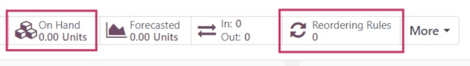
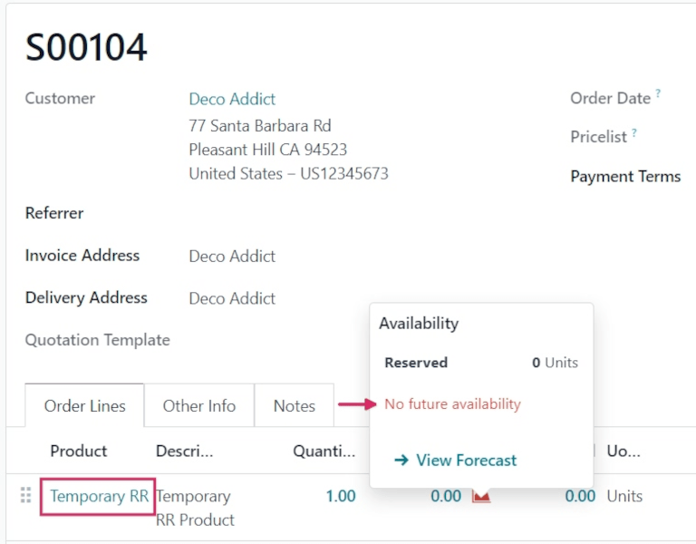
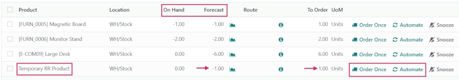
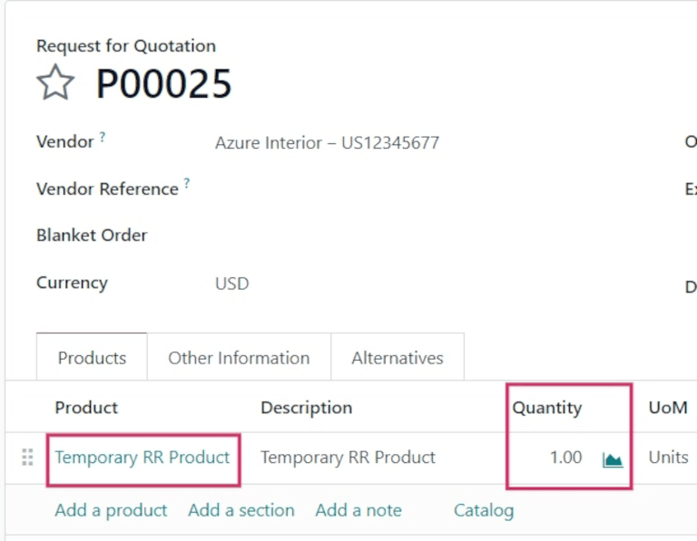

==========================
Temporary reordering rules
==========================

Some businesses require certain products to always have a minimum quantity of stock on-hand at any
given time. To avoid stock falling below a certain threshold, companies can create *reordering
rules* in Odoo to automate purchase orders for specific products.

Reordering rules keep the forecasted stock levels above a certain threshold, without exceeding a
specified upper limit, or maximum amount. When a product with a reordering rule falls below a
specified quantity, Odoo generates an order using the specified *route* (e.g. *Buy* or
*Manufacture*) to replenish the stock.

In certain cases, businesses might opt for *temporary reordering rules* when they do not want
specific products to be replenished automatically.

In Odoo, a "temporary" reordering rule is created in the replenishment dashboard when a product:

#. is configured with a *Buy* route
#. has no reordering rule configured
#. has `0` quantity in stock
#. is included in a sales order (SO).

This rule is deleted upon confirmation of the purchase order (PO) generated for the product.

.. seealso::
   - :doc:`../../inventory/product_management/product_replenishment/reordering_rules`
   - :doc:`../../purchase/products/reordering`

Configuration
=============

To configure a product that triggers temporary reordering rules when its stock reaches `0`, begin by
going to :menuselection:`Inventory app --> Products --> Products`, and click :guilabel:`New`.

.. note::
   The same configurations can also be made on an existing product, by going to
   :menuselection:`Inventory app --> Products --> Products`, and selecting an existing product.

On the product form, enter the product name, and ensure the :guilabel:`Can be Sold` and
:guilabel:`Can be Purchased` options are enabled, located beneath the :guilabel:`Product Name`
field.

Then, set the :guilabel:`Product Type` to `Storable Product`, under the :guilabel:`General
Information` tab.

Next, click the :guilabel:`Purchase` tab, and under :guilabel:`Vendor`, click :guilabel:`Add a line`
to select a vendor from the drop-down menu. Then, set a purchase price under :guilabel:`Price`.

.. important::
   A vendor **must** be set for temporary reordering rules to work. While a :abbr:`PO (purchase
   order)` can still be created automatically, attempting to replenish the product from the
   :guilabel:`Replenishment` dashboard in the *Inventory* app triggers a warning to add a vendor on
   the product form.

   .. image:: temporary_reordering/temporary-reordering-warning-popup.png
      :align: center
      :alt: Warning pop-up upon clicking to replenish product with no set vendor.

Before creating a :abbr:`SO (sales order)` for the product, ensure the :guilabel:`On Hand` smart
button on the product form reads `0.00 Units`. Then, ensure that the :guilabel:`Reordering Rules`
smart button reads `0`, indicating there are no rules applied to this product.

Trigger temporary reordering rule
=================================

To trigger a temporary reordering rule, create a new sales order for a product by navigating to
:menuselection:`Sales app --> New`.

Then, add a customer in the :guilabel:`Customer` field, and click :guilabel:`Add a product` under
the :guilabel:`Product` column in the :guilabel:`Order Lines` tab. Next, select the desired product
from the drop-down menu. Lastly, :guilabel:`Confirm` the :abbr:`SO (sales order)`.

Check replenishment report
==========================

To see the temporary reordering rule created for the out-of-stock product included in the sales
order, navigate to :menuselection:`Inventory app --> Operations --> Replenishment`. Doing so opens
the :guilabel:`Replenishment` dashboard.

On this dashboard, locate the product for which the temporary reordering rule was created. On its
product line, its :guilabel:`On Hand` quantity, negative :guilabel:`Forecast` quantity, *Buy*
:guilabel:`Route`, and :guilabel:`To Order` quantity to replenish can be seen.

Additionally, two replenishment options are located to the far-right of the row: :guilabel:`Order
Once` and :guilabel:`Automate`.

To use the one-time, temporary reordering rule, click :guilabel:`Order Once`. This action triggers a
confirmation pop-up window in the top-right corner, reading :guilabel:`The following replenishment
order has been generated`, along with a new purchase order number.

.. tip::
   Once the purchase order has been generated after clicking :guilabel:`Order Once`, refresh the
   page. The temporary reordering rule for the product no longer appears in the
   :guilabel:`Replenishment` dashboard.

Complete purchase order
=======================

To view the purchase order created from the :guilabel:`Replenishment` dashboard, navigate to the
:menuselection:`Purchase app`, and select the generated :abbr:`PO (purchase order)` from the
:guilabel:`Requests for Quotation` overview.

From here, click :guilabel:`Confirm Order`, then click :guilabel:`Receive Products`. Finally, click
:guilabel:`Validate` to complete the purchase order.

Now, the original sales order can be delivered and invoiced.

.. note::
   Once the :abbr:`SO (sales order)` is delivered and invoiced, ensure there are no reordering rules
   on the product form.

   Go to :menuselection:`Inventory app --> Products --> Products`, select the product, and confirm
   that the :guilabel:`Reordering Rules` smart button displays `0`.
