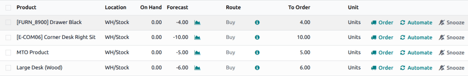

==========================
Temporary reordering rules
==========================

.. |PO| replace:: :abbr:`PO (Purchase Order)`
.. |SO| replace:: :abbr:`SO (Sales Order)`

Some businesses require certain products to always have a minimum quantity of stock on-hand at any
given time. To avoid stock falling below a certain threshold, companies can create *reordering
rules* in Odoo to automate purchase orders for specific products.

In certain cases, businesses might opt for *temporary* reordering rules when they do not want
specific products to be replenished automatically. In Odoo, a *temporary* reordering rule is created
in the replenishment dashboard when a product is configured with a *Buy* route, has no reordering
rule configured, has `0` quantity in stock, and is included in a sales order. This rule is deleted
upon confirmation of the purchase order (PO) generated for the product.

.. seealso::
   - :doc:`../../inventory/warehouses_storage/replenishment/reordering_rules`
   - :doc:`../../purchase/products/reordering`

Configuration
=============

To configure a product that triggers temporary reordering rules when its stock reaches `0`, begin by
going to :menuselection:`Inventory app --> Products --> Products`, and click :guilabel:`New`.

.. note::
   The same configurations can also be made on an existing product, by going to
   :menuselection:`Inventory app --> Products --> Products`, and selecting an existing product.

On the product form, enter the product name, and ensure the :guilabel:`Sales` and
:guilabel:`Purchase` options are enabled, located beneath the :guilabel:`Product Name` field.

On the *General Information* tab, leave :guilabel:`Product Type` set to :guilabel:`Goods`, and
ensure :guilabel:`Track Inventory` is checked, with :guilabel:`By Quantity` selected.

Next, click the *Purchase* tab, and under :guilabel:`Vendor`, click :guilabel:`Add a line` and
select a vendor from the drop-down menu. Then, set a purchase price under :guilabel:`Unit Price`.

.. important::
   A vendor **must** be set for temporary reordering rules to work. Attempting to replenish the
   product from the *Replenishment* dashboard in the **Inventory** app without one triggers a
   warning to add a vendor on the product form.

Before creating an |SO| for the product, ensure the :guilabel:`Quantity On Hand` field, on the
*General Information* tab, reads `0.00 Units`. Then, ensure that the :icon:`fa-refresh`
:guilabel:`Reordering Rules` smart button reads `0`, indicating there are no rules applied to this
product.

.. tip::
   If the button bar is full, the *Reordering Rules* smart button is located under the *More*
   dropdown.

   .. image:: temporary_reordering/more-button.png
      :alt: The smart buttons bar with the more option selected.

Trigger temporary reordering rule
=================================

To trigger a temporary reordering rule, create a new sales order for a product by navigating to
:menuselection:`Sales app --> New`.

Then, add a customer in the :guilabel:`Customer` field, and click :guilabel:`Add a product` under
the :guilabel:`Product` column in the *Order Lines* tab. Next, select the desired product from the
drop-down menu. Lastly, :guilabel:`Confirm` the |SO|.

.. _purchase/check-replenishment:

Check replenishment report
==========================

To see the temporary reordering rule created for the out-of-stock product included in the sales
order, navigate to :menuselection:`Inventory app --> Operations --> Replenishment`. Doing so opens
the *Replenishment* dashboard.

On this dashboard, locate the product for which the temporary reordering rule was created. On its
product line, its :guilabel:`On Hand` quantity, negative :guilabel:`Forecast` quantity, *Buy*
:guilabel:`Route`, and :guilabel:`To Order` quantity to replenish can be seen.

Additionally, three replenishment options are located to the far-right of the row:
:icon:`fa-truck` :guilabel:`Order`, :icon:`fa-refresh` :guilabel:`Automate`, and
:icon:`fa-bell-slash` :guilabel:`Snooze`.

To use the one-time, temporary reordering rule, click :icon:`fa-truck` :guilabel:`Order`. This
action triggers a small temporary confirmation pop-up window, reading :guilabel:`The following
replenishment order has been generated`, along with a new purchase order number.

.. tip::
   Once the purchase order has been generated after clicking :guilabel:`Once`, refresh the page. The
   temporary reordering rule for the product no longer appears in the :guilabel:`Replenishment`
   dashboard.

Complete purchase order
=======================

To view the purchase order created from the *Replenishment* dashboard, navigate to the
:menuselection:`Purchase app`, and select the generated |PO| from the *Requests for Quotation*
dashboard.

From here, click :guilabel:`Confirm Order`, then click :guilabel:`Receive`. Finally, click
:guilabel:`Validate` to complete the |PO|.

The temporary reordering rule is automatically deleted upon confirmation of the |PO|, and the
*Reordering Rules* count returns to `0`. Now, the original sales order can be delivered and
invoiced.

.. note::
   Once the |SO| is delivered and invoiced, ensure there are no reordering rules on the product
   form.

   Go to :menuselection:`Inventory app --> Products --> Products`, select the product, and confirm
   that the :icon:`fa-refresh` :guilabel:`Reordering Rules` smart button displays `0`.
