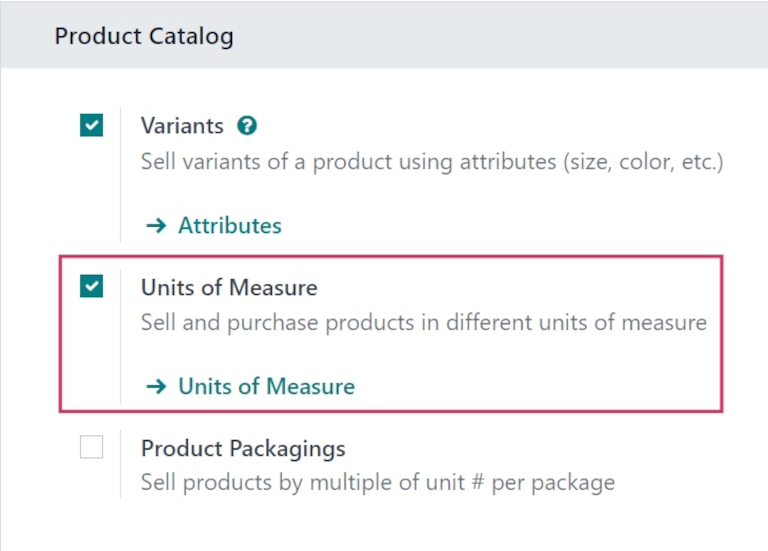
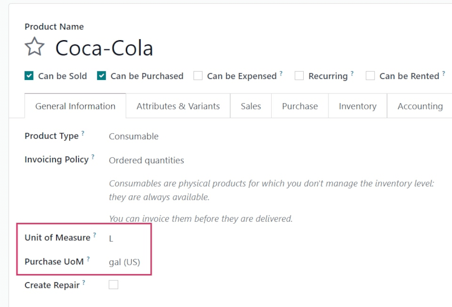
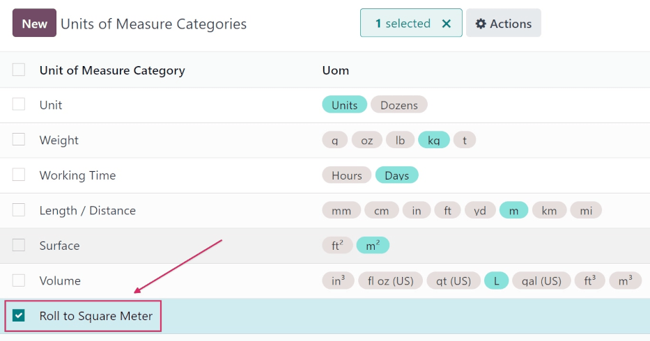
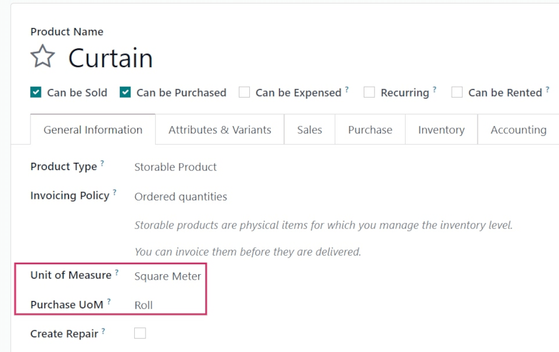

=================================================
Purchase in different units of measure than sales
=================================================

When you purchase a product, it may happen that your vendor uses a different unit of measure than
you do when you sell it. This can cause confusion between sales and purchase representatives. It is
also time-consuming to convert measures manually every time. With Odoo, you can configure your
product once and let Odoo handle the conversion.

Consider the following examples:

#. You purchase orange juice from an American vendor, and they use **gallons**. However, your
   customers are European and use **liters**.

#. You buy curtains from a vendor in the form of **rolls** and you sell pieces of the rolls to your
   customers using **square meters**.

Enable units of measure
=======================

Open your Sales app and go to :menuselection:`Configuration --> Settings`. Under Product Catalog,
enable *Units of Measure*.

Specify sales and purchase units of measure
===========================================

Standard units of measure
-------------------------

A variety of units of measure are available by default in your database. Each belongs to one of the
five pre-configured units of measure categories: *Length / Distance*, *Unit*, *Volume*, *Weight* and
*Working Time*.

.. tip::
   You can create your new units of measure and units of measure categories (see next section).

To specify different units of measures for sales and purchases, open the Purchase app and go to
:menuselection:`Products --> Products`. Create a product or select an existing one. Under the
product's *General Information* tab, first select the *Unit of Measure* to be used for sales (as
well as for other apps such as inventory). Then, select the *Purchase Unit of Measure* to be used
for purchases.

Back to the first example, if you purchase orange juice from your vendor in **gallons** and sell it
to your customers in **liters**, first select *L* (liters) as the *Unit of Measure*, and *gal (US)*
(gallons) as the *Purchase Unit of Measure*, then click on *Save*.

Create new units of measure and units of measure categories
-----------------------------------------------------------

Sometimes you need to create your own units and categories, either because the measure is not
pre-configured in Odoo or because the units do not relate with each other (e.g. kilos and
centimeters).

If you take the second example where you buy curtains from a vendor in the form of **rolls** and you
sell pieces of the rolls using **square meters**, you need to create a new *Units of Measure
Category* in order to relate both units of measure.

To do so, go to :menuselection:`Configuration --> Units of Measure Categories`. Click on *Create*
and name the category.

The next step is to create the two units of measures. To do so, go to :menuselection:`Configuration
--> Units of Measure`.

First, create the unit of measure used as the reference point for converting to other units of
measure inside the category by clicking on *Create*. Name the unit and select the units of measure
category you just created. For the *Type*, select *Reference Unit of Measure for this category
type*. Enter the *Rounding Precision* you would like to use. The quantity computed by Odoo is always
a multiple of this value.

In the example, as you cannot purchase less than 1 roll and won't use fractions of a roll as a unit
of measure, you can enter 1.

.. image:: uom/uom-new-reference-unit.png
   :align: center
   :alt: Create a new reference unit of measure in Odoo Purchase

.. note:: If you use a *Rounding Precision* inferior to 0.01, a warning message might appear stating
   that it is higher than the *Decimal Accuracy* and that it might cause inconsistencies. If you
   wish to use a *Rounding Precision* lower than 0.01, first activate the :ref:`developer mode
   <developer-mode>`, then go to :menuselection:`Settings --> Technical --> Database Structure -->
   Decimal Accuracy`, select *Product Unit of Measure* and edit *Digits* accordingly. For example,
   if you want to use a rounding precision of 0.00001, set *Digits* to 5.

Next, create a second unit of measure, name it, and select the same units of measure category as
your reference unit. As *Type*, select *Smaller* or *Bigger than the reference Unit of Measure*,
depending on your situation.

As the curtain roll equals to 100 square meters, you should select *Smaller*.

Next, you need to enter the *Ratio* between your reference unit and the second one. If the second
unit is smaller, the *Ratio* should be greater than 1. If the second unit is larger, the ratio
should be smaller than 1.

For your curtain roll, the ratio should be set to 100.

.. image:: uom/uom-second-unit.png
   :align: center
   :alt: Create a second unit of measure in Odoo Purchase

You can now configure your product just as you would using Odoo's standard units of measure.

