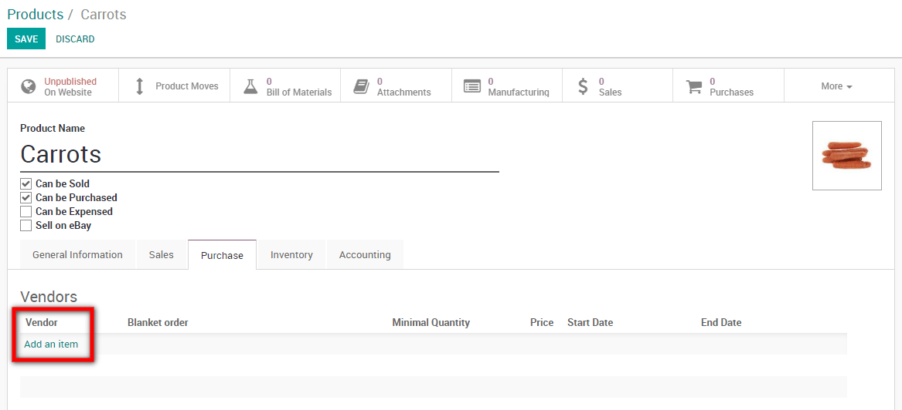
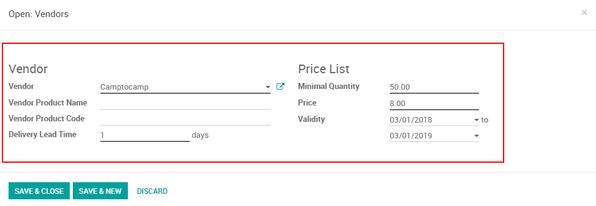

=================================
Set multiple vendors on a product
=================================

If you find yourself with the need to buy from multiple vendors for one
product, Odoo can let you directly link them with a single product.

Add vendors in a product
========================

To use this feature, go to :menuselection:`Purchases --> Products`, then
select a product.

From there you can add existing vendors to your product or create a new
one on the fly.

Note that every first time the product is purchased from a new vendor,
Odoo will automatically link the contact and price with the product.

Add price & quantity as well as a validity period
-------------------------------------------------

When you're adding a vendor to a product, you're able to add the vendor
product name & code as well as set the minimal quantity, price and
validity period.

.. tip::
    This Odoo feature also works with variants of your products, such as one
    t-shirt in different sizes!
