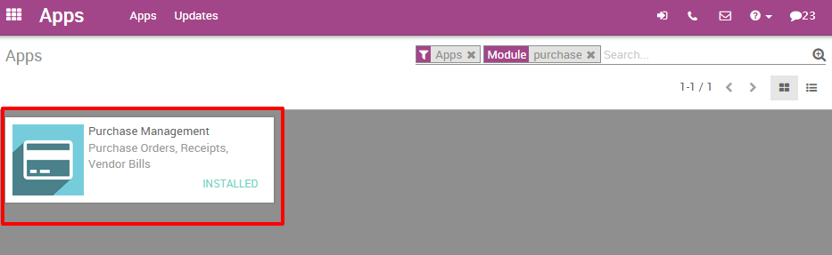

=====================================
Analyze the performance of my vendors
=====================================

If your company regularly buys products from several suppliers, it would
be useful to get statistics on your purchases. There are several reasons
to track and analyze your vendor's performance :

-  You can see how dependant from a supplier your company is;

-  you can negotiate discounts on prices;

-  You can check the average delivery time per supplier;

-  Etc.

For example, an IT products reseller that issues dozens of purchase
orders to several suppliers each week may want to measure for each
product the total price paid for each vendor and the delivery delay. The
insights gathered by the company will help it to better analyze,
forecast and plan their future orders.

Configuration
=============

Install the Purchase Management module
--------------------------------------

From the **Apps** menu, search and install the **Purchase Management**
module.

Issue some purchase orders
--------------------------

Of course, in order to analyze your vendors' performance, you need to
issue some **Request For Quotations** (RfQ) and confirm some **Purchase
Orders**.

Analyzing your vendors
======================

Generate flexible reports
-------------------------

You have access to your vendors' performances on the Reports menu.
By default, the report groups all your purchase orders on a pivot table
by **total price**, **product quantity** and **average price** for the **each month**
and for **each supplier**. Simply by accessing this basic report, you can
get a quick overview of your actual performance. You can add a lot of
extra data to your report by clicking on the **Measures** icon.

.. image:: media/analyze04.png
    :align: center

.. tip::
    By clicking on the **+** and **-** icons, you can drill up and down 
    your report in order to change the way your information is displayed. 
    For example, if I want to see all the products bought for the current 
    month, I need to click on the **+** icon on the vertical axis and 
    then on "Products".

Depending on the data you want to highlight, you may need to display
your reports in a more visual view. You can transform your report in
just a click in 3 graph views : a **Pie Chart**, a **Bar Chart** and a **Line
Chart**: These views are accessible through the icons highlighted on the
screenshot below.

.. image:: media/analyze02.png
    :align: center

.. note:: 
    On the contrary to the pivot table, a graph can only 
    be computed with one dependent and one independent measure.

Customize reports
=================

You can easily customize your purchase reports depending on your needs.
To do so, use the **Advanced search view** located in the right hand side
of your screen, by clicking on the magnifying glass icon at the end of
the search bar button. This function allows you to highlight only
selected data on your report. The **filters** option is very useful in
order to display some categories of datas, while the **Group by** option
improves the readability of your reports. Note that you can filter and
group by any existing field, making your customization very flexible and
powerful.

.. image:: media/analyze01.png
    :align: center

.. tip:: 
    You can save and reuse any customized filter by clicking 
    on **Favorites** from the **Advanced search view** and 
    then on **Save current search**. The saved filter will 
    then be accessible from the **Favorites** menu.
